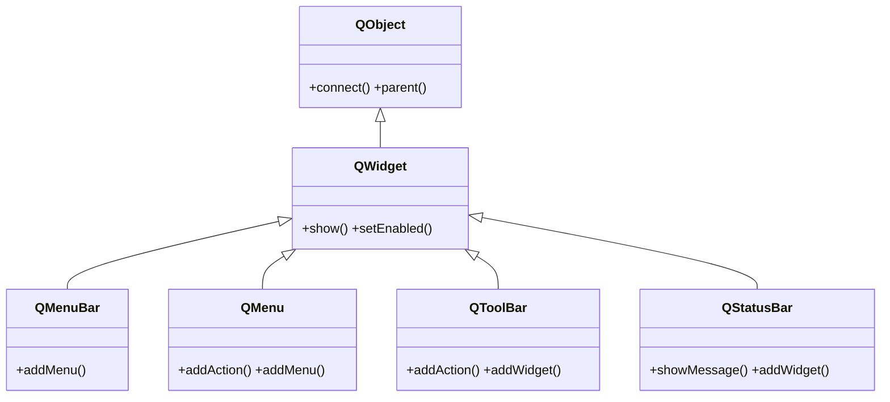
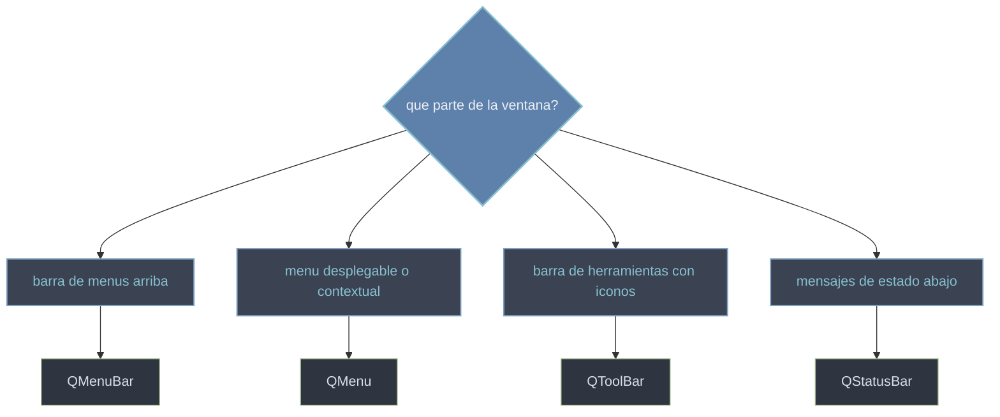

# QtWidgets/menus — menus, barras y estado

Esta carpeta agrupa los elementos de "chrome" de una [[QMainWindow]]: la **barra de menus** arriba (`QMenuBar`), los **menus desplegables** que cuelgan de ella (`QMenu`), la **barra de herramientas** con botones de acceso rapido (`QToolBar`) y la **barra de estado** abajo para mensajes breves (`QStatusBar`). El hilo comun es que todos se llenan de `QAction`, el elemento de accion que en PyQt6 vive en `QtGui`: una misma `QAction` (con su texto, icono y atajo) puede aparecer a la vez en un menu y en una toolbar.

## En accion

Una `QMainWindow` con su barra de menus, un menu "Archivo", una barra de herramientas que reutiliza la misma accion y un mensaje en la barra de estado:

```python
from PyQt6.QtWidgets import QApplication, QMainWindow, QLabel
from PyQt6.QtGui import QAction          # PyQt6: QAction vive en QtGui
import sys

app = QApplication(sys.argv)

ventana = QMainWindow()
ventana.setWindowTitle("chrome de la ventana")
ventana.setCentralWidget(QLabel("Contenido central"))

# accion compartida por el menu y la toolbar
salir = QAction("Salir", ventana)
salir.triggered.connect(ventana.close)

# barra de menus -> menu "Archivo" con la accion
menu_archivo = ventana.menuBar().addMenu("Archivo")
menu_archivo.addAction(salir)

# barra de herramientas con la misma accion
barra = ventana.addToolBar("Principal")
barra.addAction(salir)

# barra de estado con un mensaje
ventana.statusBar().showMessage("Listo")

ventana.show()
sys.exit(app.exec())                    # PyQt6: exec() (sin guion bajo)
```

## Herencia



Las cuatro **son `QWidget`**: lo que no definen (mostrarse, habilitarse, geometria) lo heredan de `QWidget`, y las señales/`parent` de `QObject`. Lo suyo es solo su papel en el armazon de la ventana.

## Que uso



## Las clases

| Clase | Rol |
|-------|-----|
| [[QMenuBar]] | la barra de menus horizontal arriba de la ventana; se obtiene con `menuBar()` |
| [[QMenu]] | un menu desplegable de acciones, submenus y separadores; tambien menu contextual |
| [[QToolBar]] | barra de herramientas con botones/acciones de acceso rapido |
| [[QStatusBar]] | la barra de estado inferior para mensajes breves y widgets de estado |

## Notas relacionadas

- [[QMainWindow]] — la ventana que aporta el menuBar, las toolbars y el statusBar
- [[QAction]] — el elemento de accion (de QtGui) que llena menus y toolbars
