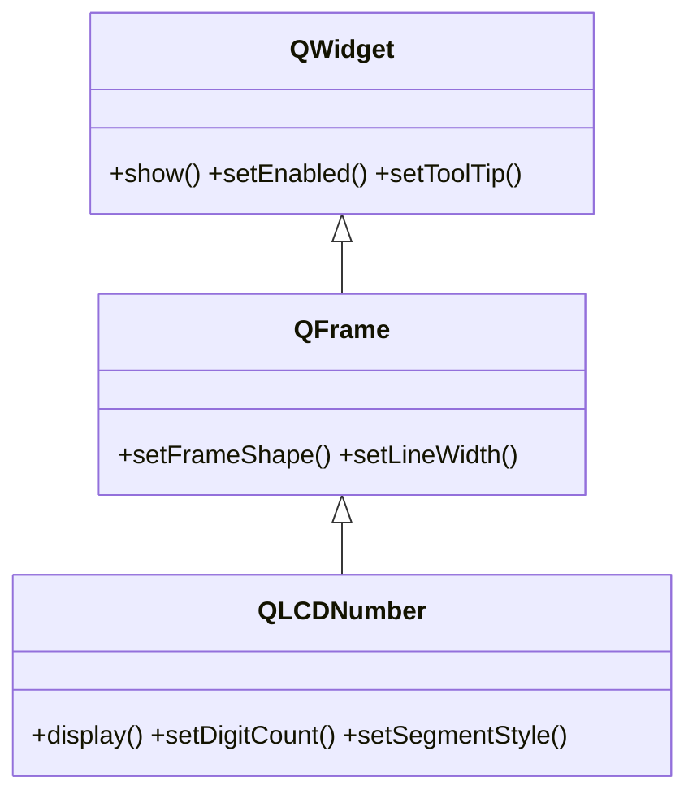

# QLCDNumber — display tipo LCD para mostrar numeros

`QLCDNumber` es un display de **siete segmentos** (estilo calculadora o reloj digital) para mostrar **numeros** de solo lectura. Recibe el valor con `display(...)` y lo pinta con su estetica de LCD. Tipico en relojes, contadores y cronometros. Hereda de [[QFrame]], asi que admite marco y borde.

## Importacion

```python
from PyQt6.QtWidgets import QLCDNumber
```

## Herencia



Lo que `QLCDNumber` **no** define lo hereda: mostrarse, habilitarse o el tooltip vienen de [[QWidget]]; el marco/borde viene de `QFrame`. Lo suyo es mostrar el numero: `display`, `setDigitCount`, `setSegmentStyle`.

## Senales

No emite senales propias relevantes: es un widget de salida pasivo (solo muestra el numero que le das).

## Propiedades

| Propiedad | Tipo | Leer \| escribir | Controla |
|-----------|------|------------------|----------|
| `digitCount` | `int` | `digitCount()` \| `setDigitCount(int)` | cuantos digitos caben en el display |
| `value` | `float` | `value()` \| `display(...)` | el numero que se muestra |
| `segmentStyle` | `QLCDNumber.SegmentStyle` | `segmentStyle()` \| `setSegmentStyle(...)` | aspecto de los segmentos (relleno, contorno...) |

## Constructor y metodos

```python
QLCDNumber(parent: QWidget | None = None)
QLCDNumber(numDigits: int, parent: QWidget | None = None)
```

Dos sobrecargas; con `numDigits` fijas cuantos digitos caben. El `parent` es opcional: el layout lo asigna al hacer `addWidget`.

| Firma | Devuelve | Que hace |
|-------|----------|----------|
| `display(valor: int \| float \| str)` | `None` | muestra el valor; acepta entero, decimal o cadena numerica |
| `setDigitCount(count: int)` | `None` | numero de digitos que caben en el display |
| `setSegmentStyle(style: QLCDNumber.SegmentStyle)` | `None` | estilo de los segmentos (enum **con scope**) |
| `value()` | `float` | el valor actual como numero |

## Casos de uso

```python
from PyQt6.QtWidgets import QApplication, QWidget, QLCDNumber, QVBoxLayout
from PyQt6.QtCore import QTimer, QTime
import sys

app = QApplication(sys.argv)
w = QWidget(); lay = QVBoxLayout(w)

# 1. Un reloj: un QTimer refresca el display cada segundo
lcd = QLCDNumber()
lcd.setDigitCount(8)                                  # hh:mm:ss
lay.addWidget(lcd)

def tick():
    lcd.display(QTime.currentTime().toString("hh:mm:ss"))

timer = QTimer(w)
timer.timeout.connect(tick)
timer.start(1000)
tick()

# 2. Un contador simple
contador = QLCDNumber()
contador.display(0)
lay.addWidget(contador)

w.show(); sys.exit(app.exec())
```

## Errores comunes

| Error | Causa | Solucion |
|-------|-------|----------|
| El numero aparece cortado o no se ve entero | `digitCount` es menor que los digitos del valor | sube `setDigitCount(...)` hasta que quepa |
| `display(...)` no muestra nada | le pasaste un tipo no numerico (objeto, lista) | pasa un `int`, `float` o una cadena que represente un numero |
| `setSegmentStyle(QLCDNumber.Flat)` falla | en Qt6 el enum lleva scope | usa `QLCDNumber.SegmentStyle.Flat` |

## Notas relacionadas

- [[QFrame]] — la clase base que aporta el marco y el borde
- [[QWidget]] — de donde vienen `show`, `setEnabled` y el resto
