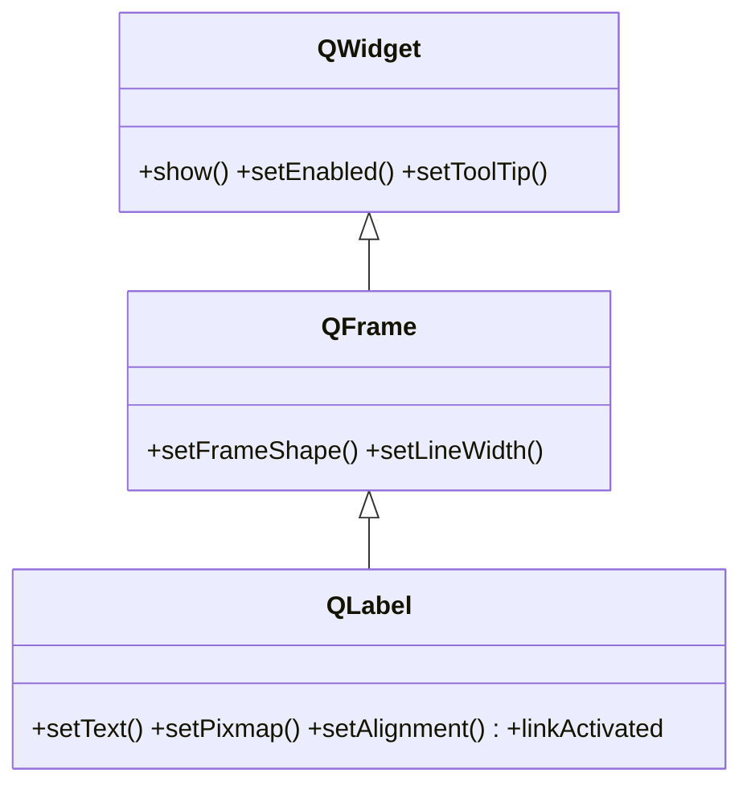

# QLabel — muestra texto o una imagen (no editable)

`QLabel` es el widget de **solo lectura** mas usado: muestra un **texto** (plano o HTML) o una **imagen**, pero el usuario no lo edita. Sirve como etiqueta de un campo, como salida de un resultado que se va actualizando (`label.setText(...)`) o para pintar una imagen con `setPixmap`. Hereda de [[QFrame]], asi que puede llevar un marco y borde; lo que muestra es estatico.

## Importacion

```python
from PyQt6.QtWidgets import QLabel
```

## Herencia



Lo que `QLabel` **no** define lo hereda: mostrarse, habilitarse o el tooltip vienen de [[QWidget]]; el marco/borde viene de `QFrame`. Lo suyo es mostrar contenido: `setText`, `setPixmap`, `setAlignment`.

## Senales

Apenas emite senales (es un widget pasivo). La unica util aparece cuando el texto es HTML con enlaces:

| Senal | Cuando se emite | Argumentos |
|-------|-----------------|------------|
| `linkActivated` | al pulsar un enlace `<a href="...">` del texto HTML | `url: str` (el destino del enlace) |

```python
label.setText('Visita <a href="https://qt.io">la web</a>')
label.linkActivated.connect(lambda url: print("clic en", url))
```

## Propiedades

En Qt los "atributos" son **propiedades**: se leen/escriben con getter/setter, no como atributo directo.

| Propiedad | Tipo | Leer \| escribir | Controla |
|-----------|------|------------------|----------|
| `text` | `str` | `text()` \| `setText(str)` | el texto visible (plano o HTML) |
| `pixmap` | `QPixmap` | `pixmap()` \| `setPixmap(QPixmap)` | la imagen que muestra (en vez de texto) |
| `alignment` | `Qt.AlignmentFlag` | `alignment()` \| `setAlignment(...)` | alineacion del contenido dentro del widget |
| `wordWrap` | `bool` | `wordWrap()` \| `setWordWrap(bool)` | si el texto largo salta de linea |
| `openExternalLinks` | `bool` | `openExternalLinks()` \| `setOpenExternalLinks(bool)` | si los enlaces HTML se abren solos en el navegador |

## Constructor y metodos

```python
QLabel(parent: QWidget | None = None)
QLabel(text: str, parent: QWidget | None = None)
```

Dos sobrecargas; la habitual es `QLabel("Texto")`. El `parent` es opcional: el layout lo asigna al hacer `addWidget`.

| Firma | Devuelve | Que hace |
|-------|----------|----------|
| `setText(text: str)` | `None` | fija el texto; acepta texto plano o **HTML** (`<b>`, `<a>`, ...) |
| `text()` | `str` | el texto actual |
| `setPixmap(pixmap: QPixmap)` | `None` | muestra una imagen en vez de texto |
| `setAlignment(flag: Qt.AlignmentFlag)` | `None` | alinea el contenido (enum **con scope**: `Qt.AlignmentFlag.AlignCenter`) |
| `setWordWrap(on: bool)` | `None` | activa el salto de linea automatico del texto largo |
| `setOpenExternalLinks(on: bool)` | `None` | abre los enlaces HTML directamente en el navegador |
| `clear()` | `None` | vacia el texto o la imagen |

## Casos de uso

```python
from PyQt6.QtWidgets import QApplication, QWidget, QLabel, QVBoxLayout
from PyQt6.QtCore import Qt
import sys

app = QApplication(sys.argv)
w = QWidget(); lay = QVBoxLayout(w)

# 1. Etiqueta de un campo
lay.addWidget(QLabel("Nombre:"))

# 2. Mostrar un resultado que se actualiza por codigo
salida = QLabel("0")
salida.setAlignment(Qt.AlignmentFlag.AlignCenter)   # enum con scope (Qt6)
salida.setText("42")                                # actualizar el contenido
lay.addWidget(salida)

# 3. Texto HTML con un enlace
link = QLabel('Mas info en <a href="https://qt.io">qt.io</a>')
link.setOpenExternalLinks(True)                     # abre el enlace en el navegador
lay.addWidget(link)

# 4. Texto largo: activar wordWrap para que no se desborde
parrafo = QLabel("Un texto muy largo que conviene partir en varias lineas.")
parrafo.setWordWrap(True)
lay.addWidget(parrafo)

w.show(); sys.exit(app.exec())
```

Para mostrar una imagen, se usa un `QPixmap`:

```python
from PyQt6.QtGui import QPixmap
img = QLabel()
img.setPixmap(QPixmap("logo.png"))
```

## Errores comunes

| Error | Causa | Solucion |
|-------|-------|----------|
| El texto largo se desborda o se corta | no activaste el salto de linea | llama a `setWordWrap(True)` |
| Espero que el usuario escriba en la etiqueta | `QLabel` es de solo lectura | usa [[QLineEdit]] para entrada de texto editable |
| `setAlignment(Qt.AlignCenter)` falla | en Qt6 los enums llevan scope | usa `Qt.AlignmentFlag.AlignCenter` |
| El enlace HTML no se abre al pulsarlo | falta habilitarlo | `setOpenExternalLinks(True)` o conecta `linkActivated` |

## Notas relacionadas

- [[QFrame]] — la clase base que aporta el marco y el borde
- [[QWidget]] — de donde vienen `show`, `setEnabled` y el resto
- [[QLineEdit]] — cuando necesitas que el texto sea **editable**
