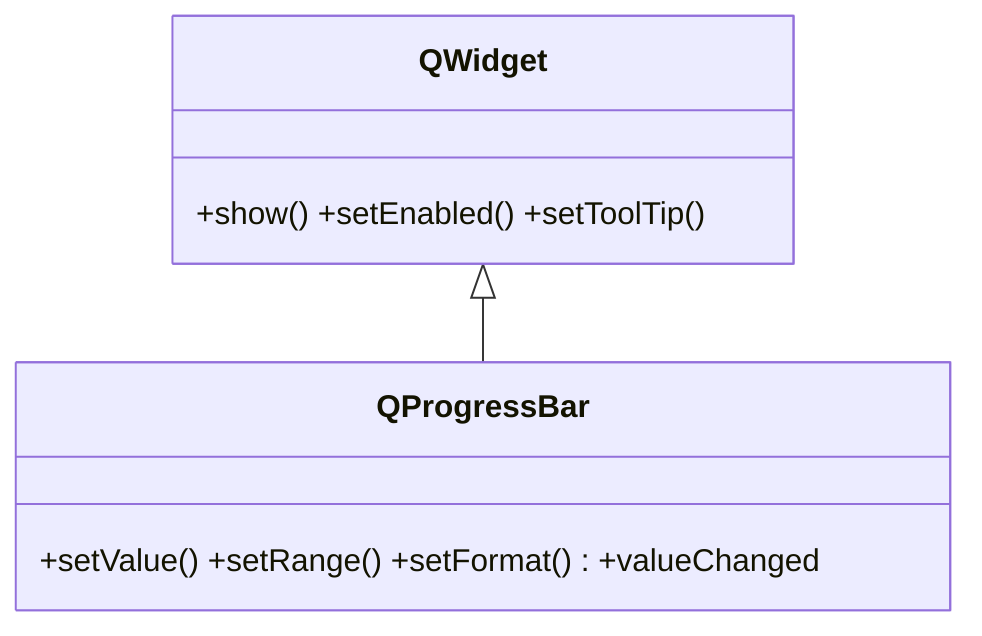

# QProgressBar — barra de progreso de una tarea

`QProgressBar` muestra el **progreso** de una tarea como una barra que se llena, normalmente de 0 a 100% (aunque el rango es configurable). Es de solo lectura: lo habitual es conectar su `setValue` al avance de un worker. Tiene ademas un **modo indeterminado** (animacion de "ocupado") para cuando no sabes cuanto falta. Cuelga directo de [[QWidget]].

## Importacion

```python
from PyQt6.QtWidgets import QProgressBar
```

## Herencia



Lo que `QProgressBar` **no** define lo hereda de [[QWidget]]: mostrarse, habilitarse, el tooltip. Lo suyo es el progreso: `setValue`, `setRange`, `setFormat`.

## Senales

| Senal | Cuando se emite | Argumentos |
|-------|-----------------|------------|
| `valueChanged` | cada vez que cambia el valor actual de la barra | `value: int` (el nuevo valor) |

```python
barra.valueChanged.connect(lambda v: print("progreso", v))
```

## Propiedades

| Propiedad | Tipo | Leer \| escribir | Controla |
|-----------|------|------------------|----------|
| `value` | `int` | `value()` \| `setValue(int)` | el valor actual (posicion de llenado) |
| `minimum` | `int` | `minimum()` \| `setMinimum(int)` | el extremo inferior del rango |
| `maximum` | `int` | `maximum()` \| `setMaximum(int)` | el extremo superior del rango |
| `format` | `str` | `format()` \| `setFormat(str)` | plantilla del texto (ej. `"%p%"` = porcentaje) |
| `textVisible` | `bool` | `isTextVisible()` \| `setTextVisible(bool)` | si se muestra el texto del porcentaje |

## Constructor y metodos

```python
QProgressBar(parent: QWidget | None = None)
```

Una sola sobrecarga; el rango por defecto es `0..100`. El `parent` es opcional: el layout lo asigna al hacer `addWidget`.

| Firma | Devuelve | Que hace |
|-------|----------|----------|
| `setValue(value: int)` | `None` | fija el valor actual (posicion de la barra) |
| `value()` | `int` | el valor actual |
| `setRange(minimum: int, maximum: int)` | `None` | fija ambos extremos del rango de una vez |
| `setFormat(fmt: str)` | `None` | plantilla del texto; `%p` = porcentaje, `%v` = valor, `%m` = total |
| `setTextVisible(visible: bool)` | `None` | muestra u oculta el texto sobre la barra |
| `reset()` | `None` | devuelve la barra a su estado inicial (vacia) |

> [!nota] Modo indeterminado
> Con `setRange(0, 0)` la barra entra en modo "ocupado": muestra una **animacion** continua sin porcentaje, util cuando no conoces de antemano cuanto va a tardar la tarea.

## Casos de uso

```python
from PyQt6.QtWidgets import QApplication, QWidget, QProgressBar, QVBoxLayout
import sys

app = QApplication(sys.argv)
w = QWidget(); lay = QVBoxLayout(w)

# 1. Barra de progreso normal (0-100%), actualizada por codigo
barra = QProgressBar()
barra.setRange(0, 100)
barra.setValue(35)                 # un worker iria llamando setValue(...)
barra.setFormat("%p%")             # mostrar el porcentaje
lay.addWidget(barra)

# 2. Barra indeterminada (animacion de "ocupado", sin porcentaje)
cargando = QProgressBar()
cargando.setRange(0, 0)            # modo indeterminado
lay.addWidget(cargando)

w.show(); sys.exit(app.exec())
```

El patron tipico es conectar la barra al avance de un worker que corre en otro hilo:

```python
worker.progreso.connect(barra.setValue)   # el worker emite el % por una senal
```

## Errores comunes

| Error | Causa | Solucion |
|-------|-------|----------|
| La barra no se refresca durante la tarea | el bucle de trabajo bloquea el event loop | mueve la tarea a un [[QThread]] (o usa `QApplication.processEvents()`) |
| El porcentaje sale mal (siempre 0% o 100%) | el rango no encaja con los valores que pasas | fija `setRange(min, max)` acorde a tu unidad de avance |
| Queria una animacion de "ocupado" y no aparece | no entraste al modo indeterminado | usa `setRange(0, 0)` |

## Notas relacionadas

- [[QWidget]] — la clase base que aporta `show`, `setEnabled` y el resto
- [[QThread]] — para no bloquear el event loop mientras avanza la tarea
