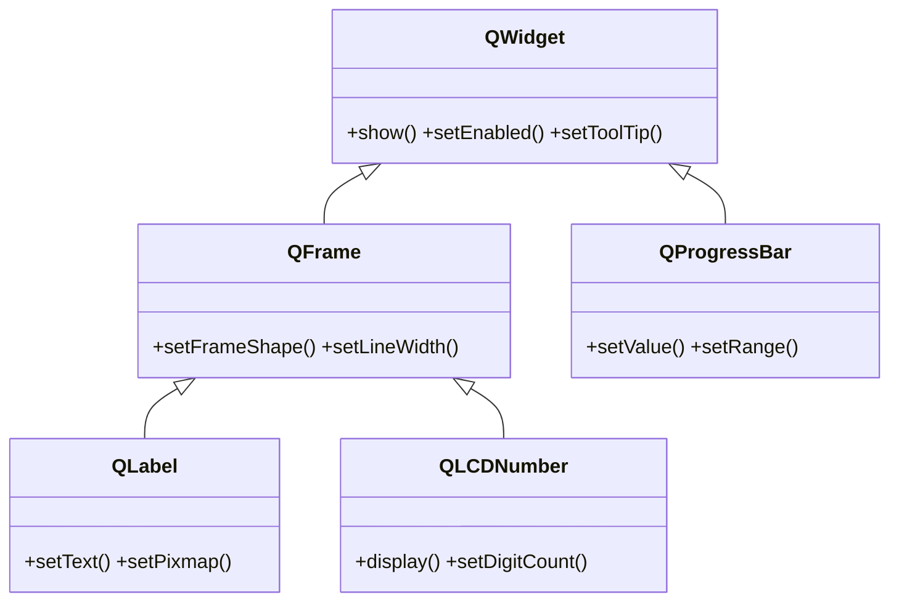
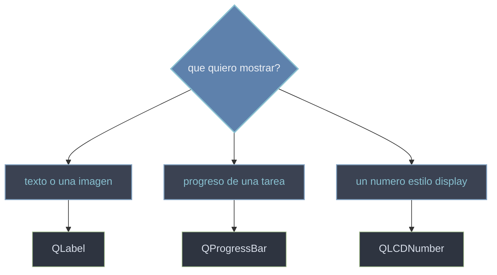

# QtWidgets/muestra — mostrar informacion

Esta carpeta agrupa los widgets de **solo lectura** que **muestran datos** al usuario sin que este los edite. A diferencia de las entradas (que reciben texto o numeros), estos widgets son salida pura: pintan un texto o una imagen ([[QLabel]]), el avance de una tarea ([[QProgressBar]]) o un numero con estetica de display ([[QLCDNumber]]). Son la cara visible de los resultados de tu programa: actualizas su contenido por codigo y ellos lo presentan.

## En accion

Un `QLabel` como titulo, un `QProgressBar` y un `QSlider` que mueve la barra a la vez que un `QLCDNumber` refleja su valor: el slider es la unica entrada, los demas solo muestran.

```python
from PyQt6.QtWidgets import (
    QApplication, QWidget, QVBoxLayout,
    QLabel, QProgressBar, QSlider, QLCDNumber
)
from PyQt6.QtCore import Qt
import sys

app = QApplication(sys.argv)
ventana = QWidget()
ventana.setWindowTitle("widgets de muestra")
raiz = QVBoxLayout(ventana)

titulo = QLabel("Progreso de la descarga")        # muestra texto
raiz.addWidget(titulo)

barra = QProgressBar()                             # muestra progreso
barra.setRange(0, 100)
raiz.addWidget(barra)

lcd = QLCDNumber()                                 # muestra un numero
lcd.setDigitCount(3)
raiz.addWidget(lcd)

slider = QSlider(Qt.Orientation.Horizontal)        # la unica entrada
slider.setRange(0, 100)
slider.valueChanged.connect(barra.setValue)        # mueve la barra
slider.valueChanged.connect(lcd.display)           # y el LCD
raiz.addWidget(slider)

ventana.show()
sys.exit(app.exec())                               # exec() (PyQt6, sin guion bajo)
```

## Herencia



[[QLabel]] y [[QLCDNumber]] heredan de `QFrame` (admiten marco/borde); [[QProgressBar]] cuelga directo de [[QWidget]]. Ninguno se edita: lo que define cada uno es **como muestra** su contenido.

## Que muestro



## Las clases

| Clase | Hereda de | Rol |
|-------|-----------|-----|
| [[QLabel]] | `QFrame` | muestra **texto** (plano o HTML) o una **imagen**; el widget mas usado |
| [[QProgressBar]] | `QWidget` | barra de **progreso** (0-100% u otro rango), con modo indeterminado |
| [[QLCDNumber]] | `QFrame` | display tipo **LCD** para mostrar numeros (reloj, contador) |

## Notas relacionadas

- [[QWidget]] — el contenedor base del que descienden todos estos widgets
