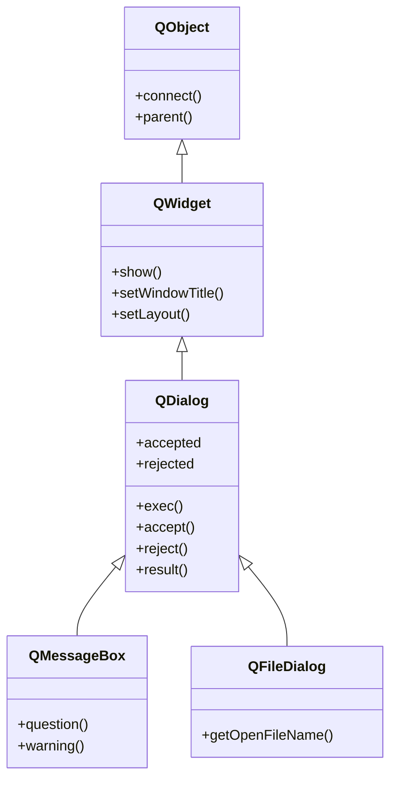

# QDialog — ventana de dialogo modal que devuelve un resultado

`QDialog` es una **ventana de dialogo**: una ventana secundaria que **pide algo al usuario y
devuelve un resultado** (aceptar o cancelar). Puede ser **modal** —bloquea el resto de la
aplicacion mientras esta abierta, con `exec()`— o **no modal** —convive con la ventana principal,
con `show()` u `open()`. Es la base de los dialogos estandar de Qt (`QMessageBox`, `QFileDialog`)
y de tus propios formularios, que se montan **subclaseandola**.

## Importacion

```python
from PyQt6.QtWidgets import QDialog
```

## Herencia



Como `QDialog` **ES un [[QWidget]]**, hereda mostrarse, el titulo, el layout y los eventos de
`QWidget`, y señales/slots de `QObject`. Lo que añade es la **logica de dialogo**: ser modal,
cerrarse con un resultado (`accept`/`reject`) y las señales que avisan de ese resultado. De
`QDialog` cuelgan a su vez los dialogos predefinidos `QMessageBox` y `QFileDialog`.

## Señales

| Señal | Cuando se emite | Argumentos |
|-------|-----------------|------------|
| `accepted` | el dialogo se cierra con `accept()` (Aceptar/Ok) | — |
| `rejected` | el dialogo se cierra con `reject()` (Cancelar/Esc) | — |
| `finished` | el dialogo se cierra de cualquier modo | `result: int` (codigo Accepted/Rejected) |

```python
dlg.accepted.connect(lambda: print("acepto"))
dlg.finished.connect(lambda r: print("cerro con", r))
```

## Propiedades

En Qt los "atributos" son **propiedades** (getter/setter). Las relevantes para `QDialog` (las de
geometria/titulo/visibilidad se heredan de [[QWidget]]):

| Propiedad | Tipo | Leer \| escribir | Controla |
|-----------|------|------------------|----------|
| `modal` | `bool` | `isModal()` \| `setModal(bool)` | si bloquea el resto de ventanas |
| `result` | `int` | `result()` \| `setResult(int)` | codigo de cierre (Accepted=1 / Rejected=0) |
| `windowTitle` | `str` | `windowTitle()` \| `setWindowTitle(str)` | titulo del dialogo (de [[QWidget]]) |
| `sizeGripEnabled` | `bool` | `isSizeGripEnabled()` \| `setSizeGripEnabled(bool)` | muestra el tirador de redimension |

## Constructor y metodos

```python
QDialog(parent: QWidget | None = None)
```

Conviene pasar el `parent` (la ventana principal): asi el dialogo se centra sobre ella y se
gestiona su memoria como hijo. El **valor que devuelve** un dialogo modal es el centro de su uso:

| Firma | Devuelve | Que hace |
|-------|----------|----------|
| `exec()` | `int` | abre **modal**: **BLOQUEA** hasta cerrarse y devuelve `QDialog.DialogCode.Accepted` o `Rejected` |
| `open()` | `None` | abre **no modal** (no bloquea); el resultado llega por la señal `finished` |
| `accept()` | `None` | cierra con `Accepted`, emite `accepted` y `finished` |
| `reject()` | `None` | cierra con `Rejected`, emite `rejected` y `finished` |
| `done(r: int)` | `None` | cierra fijando el codigo `r` y emite `finished` |
| `result()` | `int` | el codigo con que se cerro (`Accepted`/`Rejected`) |
| `setModal(modal: bool)` | `None` | marca el dialogo como modal para `show()` (`exec()` ya es modal) |

> El enum va con scope en PyQt6: `QDialog.DialogCode.Accepted`, no `QDialog.Accepted`.

## Casos de uso

```python
from PyQt6.QtWidgets import (
    QApplication, QWidget, QPushButton, QVBoxLayout,
    QDialog, QLabel, QDialogButtonBox
)
import sys

app = QApplication(sys.argv)

ventana = QWidget(); lay = QVBoxLayout(ventana)
boton = QPushButton("Abrir dialogo")
lay.addWidget(boton)

def abrir():
    dlg = QDialog(ventana)                       # parent: se centra sobre la ventana
    dlg.setWindowTitle("Confirmar")
    dl = QVBoxLayout(dlg)
    dl.addWidget(QLabel("Continuar con la operacion?"))

    botones = QDialogButtonBox(
        QDialogButtonBox.StandardButton.Ok
        | QDialogButtonBox.StandardButton.Cancel
    )
    botones.accepted.connect(dlg.accept)         # Ok -> accept()
    botones.rejected.connect(dlg.reject)         # Cancel -> reject()
    dl.addWidget(botones)

    if dlg.exec() == QDialog.DialogCode.Accepted:   # BLOQUEA aqui
        print("acepto")
    else:
        print("cancelo")

boton.clicked.connect(abrir)
ventana.show()
sys.exit(app.exec())
```

## Personalizar (subclasear)

El patron habitual es **subclasear `QDialog`** para crear un formulario propio: montas los campos
con un layout, añades un `QDialogButtonBox` (Ok/Cancel) conectando sus señales a `accept`/`reject`,
y expones un metodo que **devuelve los datos** tras aceptar.

```python
from PyQt6.QtWidgets import (
    QApplication, QDialog, QFormLayout, QLineEdit,
    QSpinBox, QDialogButtonBox
)
import sys

class DialogoUsuario(QDialog):
    def __init__(self, parent=None):
        super().__init__(parent)                 # imprescindible
        self.setWindowTitle("Nuevo usuario")

        form = QFormLayout(self)
        self.nombre = QLineEdit()
        self.edad = QSpinBox(); self.edad.setRange(0, 120)
        form.addRow("Nombre:", self.nombre)
        form.addRow("Edad:", self.edad)

        botones = QDialogButtonBox(
            QDialogButtonBox.StandardButton.Ok
            | QDialogButtonBox.StandardButton.Cancel
        )
        botones.accepted.connect(self.accept)    # cierra con Accepted
        botones.rejected.connect(self.reject)    # cierra con Rejected
        form.addRow(botones)

    def datos(self) -> dict:                      # se llama TRAS aceptar
        return {"nombre": self.nombre.text(), "edad": self.edad.value()}

app = QApplication(sys.argv)
dlg = DialogoUsuario()
if dlg.exec() == QDialog.DialogCode.Accepted:
    print(dlg.datos())                            # lee los datos mientras vive el dialogo
sys.exit(0)
```

## Errores comunes

| Error | Causa | Solucion |
|-------|-------|----------|
| El codigo sigue de largo sin esperar al dialogo | usaste `show()` cuando querias modal | usa `exec()`: bloquea y devuelve el resultado |
| `RuntimeError` al leer un campo del dialogo | lo leiste despues de que se destruyo | lee los datos mientras el dialogo vive (justo tras `exec()`) |
| Ok/Cancel no cierran el dialogo | no conectaste el `QDialogButtonBox` | conecta `accepted`->`accept` y `rejected`->`reject` |
| `QDialog.Accepted` da error o no compara bien | en PyQt6 el enum lleva scope | usa `QDialog.DialogCode.Accepted` |

## Notas relacionadas

- [[QWidget]] — la clase base de la que QDialog hereda mostrarse, layout y eventos
- [[QMainWindow]] — la ventana principal sobre la que suelen abrirse los dialogos
- [[concepto_signals_slots]] — como conectar `accepted`/`rejected` a tus slots
