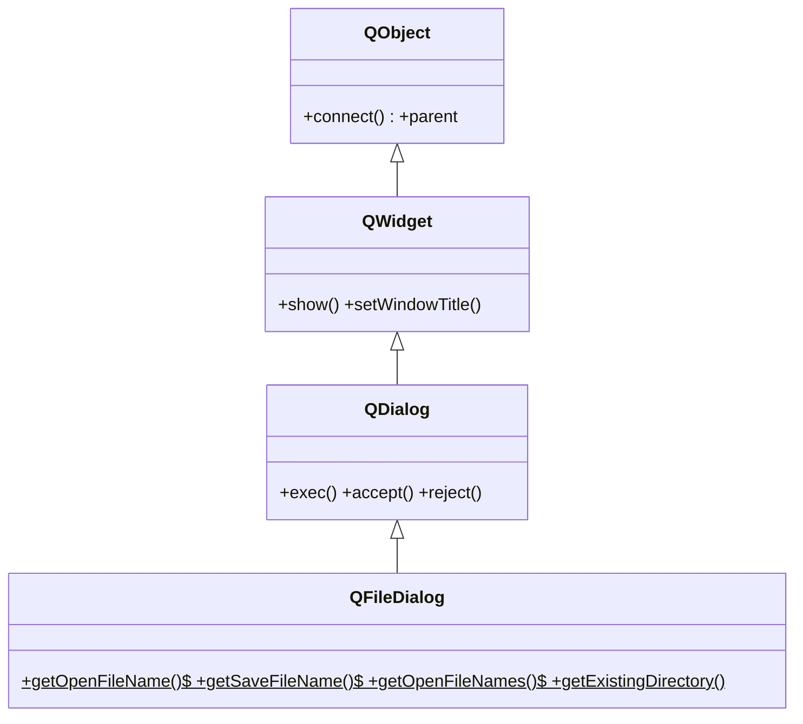

# QFileDialog — dialogo para elegir archivos o carpetas

`QFileDialog` es el **dialogo predefinido para elegir archivos o carpetas**: el clasico cuadro de "Abrir..." / "Guardar como..." del sistema. Igual que [[QMessageBox]], casi nunca se instancia: se usa via sus **metodos estaticos**, que abren el dialogo nativo y devuelven la ruta elegida. El detalle clave de PyQt6: estos metodos devuelven una **tupla** `(ruta, filtro)`, no un simple `str`.

## Importacion

```python
from PyQt6.QtWidgets import QFileDialog
```

## Herencia



Hereda de [[QDialog]] todo el comportamiento modal, pero al usar los metodos estaticos se delega en el dialogo **nativo** del sistema operativo, asi que apenas se interactua con la jerarquia directamente.

## Metodos estaticos

La forma de uso real. Todos reciben `parent`, un `titulo` y opcionalmente un directorio inicial y un `filter`. **Importante: en PyQt6 devuelven una tupla** `(ruta, filtro)` — hay que desempaquetarla.

```python
QFileDialog.getOpenFileName(parent, titulo: str, dir: str = "", filter: str = "")   # -> tuple[str, str]
QFileDialog.getSaveFileName(parent, titulo: str, dir: str = "", filter: str = "")   # -> tuple[str, str]
QFileDialog.getOpenFileNames(parent, titulo: str, dir: str = "", filter: str = "")  # -> tuple[list[str], str]
QFileDialog.getExistingDirectory(parent, titulo: str, dir: str = "")                # -> str
```

| Firma | Devuelve | Que hace |
|-------|----------|----------|
| `getOpenFileName(parent, titulo, dir="", filter="")` | `tuple[str, str]` | elegir **un** archivo a abrir; ruta `""` si se cancela |
| `getSaveFileName(parent, titulo, dir="", filter="")` | `tuple[str, str]` | elegir ruta/nombre para **guardar** |
| `getOpenFileNames(parent, titulo, dir="", filter="")` | `tuple[list[str], str]` | elegir **varios** archivos (lista de rutas) |
| `getExistingDirectory(parent, titulo, dir="")` | `str` | elegir **una carpeta** (no es tupla) |

El `filter` restringe los tipos visibles; cada filtro se separa con `;;`:

```python
"Imagenes (*.png *.jpg);;Todos (*)"
```

## Casos de uso

```python
from PyQt6.QtWidgets import QApplication, QWidget, QFileDialog
import sys

app = QApplication(sys.argv)
w = QWidget(); w.show()

# 1. Abrir un archivo y leer su ruta (se descarta el filtro con _)
ruta, _ = QFileDialog.getOpenFileName(
    w, "Abrir imagen", "", "Imagenes (*.png *.jpg);;Todos (*)"
)
if ruta:                                  # vacio = el usuario cancelo
    with open(ruta) as f:
        print("abriendo", ruta)

# 2. Guardar como
destino, _ = QFileDialog.getSaveFileName(
    w, "Guardar como", "salida.txt", "Texto (*.txt)"
)
if destino:
    with open(destino, "w") as f:
        f.write("contenido")

# 3. Elegir una carpeta (devuelve str directo, no tupla)
carpeta = QFileDialog.getExistingDirectory(w, "Elegir carpeta")
if carpeta:
    print("carpeta:", carpeta)

sys.exit(app.exec())
```

## Errores comunes

| Error | Causa | Solucion |
|-------|-------|----------|
| `open(...)` falla o la ruta es algo como `('/x.png', 'Imagenes (*.png)')` | tratas el retorno como `str` cuando es una tupla `(ruta, filtro)` | desempaqueta: `ruta, _ = QFileDialog.getOpenFileName(...)` |
| El programa procesa una ruta vacia al cancelar | no compruebas si `ruta` quedo en `""` | guarda con `if ruta:` antes de usarla |
| `getExistingDirectory` "no devuelve la tupla" | esa funcion devuelve un `str` directo, no `(ruta, filtro)` | asigna a una sola variable, sin desempaquetar |

## Notas relacionadas

- [[QDialog]] — la clase base de dialogos, aporta el comportamiento modal
- [[QMessageBox]] — otro dialogo predefinido, para mensajes y preguntas
