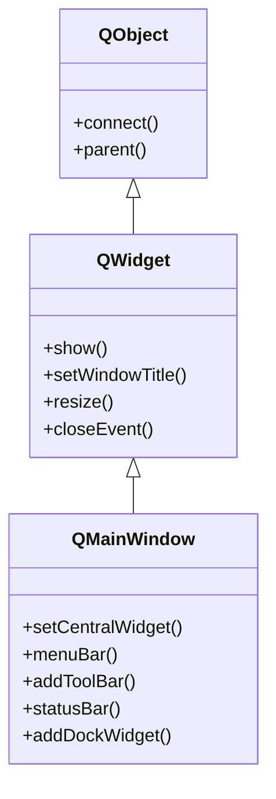

# QMainWindow — la ventana principal con menus, toolbars y central widget

`QMainWindow` es la **ventana principal** de una aplicacion de escritorio. A diferencia de un
[[QWidget]] vacio, ofrece una **estructura predefinida** de ventana de aplicacion: una barra de
menus arriba, barras de herramientas, un **widget central** (el contenido), una barra de estado
abajo y dock widgets (paneles laterales acoplables). Lo normal es **subclasearla**: heredas de
`QMainWindow`, montas tu interfaz en el constructor y fijas tu contenido con `setCentralWidget`.

## Importacion

```python
from PyQt6.QtWidgets import QMainWindow
```

## Herencia



Como `QMainWindow` **ES un [[QWidget]]**, lo que no define lo hereda: `show`, `resize`,
`setWindowTitle`, los metodos-evento (`closeEvent`, `resizeEvent`) y toda la geometria vienen de
`QWidget`; senales/slots y el `parent` vienen de `QObject`. Lo suyo es solo la **estructura de
ventana de aplicacion**: el armazon de menus, toolbars, central widget, statusbar y docks.

## Estructura visual

`QMainWindow` divide su area en zonas fijas, cada una gestionada por la propia ventana:

| Zona | Posicion | Como se obtiene/usa | Para que |
|------|----------|---------------------|----------|
| Barra de menus | arriba del todo | `menuBar()` -> `QMenuBar` | menus desplegables (Archivo, Editar...) |
| Barras de herramientas | bajo el menu (o a los lados) | `addToolBar("titulo")` -> `QToolBar` | botones de acceso rapido (acciones) |
| **Widget central** | centro | `setCentralWidget(w)` | **el contenido principal** de la app |
| Dock widgets | laterales / arriba / abajo | `addDockWidget(area, dock)` | paneles acoplables y flotantes |
| Barra de estado | abajo del todo | `statusBar()` -> `QStatusBar` | mensajes breves, progreso, hints |

El **widget central es obligatorio** para mostrar contenido: las demas zonas son opcionales.

## Propiedades

En Qt los "atributos" son **propiedades** (getter/setter, no atributo directo). Las relevantes
para `QMainWindow` (la mayoria heredadas de [[QWidget]]):

| Propiedad | Tipo | Leer \| escribir | Controla |
|-----------|------|------------------|----------|
| `centralWidget` | `QWidget` | `centralWidget()` \| `setCentralWidget(QWidget)` | el contenido principal de la ventana |
| `windowTitle` | `str` | `windowTitle()` \| `setWindowTitle(str)` | titulo de la ventana (de [[QWidget]]) |
| `size` | `QSize` | `size()` \| `resize(w, h)` | tamaño de la ventana (de [[QWidget]]) |
| `windowIcon` | `QIcon` | `windowIcon()` \| `setWindowIcon(QIcon)` | icono de la ventana |
| `visible` | `bool` | `isVisible()` \| `setVisible(bool)` | si esta mostrada (`show`/`hide`) |
| `menuBar` | `QMenuBar` | `menuBar()` \| (se crea sola) | la barra de menus superior |
| `statusBar` | `QStatusBar` | `statusBar()` \| (se crea sola) | la barra de estado inferior |

## Constructor y metodos

```python
QMainWindow(parent: QWidget | None = None)
```

Un unico constructor; normalmente se instancia **sin parent** (es la ventana top-level de la app).
El patron habitual es subclasear y construir la interfaz en `__init__`.

| Firma | Devuelve | Que hace |
|-------|----------|----------|
| `setCentralWidget(widget: QWidget)` | `None` | fija el contenido principal; **OBLIGATORIO para mostrar algo** |
| `centralWidget()` | `QWidget` | el widget central actual (o `None`) |
| `menuBar()` | `QMenuBar` | la barra de menus (la crea la primera vez) |
| `addToolBar(titulo: str)` | `QToolBar` | crea y acopla una barra de herramientas arriba |
| `statusBar()` | `QStatusBar` | la barra de estado (la crea la primera vez) |
| `addDockWidget(area: Qt.DockWidgetArea, dock: QDockWidget)` | `None` | acopla un panel lateral en el area dada |
| `setWindowTitle(titulo: str)` | `None` | fija el titulo de la ventana (heredado) |
| `resize(w: int, h: int)` | `None` | fija el tamaño de la ventana (heredado) |

## Casos de uso

```python
from PyQt6.QtWidgets import (
    QApplication, QMainWindow, QLabel, QToolBar
)
from PyQt6.QtGui import QAction          # PyQt6: QAction vive en QtGui
import sys

app = QApplication(sys.argv)

win = QMainWindow()
win.setWindowTitle("App minima")
win.resize(400, 250)

# 1. Widget central: el contenido principal (sin esto, ventana vacia)
win.setCentralWidget(QLabel("Contenido central"))

# 2. Barra de menus con una accion
menu_archivo = win.menuBar().addMenu("Archivo")
salir = QAction("Salir", win)
salir.triggered.connect(win.close)
menu_archivo.addAction(salir)

# 3. Barra de herramientas y barra de estado
barra = win.addToolBar("Principal")
barra.addAction(salir)
win.statusBar().showMessage("Listo")

win.show()                              # sin show() no se ve nada
sys.exit(app.exec())                    # PyQt6: exec() (sin guion bajo)
```

## Personalizar (subclasear)

Lo idiomatico **no** es usar `QMainWindow` tal cual, sino **subclasearla** y montar la interfaz en
el constructor. El patron:

```python
from PyQt6.QtWidgets import (
    QApplication, QMainWindow, QWidget, QVBoxLayout,
    QLabel, QPushButton
)
from PyQt6.QtGui import QAction
import sys

class MiVentana(QMainWindow):
    def __init__(self):
        super().__init__()                       # imprescindible
        self.setWindowTitle("Mi ventana")
        self.resize(420, 280)

        # --- widget central: un QWidget con su layout y sus hijos ---
        central = QWidget()
        lay = QVBoxLayout(central)               # el layout va DENTRO del central
        lay.addWidget(QLabel("Contenido principal"))
        boton = QPushButton("Saludar")
        boton.clicked.connect(self.saludar)
        lay.addWidget(boton)
        self.setCentralWidget(central)           # se cuelga del armazon

        # --- menu ---
        accion_salir = QAction("Salir", self)
        accion_salir.triggered.connect(self.close)
        self.menuBar().addMenu("Archivo").addAction(accion_salir)

        # --- barra de estado ---
        self.statusBar().showMessage("Listo")

    def saludar(self):
        self.statusBar().showMessage("Hola!")

app = QApplication(sys.argv)
win = MiVentana()
win.show()
sys.exit(app.exec())
```

Como subclase de [[QWidget]], puedes sobreescribir tambien sus metodos-evento (p. ej.
`closeEvent` para pedir confirmacion al cerrar). Para el modelo mental de la herencia, ver
[[concepto_herencia_widgets]].

## Errores comunes

| Error | Causa | Solucion |
|-------|-------|----------|
| La ventana sale vacia | no llamaste a `setCentralWidget` | crea un `QWidget` con su layout y pasalo a `setCentralWidget` |
| `setLayout` no coloca nada en la ventana | un layout no va directo sobre `QMainWindow` | el layout va **dentro del central widget**, no en la ventana |
| `AttributeError`/comportamiento raro al instanciar la subclase | olvidaste `super().__init__()` | llama `super().__init__()` como primera linea del constructor |
| `QAction` no existe al importarlo de `QtWidgets` | en PyQt6 `QAction` vive en `QtGui` | `from PyQt6.QtGui import QAction` |

## Notas relacionadas

- [[QWidget]] — la clase base de la que QMainWindow hereda show, geometria y eventos
- [[QDialog]] — la otra ventana tipica: dialogos modales que devuelven un resultado
- [[concepto_herencia_widgets]] — por que subclasear es la via para tu propia ventana
