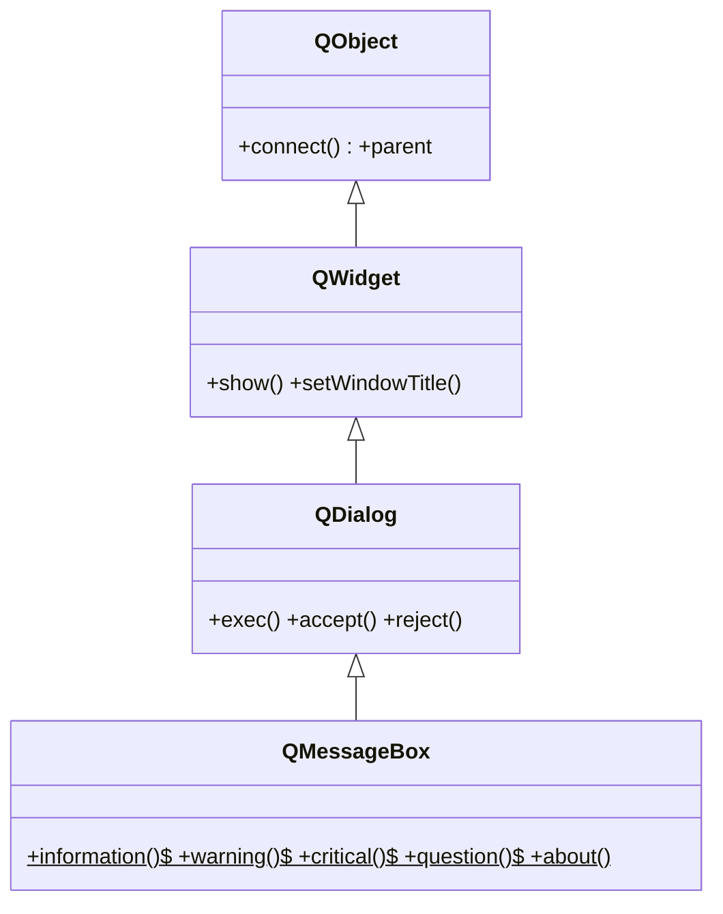

# QMessageBox — dialogo predefinido para informar, advertir o preguntar

`QMessageBox` es un **dialogo predefinido para mensajes**: sirve para informar al usuario, advertirle, mostrarle un error o hacerle una pregunta de si/no. Casi nunca se instancia: lo normal es llamar a sus **metodos estaticos** (`information`, `warning`, `critical`, `question`, `about`), que crean, muestran y cierran el dialogo en una sola linea y devuelven el boton pulsado. Solo se crea la instancia cuando hacen falta botones o iconos a medida.

## Importacion

```python
from PyQt6.QtWidgets import QMessageBox
```

## Herencia



Como dialogo, hereda de [[QDialog]] el `exec()` (lo muestra modal y bloquea hasta que se cierra) y de [[QWidget]] el titulo de ventana. Pero lo habitual es no tocar nada de eso: los metodos estaticos lo gestionan por dentro.

## Metodos estaticos

Esta es la forma de uso real. Todos reciben `parent` (la ventana madre del dialogo), un `titulo` y un `texto`, y devuelven el **boton pulsado** como `QMessageBox.StandardButton`.

```python
QMessageBox.information(parent, titulo: str, texto: str)   # -> StandardButton
QMessageBox.warning(parent, titulo: str, texto: str)       # -> StandardButton
QMessageBox.critical(parent, titulo: str, texto: str)      # -> StandardButton  (error grave)
QMessageBox.question(parent, titulo: str, texto: str,
                     buttons=QMessageBox.StandardButton.Yes | QMessageBox.StandardButton.No)  # -> StandardButton
QMessageBox.about(parent, titulo: str, texto: str)         # -> None
```

| Firma | Devuelve | Que hace |
|-------|----------|----------|
| `information(parent, titulo: str, texto: str)` | `StandardButton` | mensaje informativo (icono "i") |
| `warning(parent, titulo: str, texto: str)` | `StandardButton` | advertencia (icono triangulo) |
| `critical(parent, titulo: str, texto: str)` | `StandardButton` | error grave (icono rojo) |
| `question(parent, titulo, texto, buttons=...)` | `StandardButton` | pregunta; devuelve el boton pulsado (Yes/No...) |
| `about(parent, titulo: str, texto: str)` | `None` | cuadro "Acerca de" de la aplicacion |

Los botones son enums **con scope**: `QMessageBox.StandardButton.Yes`, `.No`, `.Ok`, `.Cancel`. Para leer la respuesta de una pregunta se compara contra ese enum:

```python
if QMessageBox.question(self, "Salir", "Deseas salir?") == QMessageBox.StandardButton.Yes:
    self.close()
```

## Casos de uso

```python
from PyQt6.QtWidgets import QApplication, QWidget, QMessageBox
import sys

app = QApplication(sys.argv)
w = QWidget(); w.show()

# 1. Aviso simple: solo informar (el retorno se ignora)
QMessageBox.information(w, "Listo", "El archivo se guardo correctamente.")

# 2. Pregunta de confirmacion: cerrar sin guardar (se lee el boton)
resp = QMessageBox.question(
    w, "Cambios sin guardar",
    "Hay cambios sin guardar. Quieres salir igualmente?",
    QMessageBox.StandardButton.Yes | QMessageBox.StandardButton.No,
)
if resp == QMessageBox.StandardButton.Yes:
    print("saliendo sin guardar")
else:
    print("cancelado, sigo editando")

# 3. Error critico
QMessageBox.critical(w, "Error", "No se pudo conectar al servidor.")

sys.exit(app.exec())
```

## Uso avanzado (instancia)

Para **botones o iconos personalizados** si se instancia: se configura el cuadro y se muestra con `exec()`.

```python
msg = QMessageBox()
msg.setWindowTitle("Confirmar")
msg.setText("El documento ha sido modificado.")
msg.setInformativeText("Quieres guardar los cambios?")
msg.setIcon(QMessageBox.Icon.Warning)
msg.setStandardButtons(
    QMessageBox.StandardButton.Save
    | QMessageBox.StandardButton.Discard
    | QMessageBox.StandardButton.Cancel
)
if msg.exec() == QMessageBox.StandardButton.Save:
    print("guardar")
```

## Errores comunes

| Error | Causa | Solucion |
|-------|-------|----------|
| El `if` nunca entra aunque pulse "Si" | comparas el resultado con el enum equivocado (`== True`, `== "Yes"`) | compara con `QMessageBox.StandardButton.Yes` |
| `AttributeError: type object 'QMessageBox' has no attribute 'Yes'` | en Qt6 los enums tienen scope | usa `QMessageBox.StandardButton.Yes`, no `QMessageBox.Yes` |
| El dialogo aparece "suelto" o sin centrar en la ventana | olvidaste el `parent` (pasaste `None`) | pasa la ventana madre como primer argumento |

## Notas relacionadas

- [[QDialog]] — la clase base de dialogos, aporta `exec()` y el comportamiento modal
- [[QFileDialog]] — otro dialogo predefinido, para elegir archivos o carpetas
