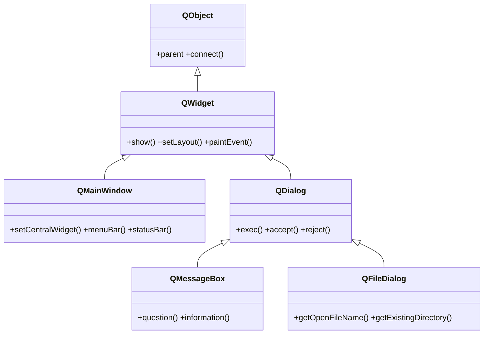
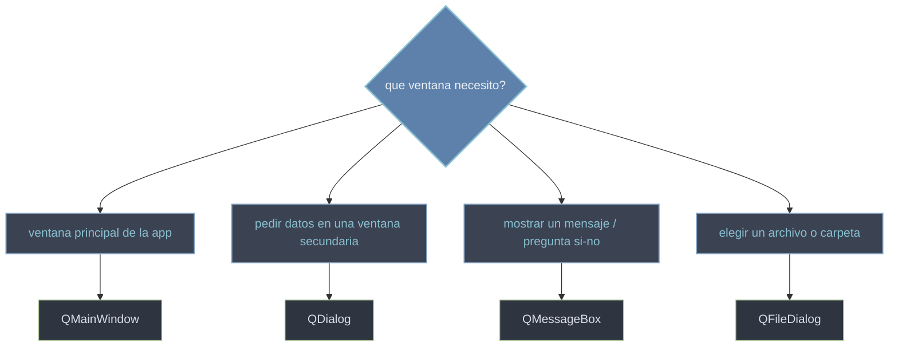

# QtWidgets/ventanas — ventana principal y dialogos

Esta carpeta agrupa las **ventanas de nivel superior**: las que aparecen como una ventana propia del sistema, sin un `parent` visual que las contenga. Son de dos clases. La **ventana principal** de la app es `QMainWindow`: trae de fabrica el armazon tipico de una aplicacion —barra de menus, barras de herramientas, barra de estado y un **widget central**—. Los **dialogos** son ventanas secundarias y suelen ser modales (bloquean el resto hasta que respondes): `QDialog` es el dialogo generico que construyes tu, y `QMessageBox`/`QFileDialog` son dialogos **predefinidos** para los dos casos mas comunes (mostrar un mensaje o pregunta, y elegir un archivo o carpeta). Todos son `QWidget`, asi que ya saben dibujarse, mostrarse con `show()` y recibir eventos; lo que añaden es la estructura propia de una ventana completa.

## En accion

```python
from PyQt6.QtWidgets import (
    QApplication, QMainWindow, QWidget, QVBoxLayout, QLabel, QPushButton
)
import sys

app = QApplication(sys.argv)

ventana = QMainWindow()                       # la ventana principal de la app
ventana.setWindowTitle("ventanas en accion")

central = QWidget()                           # el widget central obligatorio
layout = QVBoxLayout(central)                 # un layout dentro del central
layout.addWidget(QLabel("Contenido de la ventana"))
layout.addWidget(QPushButton("Pulsame"))
ventana.setCentralWidget(central)             # se cuelga en el centro

menu = ventana.menuBar().addMenu("&Archivo")  # un menu basico
menu.addAction("Salir", ventana.close)

ventana.statusBar().showMessage("Listo")      # la barra de estado, abajo

ventana.show()
sys.exit(app.exec())                          # exec() (PyQt6, sin guion bajo) bloquea
```

## Herencia



Todas las ventanas son una rama de `QWidget`: lo que no definen (dibujarse, `show()`, eventos) lo heredan de ahi. `QMainWindow` cuelga directo de `QWidget` y añade el armazon de la app. Los dialogos predefinidos `QMessageBox` y `QFileDialog` no cuelgan de `QWidget` directo: heredan de `QDialog`, asi que son dialogos ya construidos —el comportamiento modal y `accept`/`reject` les viene de `QDialog`.

## Que ventana uso



## Las clases

| Clase | Hereda de | Rol |
|-------|-----------|-----|
| [[QMainWindow]] | `QWidget` | la **ventana principal** de la app: widget central + menus, toolbars y statusbar |
| [[QDialog]] | `QWidget` | dialogo generico, modal o no modal; lo construyes tu con `exec`/`accept`/`reject` |
| [[QMessageBox]] | `QDialog` | dialogo predefinido para mensajes y preguntas (informacion, aviso, si\|no) |
| [[QFileDialog]] | `QDialog` | dialogo predefinido para elegir archivos o carpetas |

## Notas relacionadas

- [[QWidget]] — la base de la que cuelgan todas las ventanas (eventos, `show()`)
- [[concepto_event_loop]] — el bucle que mantiene viva la ventana y procesa sus eventos
