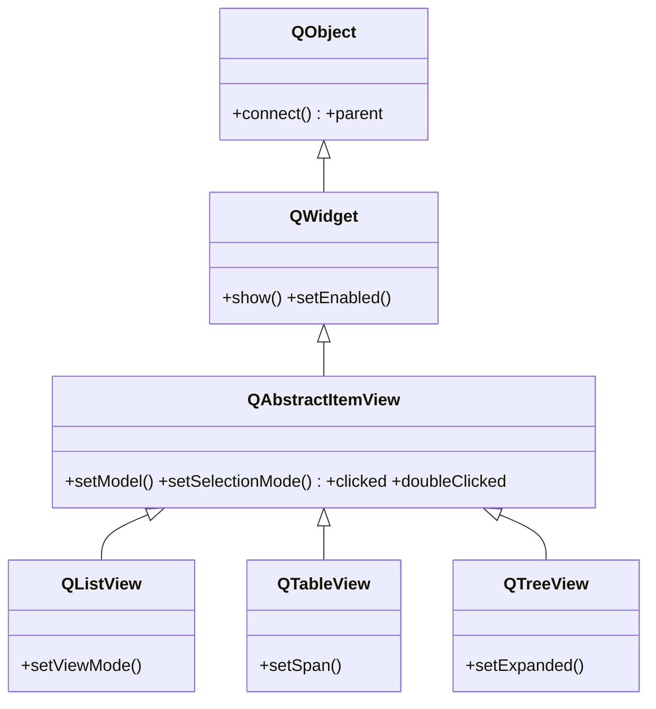

# QAbstractItemView — base de las vistas Modelo/Vista

`QAbstractItemView` es la clase base de las **vistas** del patron Modelo/Vista: `QListView`, `QTableView` y `QTreeView`. Su papel es **mostrar** los datos de un modelo y gestionar seleccion, edicion y scroll — pero **no almacena los datos**: eso es trabajo del modelo, que se conecta con `setModel`. Es abstracta: se usan sus hijas segun la forma de los datos (lista, tabla o arbol). Ver [[concepto_model_view]] para el modelo mental completo.

## Importacion

```python
from PyQt6.QtWidgets import QAbstractItemView
```

Util como tipo o para constantes (`QAbstractItemView.SelectionMode`, `EditTrigger`); para instanciar se usan las hijas.

## Herencia



Diagrama simplificado: entre `QAbstractItemView` y sus hijas hay clases intermedias en Qt, pero lo esencial es que **toda vista hereda de aqui** el conectar con un modelo, la seleccion y las señales de interaccion. De [[QWidget]] toma el ser visible; cada hija aporta su disposicion (lista, rejilla, arbol).

## Señales

| Señal | Cuando se emite | Argumentos |
|-------|-----------------|------------|
| `clicked` | al hacer clic en un item | `index: QModelIndex` |
| `doubleClicked` | al hacer doble clic en un item | `index: QModelIndex` |
| `activated` | al activar (Enter o doble clic, segun plataforma) | `index: QModelIndex` |
| `pressed` | al presionar el boton del raton sobre un item | `index: QModelIndex` |
| `entered` | al pasar el raton sobre un item (con mouse tracking) | `index: QModelIndex` |

```python
vista.doubleClicked.connect(self.abrir_detalle)   # recibe el QModelIndex
```

## Propiedades

| Propiedad | Tipo | Leer \| escribir | Controla |
|-----------|------|------------------|----------|
| `selectionMode` | `QAbstractItemView.SelectionMode` | `selectionMode()` \| `setSelectionMode(modo)` | cuantos items se pueden seleccionar |
| `editTriggers` | `QAbstractItemView.EditTrigger` | `editTriggers()` \| `setEditTriggers(...)` | que gesto inicia la edicion de una celda |
| `alternatingRowColors` | `bool` | `alternatingRowColors()` \| `setAlternatingRowColors(bool)` | filas en colores alternos |
| `model` | `QAbstractItemModel` | `model()` \| `setModel(model)` | el modelo de datos que muestra la vista |

## Constructor y metodos

```python
QAbstractItemView(parent: QWidget | None = None)
```

Es abstracta: no se instancia directo. Estos metodos los heredan todas las vistas:

| Firma | Devuelve | Que hace |
|-------|----------|----------|
| `setModel(model: QAbstractItemModel)` | `None` | conecta la vista a un modelo de datos |
| `model()` | `QAbstractItemModel \| None` | el modelo actual |
| `setSelectionModel(sel: QItemSelectionModel)` | `None` | reemplaza el modelo de seleccion |
| `currentIndex()` | `QModelIndex` | el item actualmente activo |
| `setCurrentIndex(index: QModelIndex)` | `None` | mueve el foco/seleccion a ese item |
| `setSelectionMode(mode: QAbstractItemView.SelectionMode)` | `None` | fija cuantos items se pueden seleccionar |
| `setEditTriggers(triggers: QAbstractItemView.EditTrigger)` | `None` | define que gesto activa la edicion |
| `setItemDelegate(delegate: QAbstractItemDelegate)` | `None` | instala el delegate que dibuja/edita las celdas |

> En PyQt6 los enums tienen scope: `QAbstractItemView.SelectionMode.SingleSelection`.

## Casos de uso

El patron central: crear vista, crear modelo, conectarlos con `setModel`, conectar señales.

```python
from PyQt6.QtWidgets import QApplication, QListView
from PyQt6.QtCore import QStringListModel, QModelIndex
import sys

app = QApplication(sys.argv)

vista = QListView()
modelo = QStringListModel(["Manzana", "Pera", "Uva"])
vista.setModel(modelo)                              # vista <-> modelo

vista.setSelectionMode(QListView.SelectionMode.SingleSelection)
vista.doubleClicked.connect(
    lambda idx: print("doble clic en:", idx.data())  # idx es un QModelIndex
)

vista.show()
sys.exit(app.exec())
```

## Personalizar (subclasear)

Lo habitual no es subclasear la vista, sino instalar un **delegate**: una subclase de `QStyledItemDelegate` pasada con `setItemDelegate`, que sobreescribe `paint` para dibujar celdas a medida y `createEditor` para editarlas. Subclasear la propia vista solo hace falta para comportamiento de interaccion muy especifico. Modelo y delegate cubren casi todo; ver [[concepto_model_view]].

## Errores comunes

| Error | Causa | Solucion |
|-------|-------|----------|
| La vista aparece vacia | no le asignaste modelo | llama a `setModel(modelo)` |
| Mi slot de `clicked` falla al usar el argumento | la señal emite un `QModelIndex`, no texto | usa `index.data()` / `index.row()` sobre el `QModelIndex` |
| Puedo seleccionar varias filas sin querer | el modo de seleccion por defecto lo permite | `setSelectionMode(... .SingleSelection)` |
| Edita celdas al hacer doble clic sin querer | hay `editTriggers` activos | `setEditTriggers(... .NoEditTriggers)` |

## Notas relacionadas

- [[concepto_model_view]] — el patron Modelo/Vista/Delegate de Qt
- [[QWidget]] — de donde la vista hereda el ser visible
- [[QListView]] — la hija concreta mas simple
