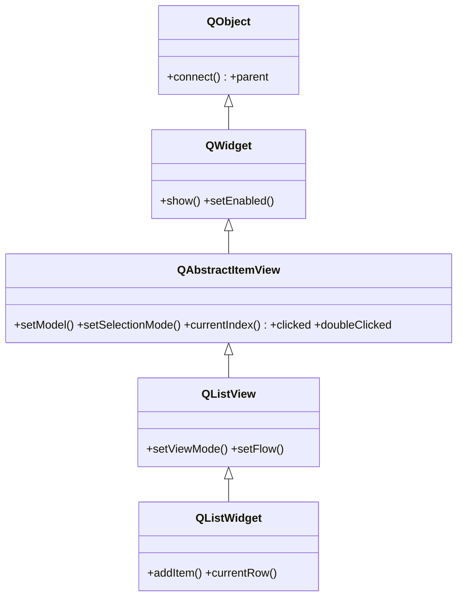

# QListView — vista de lista que muestra los items de un modelo

`QListView` es la **vista** mas simple del patron Modelo/Vista: muestra los items de un **modelo** en una sola columna (una lista). No almacena los datos: se los pide al modelo, que se conecta con `setModel`. Es la opcion cuando los datos son tuyos, grandes o se ven en varias vistas a la vez. Su version *convenience* item-based (modelo+vista en una clase, sin modelo aparte) es [[QListWidget]]. Ver [[concepto_model_view]] para el modelo mental completo.

## Importacion

```python
from PyQt6.QtWidgets import QListView
```

## Herencia



Lo esencial lo hereda de [[QAbstractItemView]]: conectar con un modelo (`setModel`), la seleccion, el `currentIndex()` y las senales de interaccion (`clicked`, `doubleClicked`, `activated`). De [[QWidget]] toma el ser visible. `QListView` apenas agrega lo suyo: la disposicion en lista o en rejilla de iconos (`setViewMode`, `setFlow`).

## Senales

Hereda las senales de [[QAbstractItemView]]; todas emiten el `QModelIndex` del item:

| Senal | Cuando se emite | Argumentos |
|-------|-----------------|------------|
| `clicked` | al hacer clic en un item | `index: QModelIndex` |
| `doubleClicked` | al hacer doble clic en un item | `index: QModelIndex` |
| `activated` | al activar (Enter o doble clic, segun plataforma) | `index: QModelIndex` |

```python
vista.clicked.connect(lambda idx: print(idx.data()))   # idx es un QModelIndex
```

## Propiedades

| Propiedad | Tipo | Leer \| escribir | Controla |
|-----------|------|------------------|----------|
| `viewMode` | `QListView.ViewMode` | `viewMode()` \| `setViewMode(modo)` | lista (`ListMode`) o rejilla de iconos (`IconMode`) |
| `flow` | `QListView.Flow` | `flow()` \| `setFlow(...)` | direccion en que se colocan los items |
| `model` | `QAbstractItemModel` | `model()` \| `setModel(model)` | el modelo de datos que muestra la vista (heredada) |
| `selectionMode` | `QAbstractItemView.SelectionMode` | `selectionMode()` \| `setSelectionMode(modo)` | cuantos items se pueden seleccionar (heredada) |

## Constructor y metodos

```python
QListView(parent: QWidget | None = None)
```

Constructor unico; lo normal es crearla vacia y conectarla a un modelo con `setModel`.

| Firma | Devuelve | Que hace |
|-------|----------|----------|
| `setModel(model: QAbstractItemModel)` | `None` | conecta la vista a un modelo de datos (heredado) |
| `setViewMode(mode: QListView.ViewMode)` | `None` | lista (`ListMode`) o rejilla de iconos (`IconMode`) |
| `setFlow(flow: QListView.Flow)` | `None` | direccion del flujo de items (`LeftToRight` / `TopToBottom`) |
| `setSelectionMode(mode: QAbstractItemView.SelectionMode)` | `None` | fija cuantos items se pueden seleccionar (heredado) |
| `currentIndex()` | `QModelIndex` | el item actualmente activo (heredado) |

> En PyQt6 los enums tienen scope: `QListView.ViewMode.IconMode`, `QListView.Flow.LeftToRight`, `QListView.SelectionMode.SingleSelection`.

## Casos de uso

El patron central: crear la vista, crear un modelo, conectarlos con `setModel`. La vista pide los datos al modelo sola.

```python
from PyQt6.QtWidgets import QApplication, QListView
from PyQt6.QtCore import QStringListModel
import sys

app = QApplication(sys.argv)

# 1. Lista de strings con un modelo ya hecho (QStringListModel)
vista = QListView()
modelo = QStringListModel(["Manzana", "Pera", "Uva"])
vista.setModel(modelo)                                  # vista <-> modelo
vista.setSelectionMode(QListView.SelectionMode.SingleSelection)
vista.clicked.connect(lambda idx: print("clic en:", idx.data()))

vista.show()
sys.exit(app.exec())
```

Para mostrar la misma lista como **rejilla de iconos**, basta cambiar el modo de vista:

```python
vista.setViewMode(QListView.ViewMode.IconMode)          # de lista a iconos
```

Con un `QStandardItemModel` puedes ademas dar icono y datos a cada item; el modelo guarda los datos y una o varias vistas los muestran.

## Cuando usar QListView vs QListWidget

| Necesitas... | Usa |
|--------------|-----|
| Datos propios (DB, lista en memoria), muchos items, o varias vistas del mismo dato | **`QListView`** + modelo |
| Una lista pequena y estatica, llenada item a item | **[[QListWidget]]** (convenience item-based) |

Regla practica: empieza con `QListWidget` si solo vas a volcar un punado de elementos fijos; pasa a `QListView` + modelo cuando los datos son tuyos, grandes o se reusan en otra vista, porque escala y no los duplica.

## Errores comunes

| Error | Causa | Solucion |
|-------|-------|----------|
| La vista aparece vacia | no le asignaste modelo | llama a `setModel(modelo)` |
| Intento editar la lista "en la vista" y no cambia | la vista no almacena datos, solo los muestra | edita el **modelo** (`modelo.setStringList(...)`), la vista se actualiza sola |
| Mi slot de `clicked` falla al usar el argumento | la senal emite un `QModelIndex`, no texto | usa `index.data()` / `index.row()` |
| Espero columnas y solo veo una | `QListView` es de una sola columna | para varias columnas usa `QTableView` |

## Notas relacionadas

- [[QAbstractItemView]] — la base que aporta `setModel`, seleccion y las senales
- [[QListWidget]] — la version convenience item-based (modelo+vista en una clase)
- [[concepto_model_view]] — el patron Modelo/Vista/Delegate de Qt
