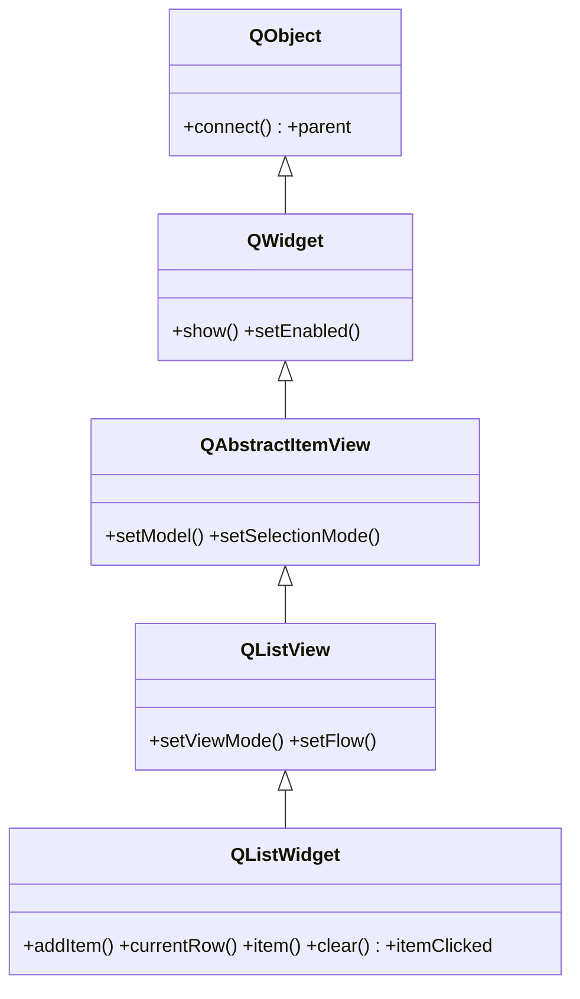

# QListWidget — lista convenience que junta modelo y vista

`QListWidget` es la version **convenience item-based** de [[QListView]]: junta modelo y vista en una sola clase, asi que la llenas con items directamente (sin modelo aparte). Cada elemento es un `QListWidgetItem`. Es la opcion mas simple para listas **pequeñas y estaticas**; para datos grandes o propios conviene `QListView` + un modelo. Ver [[concepto_model_view]] para el modelo mental completo.

## Importacion

```python
from PyQt6.QtWidgets import QListWidget, QListWidgetItem
```

## Herencia



Hereda de [[QListView]] toda la maquinaria de vista de lista (disposicion, seleccion, scroll, `setViewMode`) y a traves de ella de [[QAbstractItemView]]. Lo que agrega es un **modelo interno ya montado**: en vez de `setModel`, expone metodos item-based (`addItem`, `item`, `takeItem`) y señales que entregan el `QListWidgetItem` o el numero de fila, no un `QModelIndex`.

## Señales

A diferencia de las vistas puras, sus señales entregan el **item** (objeto) o la **fila** (int), no un `QModelIndex`:

| Señal | Cuando se emite | Argumentos |
|-------|-----------------|------------|
| `currentRowChanged` | cambia la fila seleccionada | `row: int` |
| `itemClicked` | al hacer clic en un item | `item: QListWidgetItem` |
| `itemDoubleClicked` | al hacer doble clic en un item | `item: QListWidgetItem` |
| `currentItemChanged` | cambia el item actual | `actual: QListWidgetItem, previo: QListWidgetItem` |

```python
lista.itemClicked.connect(lambda it: print(it.text()))     # it es un QListWidgetItem
lista.currentRowChanged.connect(lambda r: print("fila", r))  # r es un int
```

## Propiedades

| Propiedad | Tipo | Leer \| escribir | Controla |
|-----------|------|------------------|----------|
| `currentRow` | `int` | `currentRow()` \| `setCurrentRow(int)` | indice de la fila seleccionada (`-1` si ninguna) |
| `currentItem` | `QListWidgetItem` | `currentItem()` \| `setCurrentItem(item)` | el item seleccionado (objeto) |
| `count` | `int` | `count()` | cuantos items hay (solo lectura) |
| `selectionMode` | `QAbstractItemView.SelectionMode` | `selectionMode()` \| `setSelectionMode(modo)` | cuantos items se pueden seleccionar (heredada) |

## Constructor y metodos

```python
QListWidget(parent: QWidget | None = None)
```

Constructor unico; lo normal es crearla vacia y llenarla con `addItem` / `addItems`.

| Firma | Devuelve | Que hace |
|-------|----------|----------|
| `addItem(texto: str)` | `None` | agrega un item de texto al final (acepta tambien un `QListWidgetItem`) |
| `addItems(textos: list[str])` | `None` | agrega varios items de texto de golpe |
| `insertItem(row: int, texto: str)` | `None` | inserta un item en la fila indicada |
| `currentRow()` | `int` | indice de la fila seleccionada (`-1` si ninguna) |
| `setCurrentRow(row: int)` | `None` | selecciona esa fila |
| `currentItem()` | `QListWidgetItem` | el item seleccionado (objeto) |
| `item(row: int)` | `QListWidgetItem` | el item en esa fila |
| `takeItem(row: int)` | `QListWidgetItem` | quita y devuelve el item de esa fila |
| `clear()` | `None` | borra todos los items |
| `count()` | `int` | numero de items |

### QListWidgetItem

Cada elemento de la lista es un `QListWidgetItem` (no es un widget, es un dato visual). Sus metodos: `.text()` / `.setText(str)`, `.setIcon(QIcon)`, y datos arbitrarios con `.setData(role, valor)` / `.data(role)`. Para items con icono o datos propios, se crea el `QListWidgetItem(...)` y se pasa a `addItem(item)`:

```python
from PyQt6.QtWidgets import QListWidgetItem
from PyQt6.QtGui import QIcon

it = QListWidgetItem("Tarea importante")
it.setIcon(QIcon("estrella.png"))
lista.addItem(it)                       # addItem acepta str o QListWidgetItem
```

## Casos de uso

```python
from PyQt6.QtWidgets import QApplication, QListWidget
import sys

app = QApplication(sys.argv)

# Lista de tareas: se llena con addItem, sin modelo aparte
lista = QListWidget()
lista.addItems(["Comprar pan", "Llamar a Ana", "Estudiar Qt"])
lista.insertItem(0, "Despertar")              # al principio

# leer la seleccion: por item (texto) o por fila (int)
lista.itemClicked.connect(lambda it: print("clic:", it.text()))
lista.currentRowChanged.connect(lambda r: print("fila actual:", r))

lista.show()
sys.exit(app.exec())
```

## Errores comunes

| Error | Causa | Solucion |
|-------|-------|----------|
| Confundo `row` con el `item` | `currentRow()` da un `int`; `currentItem()` da el objeto | usa `row` para indices, `item` (o `item(row)`) para el `QListWidgetItem` |
| `currentItem().text()` lanza error | no hay seleccion, `currentItem()` es `None` | comprueba `if lista.currentItem():` antes |
| Va lento con miles de filas | item-based crea un objeto por item | migra a [[QListView]] + un modelo |
| Llamo a `setModel` y falla o no encaja | `QListWidget` ya trae su modelo interno | usa `addItem`/`item`; si necesitas modelo aparte, usa `QListView` |

## Notas relacionadas

- [[QListView]] — la vista de lista que consume un modelo aparte
- [[concepto_model_view]] — Widget (atajo) vs Vista+Modelo, cuando elegir cada uno
- [[QAbstractItemView]] — la base de todas las vistas Modelo/Vista
