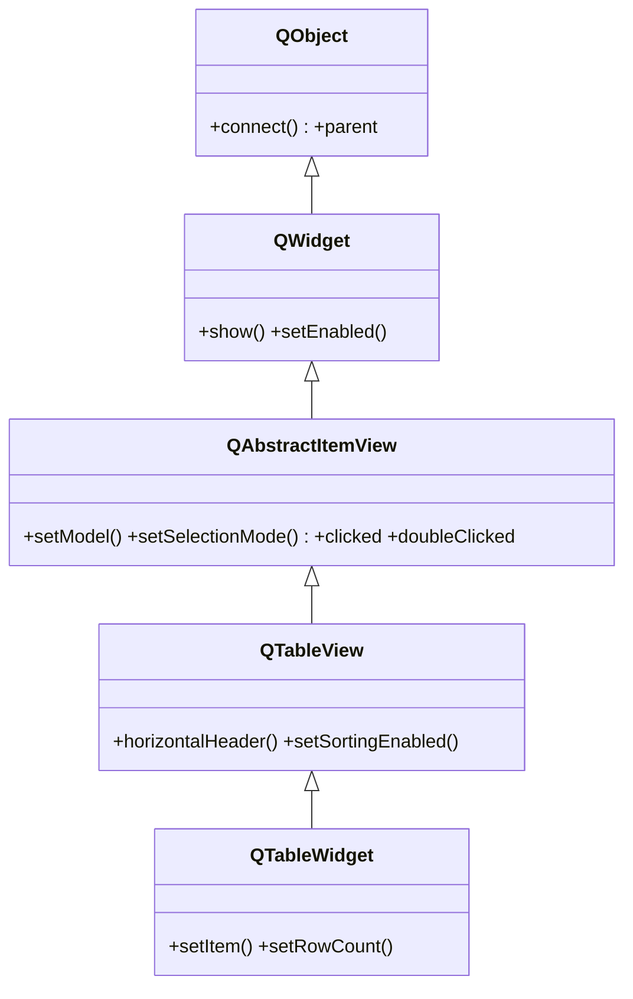

# QTableView — vista de tabla que muestra los datos de un modelo

`QTableView` es la **vista** de tabla (filas x columnas) del patron Modelo/Vista: no guarda datos, los **muestra** pidiendolos a un **modelo** que le conectas con `setModel`. Es la opcion para datos **propios o grandes** (una `QAbstractTableModel` que envuelve tu fuente real) o cuando quieres separar la logica de datos de su presentacion. Su version *convenience* item-based, que junta modelo y vista en una sola clase, es [[QTableWidget]]. Ver [[concepto_model_view]] para el modelo mental completo.

## Importacion

```python
from PyQt6.QtWidgets import QTableView
```

## Herencia



Lo que `QTableView` **no** define lo hereda: conectar con un modelo (`setModel`), la seleccion y las señales de interaccion (`clicked`, `doubleClicked`, `activated`) vienen de [[QAbstractItemView]]; el ser visible viene de [[QWidget]]. `QTableView` agrega lo propio de una rejilla: cabeceras (`horizontalHeader`, `verticalHeader`), ancho de columnas y ordenacion. De `QTableView` hereda a su vez [[QTableWidget]], el atajo item-based.

## Señales

Heredadas de [[QAbstractItemView]]; todas emiten un `QModelIndex`.

| Señal | Cuando se emite | Argumentos |
|-------|-----------------|------------|
| `clicked` | al hacer clic en una celda | `index: QModelIndex` |
| `doubleClicked` | al hacer doble clic en una celda | `index: QModelIndex` |
| `activated` | al activar (Enter o doble clic, segun plataforma) | `index: QModelIndex` |

```python
tabla.doubleClicked.connect(lambda idx: print(idx.row(), idx.column()))
```

## Propiedades

| Propiedad | Tipo | Leer \| escribir | Controla |
|-----------|------|------------------|----------|
| `model` | `QAbstractItemModel` | `model()` \| `setModel(model)` | el modelo de datos que muestra la tabla (de [[QAbstractItemView]]) |
| `sortingEnabled` | `bool` | `isSortingEnabled()` \| `setSortingEnabled(bool)` | si se puede ordenar al pulsar la cabecera |
| `showGrid` | `bool` | `showGrid()` \| `setShowGrid(bool)` | si se dibuja la rejilla entre celdas |
| `alternatingRowColors` | `bool` | `alternatingRowColors()` \| `setAlternatingRowColors(bool)` | filas en colores alternos (de [[QAbstractItemView]]) |

## Constructor y metodos

```python
QTableView(parent: QWidget | None = None)
```

| Firma | Devuelve | Que hace |
|-------|----------|----------|
| `setModel(model: QAbstractItemModel)` | `None` | conecta la tabla a su modelo de datos (heredado; imprescindible) |
| `horizontalHeader()` | `QHeaderView` | la cabecera de columnas (para estirar, ocultar, etc.) |
| `verticalHeader()` | `QHeaderView` | la cabecera de filas |
| `setColumnWidth(col: int, ancho: int)` | `None` | fija el ancho en px de una columna |
| `resizeColumnsToContents()` | `None` | ajusta cada columna al ancho de su contenido |
| `setSortingEnabled(on: bool)` | `None` | habilita ordenar al pulsar la cabecera |
| `hideColumn(col: int)` | `None` | oculta una columna por indice |

## Casos de uso

El patron central: crear vista, crear modelo, conectarlos con `setModel`, ajustar columnas y orden.

```python
from PyQt6.QtWidgets import QApplication, QTableView
from PyQt6.QtGui import QStandardItemModel, QStandardItem
import sys

app = QApplication(sys.argv)

# Modelo generico ya listo (sin subclasear nada)
modelo = QStandardItemModel(2, 2)
modelo.setHorizontalHeaderLabels(["Nombre", "Edad"])
modelo.setItem(0, 0, QStandardItem("Ana"));  modelo.setItem(0, 1, QStandardItem("30"))
modelo.setItem(1, 0, QStandardItem("Luis")); modelo.setItem(1, 1, QStandardItem("25"))

vista = QTableView()
vista.setModel(modelo)                 # vista <-> modelo
vista.resizeColumnsToContents()        # ajustar columnas al contenido
vista.setSortingEnabled(True)          # ordenar al pulsar la cabecera

vista.show()
sys.exit(app.exec())
```

Para **datos propios** (una base de datos, una lista en memoria) se subclasea `QAbstractTableModel` y se conecta igual con `setModel` — ver [[modelo_personalizado]]. Asi el mismo modelo puede alimentar varias vistas sin duplicar nada.

## Errores comunes

| Error | Causa | Solucion |
|-------|-------|----------|
| La tabla aparece vacia | no le asignaste modelo | llama a `setModel(modelo)` |
| Intentas hacer `setItem` en la vista | `setItem` es de [[QTableWidget]], no de la vista | usa el modelo para escribir datos, o usa `QTableWidget` |
| Modificas los datos "en la vista" y no persisten | en View+Model los datos viven en el **modelo** | edita el modelo; la vista solo lo presenta |
| Las columnas salen demasiado estrechas | anchos por defecto | `resizeColumnsToContents()` o `setColumnWidth(...)` |

## Notas relacionadas

- [[concepto_model_view]] — el patron Modelo/Vista/Delegate de Qt
- [[QAbstractItemView]] — la base que aporta `setModel`, seleccion y señales
- [[QTableWidget]] — el atajo item-based (modelo+vista en una clase)
