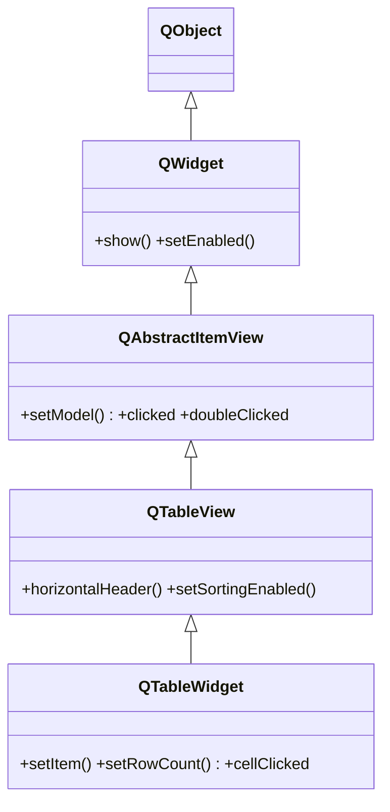

# QTableWidget — tabla convenience que se llena celda a celda

`QTableWidget` es la version *convenience* **item-based** de la tabla: junta modelo y vista en una sola clase, asi que **no manejas un modelo aparte**. Llenas la tabla celda a celda con objetos `QTableWidgetItem` (`setItem`), sin implementar nada. Es lo comodo para tablas **pequenas y estaticas**; para datos propios, grandes o varias vistas del mismo dato, usa la vista [[QTableView]] con un modelo. Ver [[concepto_model_view]] para cuando elegir cada una.

## Importacion

```python
from PyQt6.QtWidgets import QTableWidget, QTableWidgetItem
```

## Herencia



Lo que `QTableWidget` **no** define lo hereda: cabeceras, ordenacion y ancho de columnas vienen de [[QTableView]]; la seleccion y las senales `clicked`/`doubleClicked` de [[QAbstractItemView]]; el ser visible de [[QWidget]]. Lo propio que agrega es la API **item-based** (`setRowCount`, `setItem`, `item`) y senales en coordenadas de celda (`cellClicked(row, column)`), mas comodas que el `QModelIndex` de la vista base.

## Senales

| Senal | Cuando se emite | Argumentos |
|-------|-----------------|------------|
| `cellClicked` | al hacer clic en una celda | `row: int, column: int` |
| `cellChanged` | cuando cambia el contenido de una celda | `row: int, column: int` |
| `currentCellChanged` | al moverse la celda actual | `row, column, prevRow, prevColumn` |
| `itemSelectionChanged` | cuando cambia la seleccion | — |

```python
tabla.cellClicked.connect(lambda r, c: print("clic en", r, c))
```

## Propiedades

| Propiedad | Tipo | Leer \| escribir | Controla |
|-----------|------|------------------|----------|
| `rowCount` | `int` | `rowCount()` \| `setRowCount(int)` | numero de filas de la tabla |
| `columnCount` | `int` | `columnCount()` \| `setColumnCount(int)` | numero de columnas |
| `currentRow` | `int` | `currentRow()` | indice de la fila activa |
| `currentColumn` | `int` | `currentColumn()` | indice de la columna activa |

## Constructor y metodos

```python
QTableWidget(parent: QWidget | None = None)
QTableWidget(rows: int, columns: int, parent: QWidget | None = None)
```

La sobrecarga habitual es `QTableWidget(filas, columnas)`, que ya deja la tabla dimensionada.

| Firma | Devuelve | Que hace |
|-------|----------|----------|
| `setRowCount(rows: int)` | `None` | fija el numero de filas |
| `setColumnCount(columns: int)` | `None` | fija el numero de columnas |
| `setItem(row: int, column: int, item: QTableWidgetItem)` | `None` | coloca un item en una celda |
| `item(row: int, column: int)` | `QTableWidgetItem \| None` | el item de una celda (None si esta vacia) |
| `setHorizontalHeaderLabels(labels: list[str])` | `None` | pone las etiquetas de las columnas |
| `currentRow()` | `int` | indice de la fila actual |
| `currentColumn()` | `int` | indice de la columna actual |
| `rowCount()` | `int` | numero de filas |
| `columnCount()` | `int` | numero de columnas |
| `clearContents()` | `None` | borra los items, conservando filas/columnas |

### QTableWidgetItem

Cada celda es un `QTableWidgetItem`: el objeto que guarda el texto y el formato de esa celda. Se crea con su texto y se coloca con `setItem(r, c, item)`.

| Firma | Devuelve | Que hace |
|-------|----------|----------|
| `QTableWidgetItem(text: str)` | — | crea el item con su texto |
| `text()` | `str` | el texto de la celda |
| `setText(text: str)` | `None` | cambia el texto |
| `setBackground(brush: QBrush)` | `None` | color de fondo de la celda |

## Casos de uso

Dimensionar la tabla, ponerle cabeceras y rellenarla celda a celda.

```python
from PyQt6.QtWidgets import QApplication, QTableWidget, QTableWidgetItem
import sys

app = QApplication(sys.argv)

tabla = QTableWidget(3, 2)                              # 3 filas, 2 columnas
tabla.setHorizontalHeaderLabels(["Nombre", "Edad"])

datos = [("Ana", "30"), ("Luis", "25"), ("Eva", "41")]
for r, (nombre, edad) in enumerate(datos):
    tabla.setItem(r, 0, QTableWidgetItem(nombre))      # celda a celda
    tabla.setItem(r, 1, QTableWidgetItem(edad))

# Leer una celda (comprobando que no este vacia)
item = tabla.item(0, 0)
if item is not None:
    print(item.text())                                 # -> "Ana"

tabla.cellClicked.connect(lambda r, c: print("clic en", r, c))

tabla.show()
sys.exit(app.exec())
```

## Errores comunes

| Error | Causa | Solucion |
|-------|-------|----------|
| Los `setItem` no aparecen | la tabla es 0x0 | fija antes `setRowCount` / `setColumnCount` (o usa el constructor con filas/columnas) |
| `AttributeError` al hacer `tabla.item(r, c).text()` | la celda esta vacia y `item(r, c)` devolvio `None` | comprueba `if item is not None:` antes de `.text()` |
| Va lento con miles de filas | item-based crea un objeto por celda | migra a [[QTableView]] + `QAbstractTableModel` |
| Quieres datos desde una fuente externa (DB) | item-based no escala ni separa logica | usa View+Model en vez de Widget |

## Notas relacionadas

- [[concepto_model_view]] — Widget (atajo) vs View+Model: cuando elegir cada uno
- [[QTableView]] — la vista de tabla que consume un modelo (la base de esta clase)
