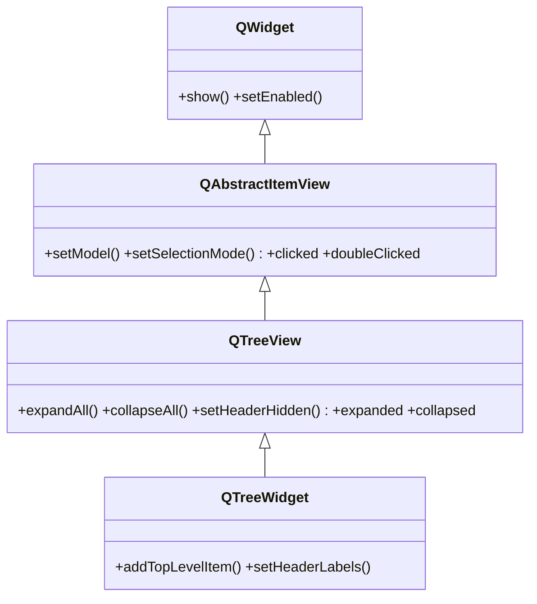

# QTreeView — vista de arbol jerarquico de un modelo

`QTreeView` es la **vista** que muestra los datos de un **modelo** en forma de **arbol** jerarquico: items que pueden tener hijos, expandibles y colapsables. Como toda vista del patron Modelo/Vista (ver [[concepto_model_view]]), no almacena los datos: los pide a un modelo que se conecta con `setModel`. La jerarquia (que item es hijo de cual) la define **el modelo**, no la vista. Usa `QTreeView` cuando tus datos son jerarquicos, propios o grandes; para arboles pequenos y estaticos hechos a mano esta [[QTreeWidget]].

## Importacion

```python
from PyQt6.QtWidgets import QTreeView
```

## Herencia



Todo lo de conectar un modelo, la seleccion y las senales `clicked`/`doubleClicked` lo hereda de [[QAbstractItemView]]; el ser visible viene de [[QWidget]]. `QTreeView` aporta lo especifico del arbol: expandir/colapsar nodos y la cabecera. `QTreeWidget` es su hija **convenience** item-based, que junta vista y modelo en una clase.

## Senales

| Senal | Cuando se emite | Argumentos |
|-------|-----------------|------------|
| `clicked` | al hacer clic en un item | `index: QModelIndex` |
| `doubleClicked` | al hacer doble clic en un item | `index: QModelIndex` |
| `expanded` | al expandir un nodo (mostrar sus hijos) | `index: QModelIndex` |
| `collapsed` | al colapsar un nodo (ocultar sus hijos) | `index: QModelIndex` |

```python
arbol.expanded.connect(lambda idx: print("abierto:", idx.data()))
```

## Propiedades

| Propiedad | Tipo | Leer \| escribir | Controla |
|-----------|------|------------------|----------|
| `headerHidden` | `bool` | `isHeaderHidden()` \| `setHeaderHidden(bool)` | si se oculta la fila de cabecera |
| `rootIsDecorated` | `bool` | `rootIsDecorated()` \| `setRootIsDecorated(bool)` | si los nodos raiz muestran el control de expandir |
| `itemsExpandable` | `bool` | `itemsExpandable()` \| `setItemsExpandable(bool)` | si el usuario puede expandir/colapsar |
| `model` | `QAbstractItemModel` | `model()` \| `setModel(model)` | el modelo de datos que muestra la vista (heredada) |

## Constructor y metodos

```python
QTreeView(parent: QWidget | None = None)
```

| Firma | Devuelve | Que hace |
|-------|----------|----------|
| `setModel(model: QAbstractItemModel)` | `None` | conecta la vista al modelo (heredada de [[QAbstractItemView]]) |
| `expandAll()` | `None` | expande todos los nodos del arbol |
| `collapseAll()` | `None` | colapsa todos los nodos |
| `expand(index: QModelIndex)` | `None` | expande el nodo de ese indice |
| `collapse(index: QModelIndex)` | `None` | colapsa el nodo de ese indice |
| `setHeaderHidden(hide: bool)` | `None` | oculta o muestra la fila de cabecera |
| `setColumnWidth(column: int, width: int)` | `None` | fija el ancho en pixeles de una columna |

## Casos de uso

Un modelo jerarquico con `QStandardItemModel`: cada nodo es un `QStandardItem` y los hijos se cuelgan con `appendRow` **sobre el item padre** (la jerarquia vive en el modelo).

```python
from PyQt6.QtWidgets import QApplication, QTreeView
from PyQt6.QtGui import QStandardItemModel, QStandardItem
import sys

app = QApplication(sys.argv)

modelo = QStandardItemModel()
modelo.setHorizontalHeaderLabels(["Estructura"])

raiz = QStandardItem("Proyecto")
hijo1 = QStandardItem("src")
hijo1.appendRow(QStandardItem("main.py"))     # nieto: hijo de hijo1
hijo1.appendRow(QStandardItem("utils.py"))
raiz.appendRow(hijo1)                          # la jerarquia se arma en el modelo
raiz.appendRow(QStandardItem("README.md"))
modelo.appendRow(raiz)

arbol = QTreeView()
arbol.setModel(modelo)                         # vista <-> modelo
arbol.expandAll()
arbol.show()

sys.exit(app.exec())
```

Un **explorador de archivos** real con `QFileSystemModel` (el modelo ya viene hecho: lee el disco):

```python
from PyQt6.QtWidgets import QApplication, QTreeView
from PyQt6.QtGui import QFileSystemModel
import sys

app = QApplication(sys.argv)

modelo = QFileSystemModel()
modelo.setRootPath("/")
arbol = QTreeView()
arbol.setModel(modelo)
arbol.setRootIndex(modelo.index("/home"))      # arranca en /home
arbol.show()

sys.exit(app.exec())
```

## Cuando QTreeView vs QTreeWidget

| Necesitas... | Usa |
|--------------|-----|
| Datos propios (disco, DB, lista en memoria), grandes, o varias vistas del mismo dato | **`QTreeView`** + modelo (`QStandardItemModel`, `QFileSystemModel`) |
| Un arbol pequeno y estatico que llenas a mano | **[[QTreeWidget]]** (item-based, sin modelo aparte) |

## Errores comunes

| Error | Causa | Solucion |
|-------|-------|----------|
| El arbol sale vacio | no le asignaste modelo | llama a `setModel(modelo)` |
| Intentas anadir hijos a la vista | la jerarquia se arma en el **modelo**, no en `QTreeView` | usa `appendRow`/`addChild` sobre los items del modelo |
| `clicked` falla al usar el argumento | la senal emite un `QModelIndex`, no texto | usa `index.data()` / `index.row()` |

## Notas relacionadas

- [[QAbstractItemView]] — la base que aporta `setModel`, seleccion y senales
- [[QTreeWidget]] — el atajo item-based del arbol
- [[concepto_model_view]] — el patron Modelo/Vista/Delegate de Qt
