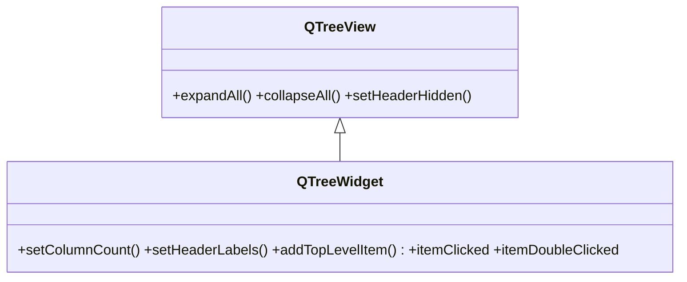

# QTreeWidget — arbol convenience item-based (sin modelo aparte)

`QTreeWidget` es la version **convenience** del arbol: junta vista y modelo en una sola clase, asi que se construye **item a item** con `QTreeWidgetItem` y sus hijos, **sin un modelo separado**. Es la via mas simple para arboles pequeños y estaticos. Por debajo es un [[QTreeView]] con su modelo interno: por eso piensas en *items*, no en indices ni en `setModel`. Para datos propios, grandes o compartidos por varias vistas, usa `QTreeView` + modelo (ver [[concepto_model_view]]).

## Importacion

```python
from PyQt6.QtWidgets import QTreeWidget, QTreeWidgetItem
```

## Herencia



Hereda de [[QTreeView]] todo lo de expandir/colapsar y la cabecera; lo que aporta es la API **item-based**: `addTopLevelItem`, `setHeaderLabels`, `currentItem`. Sus señales tambien cambian de plano: en vez de emitir un `QModelIndex` (como la vista), emiten directamente el `QTreeWidgetItem` afectado.

## Señales

| Señal | Cuando se emite | Argumentos |
|-------|-----------------|------------|
| `itemClicked` | al hacer clic en un item | `item: QTreeWidgetItem, column: int` |
| `itemDoubleClicked` | al hacer doble clic en un item | `item: QTreeWidgetItem, column: int` |
| `itemExpanded` | al expandir un item (mostrar sus hijos) | `item: QTreeWidgetItem` |
| `currentItemChanged` | al cambiar el item actual | `actual: QTreeWidgetItem, anterior: QTreeWidgetItem` |

```python
arbol.itemClicked.connect(lambda item, col: print(item.text(col)))
```

## Propiedades

| Propiedad | Tipo | Leer \| escribir | Controla |
|-----------|------|------------------|----------|
| `columnCount` | `int` | `columnCount()` \| `setColumnCount(int)` | numero de columnas del arbol |
| `headerHidden` | `bool` | `isHeaderHidden()` \| `setHeaderHidden(bool)` | si se oculta la cabecera (heredada) |
| `currentItem` | `QTreeWidgetItem` | `currentItem()` \| `setCurrentItem(item)` | el item activo |

## Constructor y metodos

```python
QTreeWidget(parent: QWidget | None = None)
```

| Firma | Devuelve | Que hace |
|-------|----------|----------|
| `setColumnCount(columns: int)` | `None` | fija cuantas columnas tiene el arbol |
| `setHeaderLabels(labels: list[str])` | `None` | pone los textos de la fila de cabecera (define columnas) |
| `addTopLevelItem(item: QTreeWidgetItem)` | `None` | añade un nodo de primer nivel (raiz) |
| `topLevelItem(index: int)` | `QTreeWidgetItem` | el nodo raiz en esa posicion |
| `currentItem()` | `QTreeWidgetItem` | el item actualmente seleccionado |
| `clear()` | `None` | borra todos los items |

## QTreeWidgetItem — el nodo

Cada nodo del arbol es un `QTreeWidgetItem`. Se añaden hijos con `padre.addChild(hijo)`, o creando el item con su padre directo: `QTreeWidgetItem(padre, ["texto"])`. La jerarquia se arma **encadenando items**, no con un modelo.

| Metodo | Devuelve | Que hace |
|--------|----------|----------|
| `addChild(item: QTreeWidgetItem)` | `None` | cuelga un item como hijo de este nodo |
| `text(column: int)` | `str` | el texto de esa columna |
| `setText(column: int, text: str)` | `None` | fija el texto de una columna |
| `setExpanded(expand: bool)` | `None` | expande o colapsa el nodo |

## Casos de uso

Un arbol de **categorias > subcategorias** con varias columnas: `setHeaderLabels` define las columnas, `addTopLevelItem` cuelga las raices y `addChild` los hijos.

```python
from PyQt6.QtWidgets import QApplication, QTreeWidget, QTreeWidgetItem
import sys

app = QApplication(sys.argv)

arbol = QTreeWidget()
arbol.setColumnCount(2)
arbol.setHeaderLabels(["Categoria", "Stock"])

frutas = QTreeWidgetItem(["Frutas", ""])       # nodo raiz
arbol.addTopLevelItem(frutas)
frutas.addChild(QTreeWidgetItem(["Manzana", "12"]))   # hijos
frutas.addChild(QTreeWidgetItem(["Pera", "5"]))

verduras = QTreeWidgetItem(["Verduras", ""])
arbol.addTopLevelItem(verduras)
QTreeWidgetItem(verduras, ["Zanahoria", "8"])  # crear con el padre directo

frutas.setExpanded(True)
arbol.itemClicked.connect(lambda item, col: print("clic:", item.text(0)))
arbol.show()

sys.exit(app.exec())
```

## Errores comunes

| Error | Causa | Solucion |
|-------|-------|----------|
| Solo se ve una columna | no fijaste columnas | llama a `setColumnCount(n)` o `setHeaderLabels([...])` |
| No aparece cabecera con nombres | no diste etiquetas | usa `setHeaderLabels([...])` |
| Confundes item con indice | `QTreeWidget` es item-based, no usa `QModelIndex` | trabaja con `QTreeWidgetItem` (`currentItem`, `topLevelItem`), no con indices |
| El texto sale en la columna equivocada | `text`/`setText` reciben el numero de columna | pasa el indice de columna correcto a `setText(col, ...)` |

## Notas relacionadas

- [[QTreeView]] — la vista de arbol con modelo de la que hereda
- [[concepto_model_view]] — por que el Widget es el atajo item-based
- [[QAbstractItemView]] — la base de todas las vistas
