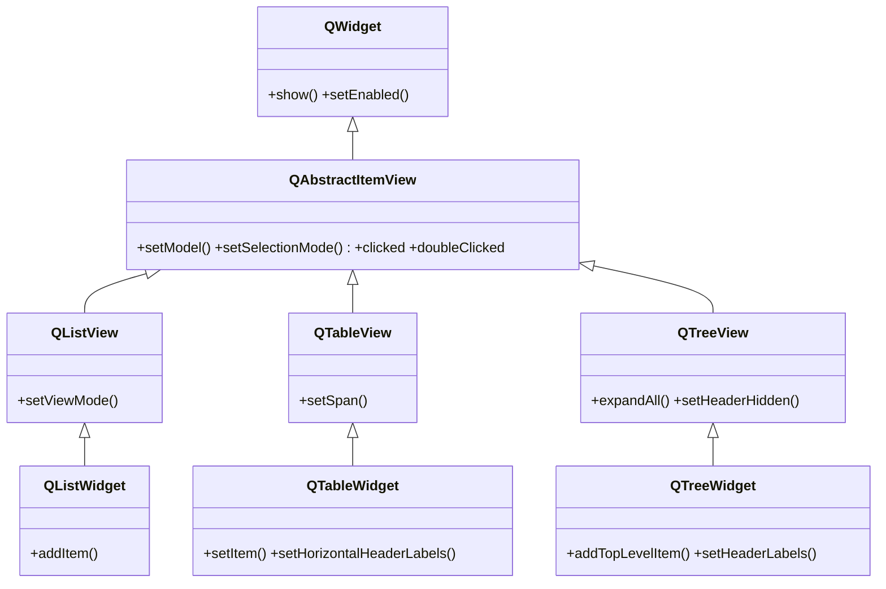
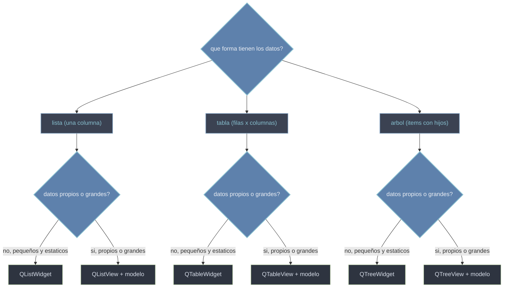

# QtWidgets/vistas — listas, tablas y arboles (Modelo/Vista)

Esta carpeta agrupa los widgets que muestran **COLECCIONES** de datos: listas, tablas y arboles. La distincion central es como manejan esos datos. Las **View** (`QListView`, `QTableView`, `QTreeView`) muestran un **modelo** separado: la vista pinta, el modelo guarda, y se conectan con `setModel`. Los **Widget** (`QListWidget`, `QTableWidget`, `QTreeWidget`) son la version *convenience* **item-based**: juntan modelo y vista en una clase, asi que cargas los datos item a item sin modelo aparte. El Widget es mas simple para datos pequeños y estaticos; la View escala a datos propios, grandes o compartidos. Todo el modelo mental esta en [[concepto_model_view]].

## En accion

La via *convenience* mas directa: un `QTableWidget` que rellenas celda a celda con cabeceras, sin definir ningun modelo.

```python
from PyQt6.QtWidgets import QApplication, QTableWidget, QTableWidgetItem
import sys

app = QApplication(sys.argv)

tabla = QTableWidget(2, 2)                          # 2 filas, 2 columnas
tabla.setHorizontalHeaderLabels(["Nombre", "Edad"])
tabla.setItem(0, 0, QTableWidgetItem("Ana"))        # celda a celda
tabla.setItem(0, 1, QTableWidgetItem("30"))
tabla.setItem(1, 0, QTableWidgetItem("Luis"))
tabla.setItem(1, 1, QTableWidgetItem("25"))
tabla.show()

sys.exit(app.exec())
```

## Herencia



Toda vista hereda de [[QAbstractItemView]] el conectar con un modelo, la seleccion y las señales; cada **View** aporta su forma (lista, tabla, arbol) y cada **Widget** cuelga de su View como atajo item-based.

## Que vista uso



## Las clases

| Clase | Hereda de | Tipo | Rol |
|-------|-----------|------|-----|
| [[QAbstractItemView]] | `QWidget` | base | base abstracta de todas las vistas: `setModel`, seleccion, señales |
| `QListView` | `QAbstractItemView` | View con modelo | muestra un modelo como **lista** de una columna |
| `QTableView` | `QAbstractItemView` | View con modelo | muestra un modelo como **tabla** de filas y columnas |
| [[QTreeView]] | `QAbstractItemView` | View con modelo | muestra un modelo como **arbol** jerarquico |
| `QListWidget` | `QListView` | Widget convenience | lista item-based, sin modelo aparte |
| `QTableWidget` | `QTableView` | Widget convenience | tabla item-based, sin modelo aparte |
| [[QTreeWidget]] | `QTreeView` | Widget convenience | arbol item-based, sin modelo aparte |

## Notas relacionadas

- [[concepto_model_view]] — el patron Modelo/Vista/Delegate y cuando Widget vs View
- [[QAbstractItemView]] — la base comun de todas las vistas
- [[modelo_personalizado]] — subclasear un modelo para una View con datos propios
