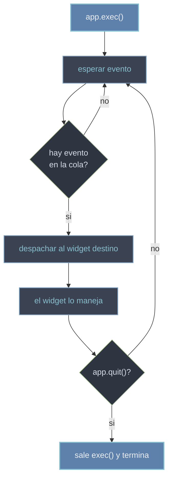

# el bucle de eventos — QApplication.exec

El **event loop** (bucle de eventos) es el bucle infinito que espera y despacha los eventos de la aplicacion: clics de raton, pulsaciones de teclado, timers, peticiones de repintado. Mientras corre, recibe cada evento que llega del sistema y se lo entrega al widget que corresponde. Se arranca con `app.exec()`, que **BLOQUEA** la ejecucion: la linea siguiente no corre hasta que la aplicacion se cierra. Sin el, la ventana se muestra pero no responde a nada.

## Por que existe

Una GUI no es un programa lineal que termina: es reactiva. Tiene que quedarse viva esperando lo que haga el usuario y reaccionar en el momento. El event loop es ese "estar a la espera": en vez de que tu codigo pregunte constantemente "hubo un clic?", el loop recibe los eventos del sistema operativo y los reparte a quien toca. Por eso toda app PyQt6 termina en `app.exec()`.

## Como funciona

`QApplication` es **unica por aplicacion** (una sola instancia) y debe crearse **antes** que cualquier widget. Su metodo `exec()` arranca el loop; `quit()` lo detiene; `processEvents()` procesa los eventos pendientes sin bloquear.

```python
from PyQt6.QtWidgets import QApplication, QLabel
import sys

app = QApplication(sys.argv)        # unica, ANTES de crear widgets

etiqueta = QLabel("Hola")
etiqueta.show()

sys.exit(app.exec())                # arranca el loop y BLOQUEA hasta cerrar
# esta linea NO corre hasta que la ventana se cierra
```

Los eventos se **encolan** y se entregan a los widgets uno a uno, en orden. El loop saca un evento de la cola, lo despacha al widget destino, este lo maneja, y el loop vuelve a esperar el siguiente.



## No bloquees el loop

Como el loop es **un solo hilo**, mientras se ejecuta un slot el loop esta parado: no despacha mas eventos. Una operacion larga dentro de un slot **congela la GUI** (no repinta, no responde a clics) hasta que termina.

```python
from PyQt6.QtWidgets import QApplication, QPushButton
import sys, time

app = QApplication(sys.argv)

boton = QPushButton("Calcular")
boton.clicked.connect(lambda: time.sleep(5))   # MAL: congela la ventana 5 s
boton.show()

sys.exit(app.exec())
```

Durante esos 5 segundos la ventana no se puede mover ni cerrar: el loop esta bloqueado esperando que el slot retorne. Soluciones:

- Mover el trabajo pesado a un `QThread` (el loop sigue libre y reacciona).
- Trocear el trabajo y llamar `app.processEvents()` entre trozos para que el loop respire (con cuidado: puede reentrar y complicar el estado).

## Errores comunes

| Error | Causa | Solucion |
|-------|-------|----------|
| El codigo despues de `app.exec()` no corre | `exec()` BLOQUEA hasta que la app se cierra | pon ahi solo limpieza de cierre; el resto va antes o en slots |
| `QWidget: Must construct a QApplication before a QWidget` | creaste widgets antes de `QApplication` | crea `QApplication(sys.argv)` primero, luego los widgets |
| La GUI se congela al pulsar un boton | un slot hace trabajo pesado y bloquea el loop | mueve el trabajo a un `QThread` o trocealo con `processEvents()` |
| Llamas `exec_()` y falla | `exec_()` es PyQt5; en Qt6 es sin guion bajo | usa `app.exec()` |

## Notas relacionadas

- [[concepto_signals_slots]] — los slots se ejecutan dentro del loop; no los bloquees
- [[concepto_sistema_eventos]] — que son los eventos que el loop despacha
