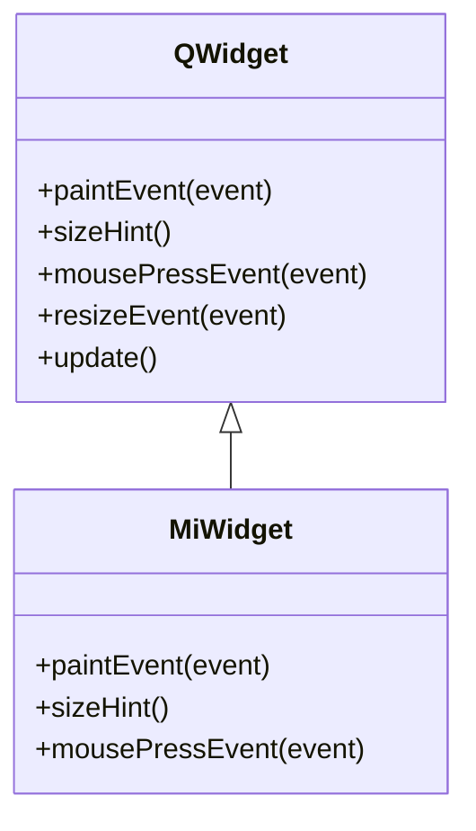

# subclasear para personalizar — el patron clave de Qt

La forma natural de crear algo propio en Qt no es configurar un objeto desde fuera, sino **subclasear** una clase existente y **sobreescribir sus metodos**. Quieres un widget que se dibuje a tu manera: heredas de `QWidget` y reescribes `paintEvent`. Quieres tu ventana principal: heredas de `QMainWindow` y montas todo en `__init__`. Qt esta disenado para que extiendas su comportamiento redefiniendo los metodos que el framework ya llama por ti. Regla inquebrantable: en `__init__` de cualquier subclase **debes** llamar a `super().__init__(parent)`, porque ahi es donde Qt inicializa el objeto C++ subyacente.

## Por que existe

Muchos comportamientos de Qt son "ganchos" (hooks): el framework decide *cuando* repintar, *cuando* hubo un clic o *que* tamano preferido tiene un widget, y para saber *como* responder llama a metodos virtuales de tu clase. No los invocas tu; los invoca el event loop. Subclasear y sobreescribir esos metodos es la unica via para inyectar tu logica en ese flujo. Es el mismo principio que el arbol de objetos o las senales: extiendes `QObject` y sus descendientes en lugar de pelearte con ellos desde fuera.

```python
# No "configuras" un widget para que se dibuje distinto:
# heredas y reescribes el metodo que Qt llamara al repintar.
class MiWidget(QWidget):
    def paintEvent(self, event):     # Qt lo llama solo, cuando toca repintar
        ...                          # aqui va tu dibujo
```

## Como funciona

Subclaseas, llamas a `super().__init__(parent)` y sobreescribes los metodos que necesites. Estos son los mas habituales:

| Metodo | Cuando lo llama Qt | Para que se sobreescribe |
|--------|--------------------|--------------------------|
| `paintEvent(self, event)` | cada vez que el widget debe redibujarse | dibujar con `QPainter` |
| `sizeHint(self)` | al calcular el layout | declarar el tamano preferido (`QSize`) |
| `mousePressEvent(self, event)` | al pulsar el raton sobre el widget | reaccionar al clic |
| `mouseMoveEvent(self, event)` | al mover el raton sobre el widget | arrastrar, seguir el cursor |
| `resizeEvent(self, event)` | al cambiar de tamano el widget | recolocar contenido segun el nuevo tamano |

### Subclasear la ventana principal

El patron mas comun de toda app PyQt: heredar de `QMainWindow` y construir la interfaz en `__init__`.

```python
from PyQt6.QtWidgets import QApplication, QMainWindow, QPushButton
import sys

class Ventana(QMainWindow):
    def __init__(self):
        super().__init__()                      # OBLIGATORIO y lo primero
        self.setWindowTitle("Mi app")
        self.boton = QPushButton("Pulsame", self)
        self.setCentralWidget(self.boton)

app = QApplication(sys.argv)
ventana = Ventana()
ventana.show()
sys.exit(app.exec())
```

### Ejemplo: un widget que se dibuja a si mismo

Aqui esta el corazon del patron. `CirculoWidget` hereda de `QWidget`, declara su tamano preferido con `sizeHint` y se dibuja en `paintEvent` usando `QPainter` y `QBrush`.

```python
from PyQt6.QtWidgets import QApplication, QWidget
from PyQt6.QtGui import QPainter, QBrush, QColor
from PyQt6.QtCore import QSize, Qt
import sys

class CirculoWidget(QWidget):
    def __init__(self, parent=None):
        super().__init__(parent)            # imprescindible

    def sizeHint(self):
        return QSize(160, 160)              # tamano preferido del widget

    def paintEvent(self, event):
        painter = QPainter(self)
        painter.setRenderHint(QPainter.RenderHint.Antialiasing)
        painter.setBrush(QBrush(QColor("#88c0d0")))
        painter.drawEllipse(20, 20, 120, 120)   # dibuja el circulo
        # el QPainter se cierra solo al destruirse al final del metodo

app = QApplication(sys.argv)
w = CirculoWidget()
w.show()
sys.exit(app.exec())
```

Para forzar un repintado tras cambiar algo (un color, una posicion), no llames a `paintEvent` directamente: llama a `self.update()`, que agenda un `paintEvent` en el event loop.



> [!tip] La receta completa
> Para el paso a paso de construir un widget propio (estructura, dibujo, interaccion y
> repintado) consulta [[widget_personalizado]].

## Errores comunes

| Error | Causa | Solucion |
|-------|-------|----------|
| `RuntimeError` o crash al crear la subclase | olvidaste `super().__init__(parent)` en `__init__` | llamalo siempre, y lo primero, en cada subclase de `QObject`/`QWidget` |
| El dibujo no aparece o parpadea | pintas fuera de `paintEvent` (creas `QPainter(self)` en otro metodo) | dibuja **solo** dentro de `paintEvent` |
| El widget no se redibuja tras cambiar un dato | no avisaste a Qt de que hay que repintar | llama a `self.update()` (nunca a `paintEvent()` a mano) |
| El layout ignora tu tamano | no sobreescribiste `sizeHint` (o devuelve algo invalido) | devuelve un `QSize` valido en `sizeHint` |
| Los eventos de raton no llegan | sobreescribiste un metodo con la firma equivocada | respeta la firma exacta, ej. `mousePressEvent(self, event)` |

## Notas relacionadas

- [[widget_personalizado]] — la receta detallada de un widget propio
- [[concepto_qobject_arbol]] — `super().__init__(parent)` inicializa el objeto y fija el parent
- [[concepto_signals_slots]] — la otra via de extension: comunicar objetos con senales
