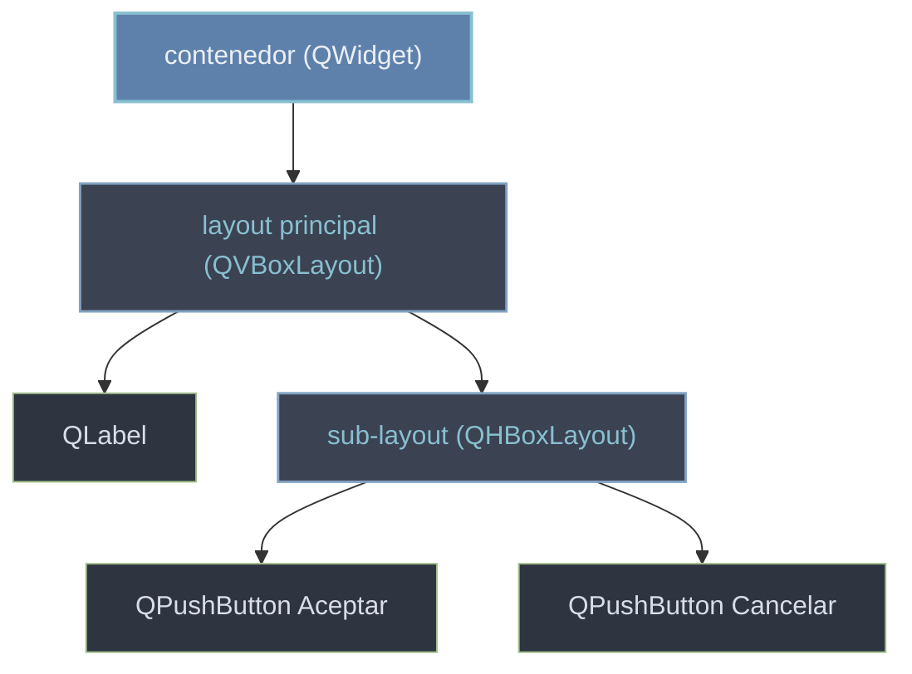

# gestion geometrica con layouts — posicionar widgets automaticamente

Un **layout** (`QVBoxLayout`, `QHBoxLayout`, `QGridLayout`, `QFormLayout`) coloca y redimensiona los widgets **automaticamente** cuando cambia el tamaño de la ventana. Es la alternativa a posicionar a mano con `setGeometry`/`move`, que fija coordenadas rigidas y no se adapta. Un layout no es un widget: hereda de `QLayout` y se encarga de gestionar la geometria de los widgets que contiene.

## Por que existe

Si colocas los widgets a mano (`boton.move(10, 40)`, `boton.setGeometry(...)`), la interfaz queda clavada a unas coordenadas: al maximizar la ventana, cambiar la fuente o traducir el texto, todo se descuadra. El layout resuelve esto: tu describes la **relacion** entre widgets (en columna, en fila, en rejilla) y el layout recalcula posiciones y tamaños en cada redimension.

```python
# A mano (rigido): coordenadas fijas, no se adapta.
boton.setGeometry(10, 40, 80, 30)

# Con layout (flexible): describes la composicion, Qt recoloca solo.
layout.addWidget(boton)
```

## Como funciona

Un layout se asigna a un **contenedor** (un `QWidget`) de dos formas equivalentes, y se llena con metodos `add...`:

```python
from PyQt6.QtWidgets import QApplication, QWidget, QVBoxLayout, QPushButton
import sys

app = QApplication(sys.argv)
ventana = QWidget()

layout = QVBoxLayout(ventana)        # 1) pasar el contenedor al constructor
# ventana.setLayout(layout)          #    o 2) asignarlo despues; equivalente

layout.addWidget(QPushButton("Arriba"))
layout.addWidget(QPushButton("Abajo"))

ventana.show()
sys.exit(app.exec())
```

Metodos para llenar un layout:

- `addWidget(w)` — añade un widget.
- `addLayout(sub)` — anida otro layout (composicion).
- `addStretch()` — inserta un espacio elastico que empuja al resto.
- `addSpacing(px)` — un hueco fijo en pixeles.

## Jerarquia de composicion

Un contenedor recibe un layout, y el layout contiene widgets u otros layouts, que a su vez contienen mas widgets. Asi se compone toda la UI:



## Anidar layouts

Anidar un `QHBoxLayout` dentro de un `QVBoxLayout` es el patron base de casi cualquier dialogo: contenido en columna y, al fondo, una fila de botones alineada a la derecha con un stretch:

```python
from PyQt6.QtWidgets import (QApplication, QWidget, QVBoxLayout,
                             QHBoxLayout, QLabel, QPushButton)
import sys

app = QApplication(sys.argv)
ventana = QWidget()

raiz = QVBoxLayout(ventana)
raiz.addWidget(QLabel("Confirmas la operacion?"))

fila = QHBoxLayout()
fila.addStretch()                       # empuja los botones a la derecha
fila.addWidget(QPushButton("Cancelar"))
fila.addWidget(QPushButton("Aceptar"))
raiz.addLayout(fila)                    # anidar la fila dentro de la columna

ventana.show()
sys.exit(app.exec())
```

## QFormLayout — etiqueta + campo

`QFormLayout` esta pensado para formularios: cada fila es una etiqueta y su campo, alineados en dos columnas:

```python
from PyQt6.QtWidgets import QApplication, QWidget, QFormLayout, QLineEdit, QSpinBox
import sys

app = QApplication(sys.argv)
ventana = QWidget()

form = QFormLayout(ventana)
form.addRow("Nombre:", QLineEdit())     # etiqueta (str) + widget
form.addRow("Edad:", QSpinBox())

ventana.show()
sys.exit(app.exec())
```

## Control fino del espacio

| Ajuste | Metodo | Efecto |
|---|---|---|
| Factor de crecimiento | `addWidget(w, stretch=1)` | reparte el espacio sobrante segun el peso |
| Espacio elastico | `addStretch(1)` | empuja widgets a un extremo |
| Hueco entre widgets | `setSpacing(px)` | separacion uniforme |
| Margen del borde | `setContentsMargins(l, t, r, b)` | aire alrededor del contenido |
| Alineacion | `setAlignment(w, Qt.AlignmentFlag.AlignRight)` | alinea un widget dentro de su celda |

El `stretch` es la clave de la flexibilidad: dos widgets con `stretch=1` y `stretch=2` reparten el espacio extra en proporcion 1:2 al redimensionar.

## Errores comunes

| Error | Causa | Solucion |
|-------|-------|----------|
| El widget aparece en `(0,0)` y no se redimensiona | lo creaste con `parent` pero no lo metiste en un layout | anadelo con `layout.addWidget(w)` |
| `QWidget::setLayout: Attempting to set QLayout which already has a layout` | asignaste dos layouts al mismo contenedor | un solo layout por widget; para mas niveles, anida con `addLayout` |
| Las posiciones se descuadran al maximizar | mezclaste `setGeometry`/`move` con un layout | usa solo el layout; no fijes geometria a mano dentro de el |
| El layout ignora un widget | lo creaste sin parent y sin anadirlo al layout | todo widget visible va dentro del layout o de su contenedor |

## Notas relacionadas

- [[QWidget]] — el contenedor al que se le asigna un layout
- [[QVBoxLayout]] — apilar widgets en columna
- [[concepto_qobject_arbol]] — los layouts tambien son `QObject` (gestionan, no se dibujan)
