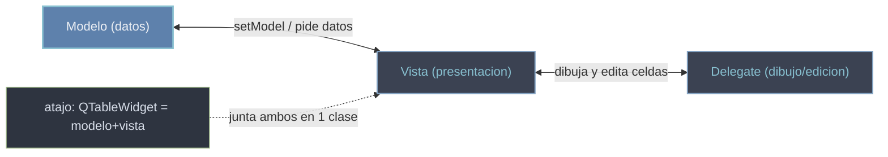

# arquitectura Modelo/Vista — separar los datos de su presentacion

Qt separa los **DATOS** de su **PRESENTACION**. El **modelo** guarda y provee los datos; la **vista** los muestra en pantalla; el **delegate** los dibuja y se encarga de su edicion. Asi una lista de registros (el modelo) puede aparecer a la vez en una tabla y en un arbol (dos vistas) sin duplicar nada: la vista no conoce los datos, solo se los pide al modelo cuando los necesita.

## Por que existe

Mezclar datos y UI te ata: si guardas los valores dentro de los propios items de la interfaz, no puedes mostrarlos de otra forma ni alimentarlos desde tu fuente real (una base de datos, una lista en memoria) sin copiarlos. Separar modelo de vista da tres ventajas:

- un **mismo modelo en VARIAS vistas** a la vez, siempre sincronizadas;
- **datos grandes eficientes**: la vista solo pide al modelo las celdas **visibles**, no carga millones de filas en memoria;
- **separacion logica/UI**: tu logica de datos vive en el modelo, aislada de como se pinta.

Modelos base (todos heredan de `QAbstractItemModel`): `QAbstractTableModel`, `QAbstractListModel` y `QStandardItemModel` (un modelo generico ya listo para usar). Vistas (heredan de `QAbstractItemView`): `QListView`, `QTableView` y `QTreeView`.



## Vista + Widget (atajo) vs Vista + Modelo

Qt ofrece un **atajo (convenience)**: `QListWidget`, `QTableWidget` y `QTreeWidget` juntan modelo y vista en una sola clase (son **item-based**: cargas los datos item a item con `setItem`, `addItem`...). No hay modelo separado, asi que son mas simples para datos **pequeños y estaticos**.

| Necesitas... | Usa |
|--------------|-----|
| Una tabla rapida con pocos datos fijos, sin fuente externa | **Widget** (`QTableWidget`, `QListWidget`) |
| Muchos datos, datos propios (DB, lista en memoria), o varias vistas del mismo dato | **View + Model** (`QTableView` + `QAbstractTableModel`) |

Regla practica: empieza con **Widget** si solo vas a volcar un punado de filas; pasa a **View + Model** cuando los datos son tuyos, grandes o cambian, porque escala y no los duplica.

## Como funciona

**Atajo: `QTableWidget` (item-based, datos pequeños).** Cargas las celdas a mano:

```python
from PyQt6.QtWidgets import QApplication, QTableWidget, QTableWidgetItem
import sys

app = QApplication(sys.argv)

tabla = QTableWidget(2, 2)                       # 2 filas, 2 columnas
tabla.setHorizontalHeaderLabels(["Nombre", "Edad"])
tabla.setItem(0, 0, QTableWidgetItem("Ana"))     # celda a celda
tabla.setItem(0, 1, QTableWidgetItem("30"))
tabla.setItem(1, 0, QTableWidgetItem("Luis"))
tabla.setItem(1, 1, QTableWidgetItem("25"))
tabla.show()

sys.exit(app.exec())
```

**View + Model: subclasear `QAbstractTableModel` (datos propios).** Para datos propios subclaseas el modelo e implementas como **minimo** `rowCount`, `columnCount` y `data(index, role)`. Aqui el modelo envuelve una **lista de listas** y la vista la pide sola:

```python
from PyQt6.QtWidgets import QApplication, QTableView
from PyQt6.QtCore import QAbstractTableModel, Qt
import sys

class TablaModelo(QAbstractTableModel):
    def __init__(self, datos):
        super().__init__()
        self._datos = datos                       # lista de listas (filas)

    def rowCount(self, parent=None):              # cuantas filas
        return len(self._datos)

    def columnCount(self, parent=None):           # cuantas columnas
        return len(self._datos[0]) if self._datos else 0

    def data(self, index, role=Qt.ItemDataRole.DisplayRole):
        if role == Qt.ItemDataRole.DisplayRole:   # que mostrar en la celda
            return self._datos[index.row()][index.column()]
        return None

app = QApplication(sys.argv)

modelo = TablaModelo([["Ana", 30], ["Luis", 25]])
vista = QTableView()
vista.setModel(modelo)                            # conectar modelo y vista
vista.show()

sys.exit(app.exec())
```

La vista llama a `rowCount`/`columnCount` para saber su tamaño y a `data(index, role)` por cada celda visible, pasando el **role** (`DisplayRole` = texto a mostrar, hay otros para color, alineacion, tooltip...). Conectar es siempre `vista.setModel(modelo)`.

## Errores comunes

| Error | Causa | Solucion |
|-------|-------|----------|
| La vista (`QTableView`) sale vacia | te falto `vista.setModel(modelo)` | conecta el modelo a la vista |
| `setItem` falla en un `QTableView` | `setItem` es de `QTableWidget` (item-based), no de la vista | usa `QTableWidget`, o un modelo si quieres `QTableView` |
| El modelo propio no muestra nada | no implementaste `data()` o no filtras por `role` | devuelve el dato solo cuando `role == DisplayRole` |
| Las celdas muestran tipos raros o vacios | devuelves un objeto no mostrable en `DisplayRole` | devuelve `str(...)` del valor para el `DisplayRole` |
| Usas `QTableWidget` con miles de filas y va lento | item-based crea un objeto por celda | migra a `QTableView` + `QAbstractTableModel` |

## Notas relacionadas

- [[QTableView]] — la vista de tabla que consume un modelo
- [[QTableWidget]] — el atajo item-based (modelo+vista en una clase)
- [[modelo_personalizado]] — subclasear `QAbstractTableModel` paso a paso
