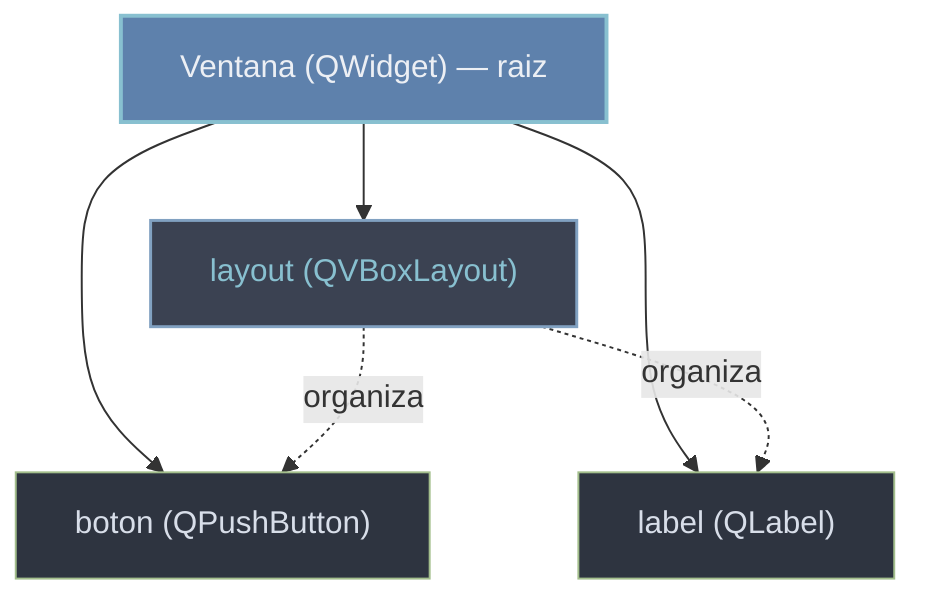

# QObject y el arbol de objetos — quien gestiona la memoria

`QObject` es la clase base de casi todo en Qt: de ella heredan los widgets, los modelos, los hilos y muchas mas. Aporta cuatro capacidades centrales: el **arbol parent/child**, las **senales y slots** (solo un `QObject` puede tener senales), las **propiedades** y los **eventos**. La idea que mas conviene interiorizar es la primera: los `QObject` se organizan en un arbol donde cada objeto tiene un **parent** y cero o mas **hijos**, y ese parent **gestiona la memoria**. Cuando un `QObject` se destruye, destruye automaticamente a todos sus hijos; no hay que liberarlos a mano.

## Por que existe

Una GUI crea cientos de objetos: ventanas, botones, etiquetas, layouts, acciones. Liberarlos uno a uno seria una fuente inagotable de fugas y de dobles liberaciones. El arbol de objetos resuelve esto: si le das un parent a cada objeto, basta con destruir la raiz (la ventana) para que toda la rama se libere en cascada. Ademas, en los widgets el parent define tambien la **jerarquia visual** (el hijo se dibuja dentro del padre), asi que una misma relacion sirve para la memoria y para el dibujado.

```python
# Sin arbol: tendrias que recordar y liberar cada objeto por separado.
# Con arbol: das parent y al morir el padre mueren todos sus hijos.
boton = QPushButton("Ok", parent=ventana)   # ventana "adopta" al boton
# al destruir ventana, el boton se destruye con ella
```

## Como funciona

El parent se fija al construir (`QPushButton("Ok", parent)`) o despues con `setParent(parent)`. Desde cualquier objeto puedes consultar la familia: `parent()` devuelve el padre, `children()` la lista de hijos directos, y `findChild(tipo, nombre)` busca un descendiente por tipo y nombre.

```python
from PyQt6.QtCore import QObject

raiz = QObject()
raiz.setObjectName("raiz")

hijo_a = QObject(raiz)            # parent = raiz (se pasa al constructor)
hijo_a.setObjectName("hijo_a")
hijo_b = QObject(raiz)
hijo_b.setObjectName("hijo_b")

print(hijo_a.parent() is raiz)            # True
print([c.objectName() for c in raiz.children()])   # ['hijo_a', 'hijo_b']
print(raiz.findChild(QObject, "hijo_b") is hijo_b) # True
```

### El parent destruye a sus hijos

Esta es la garantia clave: destruir el padre destruye la rama entera. `QObject` emite `destroyed` justo antes de morir, lo que permite verlo en accion.

```python
from PyQt6.QtCore import QObject

raiz = QObject()
hijo = QObject(raiz)
hijo.setObjectName("hijo")
hijo.destroyed.connect(lambda: print("el hijo fue destruido"))

del raiz          # se destruye la raiz -> destruye al hijo en cascada
# imprime: el hijo fue destruido
```

### En widgets, el parent es tambien la jerarquia visual

```python
from PyQt6.QtWidgets import QApplication, QWidget, QPushButton, QLabel, QVBoxLayout
import sys

app = QApplication(sys.argv)

ventana = QWidget()                 # raiz del arbol, sin parent
layout = QVBoxLayout(ventana)       # el layout toma a ventana como parent
boton = QPushButton("Pulsame")      # aun sin parent...
label = QLabel("Hola")
layout.addWidget(boton)             # ...addWidget le pone parent = ventana
layout.addWidget(label)

print(boton.parent() is ventana)    # True: el boton vive dentro de la ventana
ventana.show()
sys.exit(app.exec())
```



## El gotcha clasico de PyQt: el objeto C++ borrado

PyQt envuelve objetos C++ de Qt. Un `QObject` tiene dos "vidas": la del objeto C++ y la del envoltorio Python. Si un `QObject` **no tiene parent C++** y ademas pierdes su **referencia Python** (sale de scope, no lo guardaste en ningun lado), el recolector de Python lo borra; el objeto C++ desaparece y cualquier intento posterior de usarlo lanza:

```
RuntimeError: wrapped C++ object of type QPushButton has been deleted
```

```python
class Ventana(QWidget):
    def __init__(self):
        super().__init__()
        boton = QPushButton("Pulsame")   # MAL: local, sin parent ni self.
        # al salir de __init__ se pierde la referencia -> el boton puede morir

class VentanaBien(QWidget):
    def __init__(self):
        super().__init__()
        self.boton = QPushButton("Pulsame", self)   # BIEN: self. lo mantiene
        # alternativa: darle parent al construir tambien lo mantiene vivo
```

La regla practica: **mantener vivo todo `QObject` que quieras usar luego**, ya sea guardandolo como atributo (`self.boton = ...`) o dandole un parent que lo posea. Un objeto con parent vive mientras viva el parent, aunque no guardes referencia Python a el.

## Errores comunes

| Error | Causa | Solucion |
|-------|-------|----------|
| `RuntimeError: wrapped C++ object ... has been deleted` | el `QObject` no tenia parent ni referencia Python y fue recolectado | guardalo como `self.x = ...` o dale parent al construir |
| El widget no aparece dentro de la ventana | no tiene parent (ni se anadio a un layout de la ventana) | dale parent o usa `layout.addWidget(...)` |
| `del padre` no libera al hijo | guardaste el hijo en otra referencia Python que sigue viva | suelta tambien esa referencia, o no la guardes si no la necesitas |
| Doble liberacion / crash al cerrar | borras a mano un objeto que el parent tambien intentara destruir | deja que el parent gestione la memoria; no llames a `deleteLater()` por duplicado |
| `findChild` devuelve `None` | el nombre (`setObjectName`) no coincide o el objeto no es descendiente | fija `objectName` y verifica la jerarquia con `children()` |

## Notas relacionadas

- [[concepto_signals_slots]] — solo los `QObject` pueden tener senales
- [[concepto_herencia_widgets]] — subclasear `QWidget`/`QObject` para personalizar
- [[QObject]] — la clase base: `setParent`, `parent`, `children`, `findChild`
