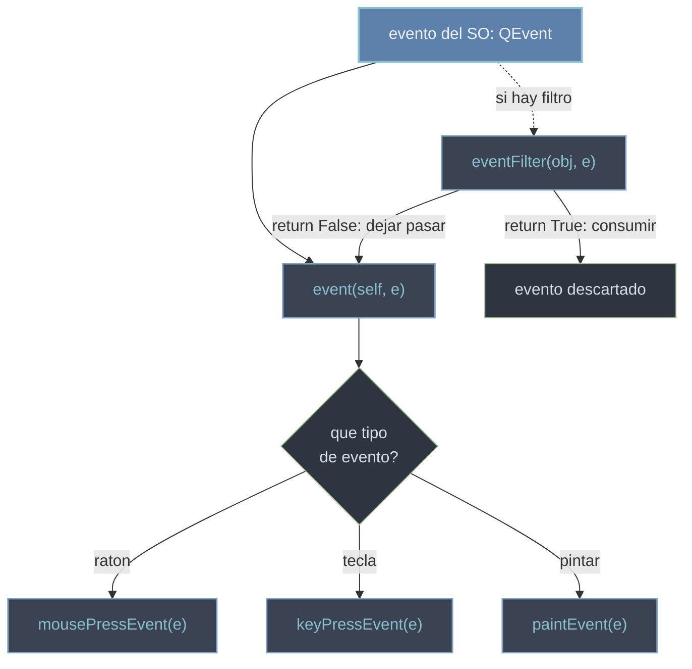

# el sistema de eventos — QEvent, override y eventFilter

Un **evento** es la entrada de bajo nivel que el sistema operativo envia a un widget: un movimiento de raton, una tecla, una peticion de repintado, un cambio de tamaño. En Qt cada evento es un objeto `QEvent` (o una subclase concreta: `QMouseEvent`, `QKeyEvent`, `QPaintEvent`, `QResizeEvent`...). Para personalizar como un widget reacciona, se **sobreescribe** el manejador correspondiente en una subclase, o se intercepta con un `eventFilter`. Los eventos son la materia prima que el [[concepto_event_loop|event loop]] despacha.

## Por que existe

Por debajo de las señales de alto nivel (un `clicked` comodo), Qt necesita un canal crudo para todo lo que el sistema le manda: pixel a pixel del raton, cada tecla, cada repintado. No todo tiene una señal. El sistema de eventos da acceso a ese nivel: permite controlar el comportamiento exacto del widget (dibujar a mano, validar teclas, vetar el cierre) sobreescribiendo el manejador justo.

## Como funciona

Cada widget recibe primero `event(self, e)`, que **despacha** el `QEvent` al manejador especifico segun su tipo: `mousePressEvent`, `keyPressEvent`, `paintEvent`, `resizeEvent`, `closeEvent`... Para personalizar, se sobreescribe ese manejador en una subclase:

```python
from PyQt6.QtWidgets import QApplication, QWidget
import sys

class Lienzo(QWidget):
    def mousePressEvent(self, e):
        print("boton:", e.button())          # que boton se pulso
        print("posicion:", e.position())     # QPointF relativo al widget
        super().mousePressEvent(e)            # deja que el comportamiento base siga

app = QApplication(sys.argv)
w = Lienzo()
w.show()
sys.exit(app.exec())
```

`e.accept()` marca el evento como atendido (no se propaga); `e.ignore()` lo rechaza para que lo gestione otro (p. ej. el widget padre).



## eventFilter: interceptar sin subclasear

A veces quieres atrapar eventos de **otro** objeto sin crear una subclase suya. Para eso instalas un filtro: `obj.installEventFilter(self)` hace que los eventos de `obj` pasen antes por tu `eventFilter(self, obj, e)`. Devuelve `True` para **consumir** el evento (no llega a `obj`) o `False` para dejarlo pasar.

```python
from PyQt6.QtCore import QEvent, QObject

class Vigilante(QObject):
    def eventFilter(self, obj, e):
        if e.type() == QEvent.Type.MouseButtonPress:
            print("clic interceptado en", obj)
            return True            # consumido: el widget no lo recibe
        return False               # el resto pasa normal

# uso: algun_widget.installEventFilter(Vigilante(parent))
```

## Señales vs eventos

Es la distincion clave del modelo de Qt, y se confunden a menudo:

| | **Eventos** | **Señales** |
|--|-------------|-------------|
| Nivel | bajo (entrada cruda) | alto (notificacion semantica) |
| Direccion | SO -> widget | widget -> tu codigo |
| Como se usan | se **sobreescribe** el manejador | se **conectan** con `.connect()` |
| Ejemplo | `mousePressEvent`, `keyPressEvent` | `clicked`, `valueChanged` |
| Cuando | necesitas control fino del widget | te basta reaccionar a "algo paso" |

En la practica, una señal de alto nivel como `clicked` se genera **a partir de** los eventos de bajo nivel (`mousePressEvent` + `mouseReleaseEvent`) que Qt ya proceso por ti.

## Errores comunes

| Error | Causa | Solucion |
|-------|-------|----------|
| El widget pierde su comportamiento normal al sobreescribir | olvidaste llamar a `super().<manejador>(e)` | llama al base cuando quieras conservar la conducta heredada |
| Intentas `mi_widget.mousePressEvent.connect(...)` | confundes evento con señal: los eventos no se conectan | sobreescribe el manejador, o usa una señal real como `clicked` |
| El `eventFilter` no filtra o da error | no devuelves un `bool` (`True`/`False`) | retorna siempre `bool`: `True` consume, `False` deja pasar |
| Mezclas tipos al comparar | usas `QEvent.MouseButtonPress` sin scope | en Qt6 los enums tienen scope: `QEvent.Type.MouseButtonPress` |

## Notas relacionadas

- [[concepto_signals_slots]] — el otro canal: notificaciones de alto nivel que se conectan
- [[concepto_event_loop]] — el bucle que despacha estos eventos a cada widget
