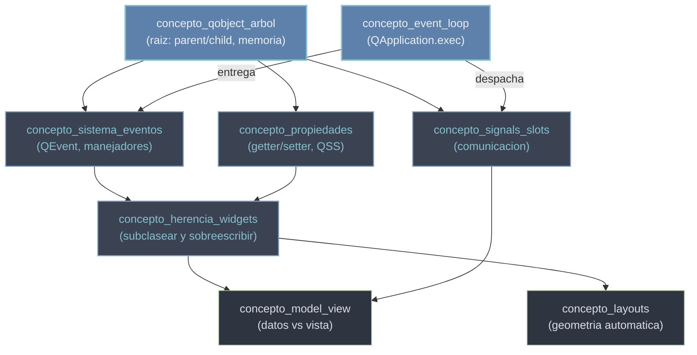

# conceptos_transversales — el modelo mental de PyQt6

PyQt6 es la libreria mas **orientada a objetos** del vault: no se trata de llamar funciones sueltas, sino de **construir un arbol de objetos que se comunican**. Por eso, antes de tocar una sola clase, conviene tener el modelo mental: ocho conceptos gobiernan todo lo demas. Quien los entiende sabe, sin abrir la documentacion, que metodos y senales tiene una clase (los hereda), como reacciona la GUI (el bucle de eventos), y como personalizar algo (subclasear y sobreescribir). La mayoria de los errores en Qt —senales que no disparan, ventanas que se congelan, widgets que no se ven— se evitan dominando estos ocho, no memorizando clases. Esta es la **nota madre**: presenta el mapa, no un listado.

## El grafo de dependencias

Casi todo cuelga de `QObject`. Las senales, los eventos y las propiedades **solo existen porque la clase es un `QObject`**; sin esa raiz no hay nada que comunicar ni que pintar. El resto encadena a partir de ahi:

`concepto_qobject_arbol` es la raiz de la rama de objetos; `concepto_event_loop` es la otra raiz: el motor que mantiene viva la GUI entregando eventos y despachando las senales. Todo lo visual (herencia, layouts, model/view) se apoya en ambas.

## Orden de lectura

Leelos en este orden: primero la raiz y su mecanismo de comunicacion, luego el motor y la entrada, despues la personalizacion y, al final, los dos sistemas de alto nivel que se construyen sobre todo lo anterior.

| # | Concepto | Idea clave | Por que en ese orden |
|---|----------|------------|----------------------|
| 1 | [[concepto_qobject_arbol]] | `QObject`, el arbol parent/child y la gestion de memoria | La raiz de casi todo: senales, eventos y propiedades dependen de ser un `QObject`. Empieza aqui. |
| 2 | [[concepto_signals_slots]] | senales y slots: el mecanismo de comunicacion entre objetos | El sistema nervioso de Qt; solo los `QObject` lo tienen, asi que sigue justo despues. |
| 3 | [[concepto_event_loop]] | el bucle de eventos (`QApplication.exec()`) | Sin el la GUI no responde; es el motor que hace que las senales y los eventos lleguen a alguien. |
| 4 | [[concepto_sistema_eventos]] | `QEvent` y los manejadores (`mousePressEvent`, `paintEvent`...) | La entrada de bajo nivel que el bucle entrega; se sobreescribe para reaccionar al raton o pintar. |
| 5 | [[concepto_herencia_widgets]] | subclasear `QWidget` y sobreescribir metodos | La forma de personalizar: combina herencia (1) con sobreescribir manejadores (4). |
| 6 | [[concepto_propiedades]] | el sistema de propiedades (getter/setter, QSS, animaciones, `pyqtProperty`) | El estado de un widget vive en propiedades; habilita QSS y animaciones. Util ya con widgets propios. |
| 7 | [[concepto_layouts]] | gestion geometrica automatica con layouts | Una vez tienes widgets, los layouts los colocan y redimensionan solos en vez de a mano. |
| 8 | [[concepto_model_view]] | separar datos (modelo) de presentacion (vista) | El patron de alto nivel para listas y tablas; se apoya en senales y herencia, va al final. |

## Notas relacionadas

- [[PyQt6/index\|PyQt6]] — el indice raiz y el mapa global de clases
- [[concepto_qobject_arbol]] — la raiz del modelo de objetos
- [[concepto_signals_slots]] — el mecanismo de comunicacion de Qt
