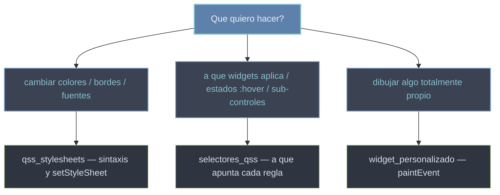

# estilado — apariencia de los widgets con QSS

Esta carpeta agrupa como cambiar la **apariencia** de una app PyQt **sin subclasear**. El estilado en Qt se hace con **QSS** (Qt Style Sheets), una sintaxis muy parecida a CSS que se aplica con `setStyleSheet`: declaras colores, bordes, fuentes, margenes y espaciados en una cadena de texto y Qt los pinta. Es la via **recomendada** para que la app "se vea bien" — colores de fondo, bordes redondeados, tipografias, estados al pasar el raton. El dibujo totalmente propio (pixel a pixel) es otra cosa: para eso se subclasea un widget y se sobreescribe `paintEvent` (ver [[widget_personalizado]]). Regla rapida: **QSS para apariencia declarativa, subclasear para dibujo o comportamiento unico**.

## En accion

Una app corta que estiliza un `QPushButton` con QSS, incluido el estado `:hover` (cuando el raton esta encima). El estilo se aplica a toda la app con `app.setStyleSheet(...)`, asi que afecta a cualquier boton.

```python
from PyQt6.QtWidgets import QApplication, QWidget, QVBoxLayout, QPushButton, QLabel
import sys

app = QApplication(sys.argv)
app.setStyleSheet("""
    QPushButton {
        background-color: #88c0d0;   /* fondo azul */
        color: #2e3440;
        border-radius: 6px;          /* esquinas redondeadas */
        padding: 8px 16px;
    }
    QPushButton:hover { background-color: #81a1c1; }   /* al pasar el raton */
""")

w = QWidget()
layout = QVBoxLayout(w)
layout.addWidget(QLabel("Pasa el raton por el boton:"))
layout.addWidget(QPushButton("Boton con estilo"))
w.show()
sys.exit(app.exec())   # PyQt6: exec() (sin guion bajo)
```

## Que necesito



## Las notas

Dos notas hermanas cubren el estilado. [[qss_stylesheets]] explica **la sintaxis** y el metodo `setStyleSheet`: como escribir las reglas y a que nivel aplicarlas (a un widget suelto, a un contenedor que las propaga a sus hijos, o a toda la app). [[selectores_qss]] explica **a que apunta** cada regla: por tipo de widget, por `#id`, por pseudo-estados como `:hover` o `:checked`, y por sub-controles como `::handle`.

| Nota | Para que |
|------|----------|
| [[qss_stylesheets]] | la sintaxis QSS y `setStyleSheet`: aplicar estilo a un widget, a un contenedor o a toda la app |
| [[selectores_qss]] | a que widgets aplica cada regla: por tipo, `#id`, pseudo-estados (`:hover`, `:checked`), sub-controles (`::handle`) |

## QSS vs subclasear

La eleccion es clara segun **que** quieras cambiar. Si es la **apariencia** (color, borde, fuente, espaciado), usa QSS: es declarativo, no toca la clase y se puede ajustar sin recompilar la logica. Si necesitas un **dibujo a medida** (formas propias pintadas pixel a pixel) o **comportamiento** especial, subclaseas el widget y sobreescribes metodos como `paintEvent` — eso es herencia, no estilado (ver [[concepto_herencia_widgets]]). En resumen: apariencia declarativa = QSS; dibujo o comportamiento unico = herencia.

## Notas relacionadas

- [[qss_stylesheets]] — la sintaxis QSS y `setStyleSheet`
- [[selectores_qss]] — a que widgets y estados apunta cada regla
- [[widget_personalizado]] — cuando el estilado no basta: dibujar con `paintEvent`
- [[QApplication]] — donde se aplica el estilo global con `app.setStyleSheet`
