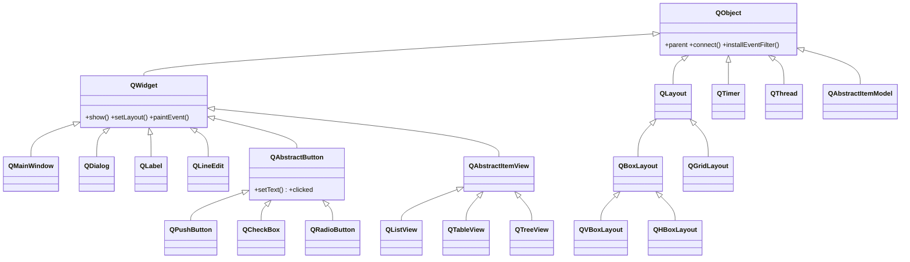

# PyQt6 — GUI de escritorio orientada a objetos

PyQt6 es el binding de Python para **Qt 6**, el framework de interfaces graficas de escritorio mas usado. A diferencia de NumPy o SciPy —donde llamas funciones sobre arrays— en PyQt6 **construyes un arbol de objetos** que se comunican entre si: una `QApplication` arranca el bucle de eventos, los `QWidget` forman la ventana, y todo reacciona mediante **senales y slots**. Es la libreria mas **orientada a objetos** del vault: casi todo hereda de `QObject` (la rama no visual) o de `QWidget` (la rama visual), y la forma natural de personalizar algo es **subclasear y sobreescribir** un metodo.

## En accion

```python
from PyQt6.QtWidgets import QApplication, QWidget, QPushButton, QVBoxLayout
import sys

app = QApplication(sys.argv)          # 1. la app y el bucle de eventos

ventana = QWidget()                   # 2. un contenedor (hereda de QObject)
ventana.setWindowTitle("Hola PyQt6")
layout = QVBoxLayout(ventana)         # 3. el layout coloca los hijos

boton = QPushButton("Pulsame")        # 4. un widget
boton.clicked.connect(lambda: print("clic!"))   # 5. senal -> slot
layout.addWidget(boton)

ventana.show()
sys.exit(app.exec())                  # 6. exec() (PyQt6, sin guion bajo) bloquea
```

## El modelo de objetos

Toda la libreria cuelga de dos raices. La cadena completa de cada clase vive en su propia nota; este es el mapa global:



> [!tip] La clave de la herencia
> Como **todo es un `QObject`**, todo tiene parent/child (gestion de memoria), senales y eventos. Como **todo widget es un `QWidget`**, todo widget se puede mostrar, recibe eventos de raton/teclado y se puede pintar. Saber que hereda una clase es saber que metodos y senales ya tiene sin abrir su documentacion.

## Los tres pilares

| Pilar | Idea | Nota |
|-------|------|------|
| **Arbol de objetos** | el `parent` posee a sus hijos y gestiona su memoria | [[concepto_qobject_arbol]] |
| **Senales y slots** | los objetos se comunican emitiendo senales que disparan slots | [[concepto_signals_slots]] |
| **Herencia para personalizar** | subclasear un widget y sobreescribir `paintEvent`, `mousePressEvent`… | [[concepto_herencia_widgets]] |

## Como navegar el vault

| Quiero… | Ir a |
|---------|------|
| El modelo mental (QObject, senales, eventos, herencia) | [[PyQt6/conceptos_transversales/index\|conceptos_transversales]] |
| La base no visual: QObject, senales, hilos, timers | [[PyQt6/QtCore/index\|QtCore]] |
| Los widgets, layouts, ventanas y vistas | [[PyQt6/QtWidgets/index\|QtWidgets]] |
| Pintura, eventos, recursos y acciones | [[PyQt6/QtGui/index\|QtGui]] |
| Crear widgets/dialogos/modelos propios | [[PyQt6/patrones/index\|patrones]] |
| Cambiar la apariencia (QSS) | [[PyQt6/estilado/index\|estilado]] |

## Notas relacionadas

- [[concepto_signals_slots]] — el mecanismo de comunicacion de Qt
- [[QWidget]] — la clase base de todo widget
- [[QApplication]] — la app y el bucle de eventos
