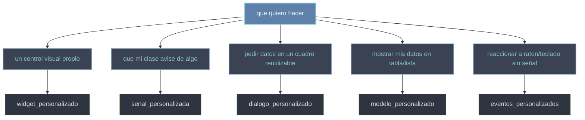

# patrones — recetas POO para extender Qt

Esta carpeta agrupa los **patrones de programacion orientada a objetos** que distinguen a quien sabe Qt de quien solo lo usa. La idea no es configurar un objeto desde fuera (pasarle opciones a un widget ya hecho), sino **subclasear** una clase de Qt y **sobreescribir** los metodos que el framework ya llama por ti: esa es la via natural para inyectar tu logica en el flujo de Qt (ver [[concepto_herencia_widgets]], la idea madre). Las cinco recetas de abajo son el corazon de "saber Qt" porque cubren las cinco cosas propias que tarde o temprano necesitas crear: un control visual, una señal, un cuadro de dialogo, un modelo de datos y una reaccion a eventos. Algunas pueden estar creandose en paralelo; los enlaces ya quedan puestos.

## En accion

Un widget propio minimo ([[widget_personalizado]]) que declara una señal propia ([[senal_personalizada]]) y la emite al hacer clic; una ventana la conecta a un slot. Dos patrones combinados en ~20 lineas, ejecutable.

```python
from PyQt6.QtWidgets import QApplication, QWidget, QLabel
from PyQt6.QtCore import pyqtSignal
import sys

class Boton(QWidget):
    pulsado = pyqtSignal()                      # señal propia (senal_personalizada)

    def mousePressEvent(self, event):           # Qt llama esto al hacer clic
        self.pulsado.emit()                     # emito mi señal

app = QApplication(sys.argv)
etiqueta = QLabel("esperando clic...")
boton = Boton()                                 # mi widget (widget_personalizado)
boton.pulsado.connect(lambda: etiqueta.setText("clic!"))  # conecto la señal
boton.resize(120, 120)
boton.show()
etiqueta.show()
sys.exit(app.exec())                            # exec() (PyQt6, sin guion bajo)
```

## Que patron necesito



## Las recetas

Cada receta tiene su nota propia: [[widget_personalizado]], [[senal_personalizada]], [[dialogo_personalizado]], [[modelo_personalizado]] y [[eventos_personalizados]]. La tabla resume que clase subclaseas y los metodos clave que sobreescribes o usas en cada una.

| Patron | Que subclaseas | Metodos clave |
|--------|----------------|---------------|
| widget_personalizado | `QWidget` | `paintEvent`, `sizeHint`, `update()` |
| senal_personalizada | `QObject` | `pyqtSignal`, `emit` |
| dialogo_personalizado | `QDialog` | `accept`, `reject`, `exec` |
| modelo_personalizado | `QAbstractTableModel` | `rowCount`, `columnCount`, `data` |
| eventos_personalizados | `QWidget` | `mousePressEvent`, `keyPressEvent`, `eventFilter` |

## El principio comun

Los cinco patrones son la misma idea bajo formas distintas: **Qt llama metodos que tu rediseñas**. Tu reescribes `paintEvent` y Qt lo invoca al repintar; reescribes `data` y la vista lo consulta al mostrar cada celda; reescribes `accept` y el boton del dialogo lo dispara; reescribes `mousePressEvent` y el event loop lo llama al pulsar el raton. Y cuando necesitas comunicar algo hacia afuera, no llamas a nadie directamente: **emites una señal** y quien quiera se conecta. Subclasear para sobreescribir ganchos (ver [[concepto_sistema_eventos]]) y emitir señales para avisar (ver [[concepto_signals_slots]]) son las dos caras de extender Qt.

## Notas relacionadas

- [[concepto_herencia_widgets]] — la idea madre: subclasear y sobreescribir en vez de configurar desde fuera
- [[concepto_signals_slots]] — emitir señales propias para comunicar objetos
- [[concepto_model_view]] — como una vista consulta tu modelo para pintar los datos
- [[concepto_sistema_eventos]] — los manejadores de evento que el event loop llama por ti
