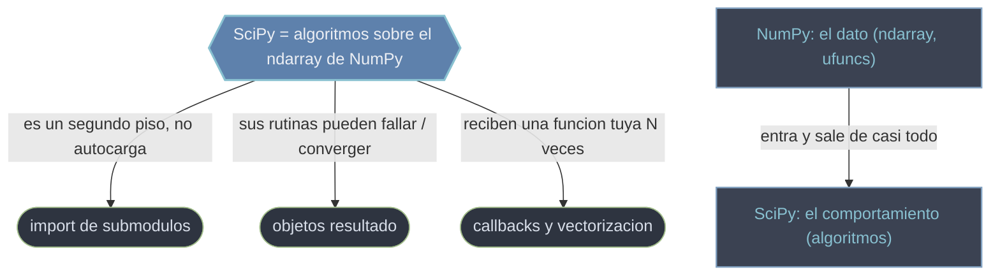

# conceptos_transversales — el modelo mental que gobierna todo SciPy

Antes de tocar cualquier submodulo conviene entender las **cuatro ideas que se repiten en casi todas las rutinas** de SciPy. No son trucos sueltos: son el modelo mental compartido que explica como se importa la libreria, que tipo de dato circula por ella, que devuelve cada funcion y como hay que escribir el codigo que le entregas. Aprenderlas una vez ahorra repetir los mismos errores en cada submodulo nuevo.

El hilo conductor es uno solo: **SciPy es la capa de algoritmos sobre el `ndarray` de NumPy**. De esa unica relacion se derivan las otras tres ideas. Como SciPy es un segundo piso sobre NumPy, sus submodulos se cargan por separado (de ahi el import explicito). Como sus rutinas son algoritmos que pueden converger o fallar, devuelven objetos-resultado con diagnostico. Y como muchas reciben una funcion tuya que llaman miles de veces, esa funcion debe estar vectorizada con NumPy.

## El modelo mental



La idea raiz arriba (`relacion NumPy-SciPy`) es de la que cuelgan las otras tres. Abajo, la division de trabajo que la sostiene: NumPy pone el `ndarray`, SciPy pone el algoritmo que lo transforma.

## En accion

Los cuatro conceptos no son teoria abstracta: aparecen juntos en cualquier llamada real. Este snippet de cuatro lineas los toca todos.

```python
import numpy as np                         # 1. relacion: NumPy es el dato
from scipy import optimize                 # 2. import explicito del submodulo

costo = lambda v: np.sum((v - np.array([1.0, 2.5]))**2)   # 4. callback vectorizado con NumPy
res = optimize.minimize(costo, x0=[0.0, 0.0])             # 3. devuelve un objeto-resultado

if res.success:                            # 3. revisa el diagnostico antes de leer la solucion
    print(res.x)                           # [1.  2.5]
```

`np` aporta el array (1); el submodulo se importo aparte (2); `minimize` devolvio un `OptimizeResult` cuyo `success` se comprueba antes de usar `x` (3); y el costo se escribio con una ufunc de NumPy, no con un bucle Python (4).

## Orden de lectura recomendado

| # | Concepto | Idea clave |
|---|----------|-----------|
| 1 | [[concepto_relacion_numpy\|relacion NumPy-SciPy]] | SciPy no reemplaza NumPy, lo extiende: el `ndarray` entra y sale de casi todo; `scipy.linalg` es superset de `numpy.linalg`. La idea raiz de la que cuelgan las demas. |
| 2 | [[concepto_import_submodulos\|import de submodulos]] | `import scipy` no basta: los submodulos no se autocargan, hay que importar `scipy.optimize`, `scipy.stats`, etc. de forma explicita. |
| 3 | [[concepto_objetos_resultado\|objetos resultado]] | muchas rutinas devuelven un Bunch (`OptimizeResult`, `OdeResult`...) con solucion + metadatos; revisa `.success` antes de leer `.x`. |
| 4 | [[concepto_callbacks_vectorizados\|callbacks y vectorizacion]] | le pasas una funcion que SciPy llama N veces: vectorizala con NumPy y cuida la firma (`f(t,y)` de `solve_ivp` vs `f(y,t)` de `odeint`). |

## Los cuatro conceptos

**[[concepto_relacion_numpy\|relacion NumPy-SciPy]]** — la division del trabajo y la idea raiz. NumPy aporta la estructura de datos y las operaciones elementales; SciPy aporta los algoritmos cientificos que operan sobre ese mismo array. Aqui vive la regla de "quien hace que" y el caso especial de `linalg`, donde NumPy y SciPy se solapan pero no son intercambiables (`scipy.linalg` es superset sobre LAPACK).

**[[concepto_import_submodulos\|import de submodulos]]** — por que `scipy.optimize` falla tras un simple `import scipy`. SciPy esta partido en submodulos independientes que arrastran dependencias pesadas (LAPACK, compilados) y no se cargan solos. Explica las tres formas validas de importar (`from scipy import optimize`, `from scipy.optimize import minimize`, `import scipy.optimize`) y la trampa del `import scipy as sp` suelto.

**[[concepto_objetos_resultado\|objetos resultado]]** — los Bunch que devuelven las rutinas. Un objeto-resultado agrupa la solucion principal con su diagnostico de convergencia, accesibles como atributos (`res.x`, `res.success`). La regla central: leer la solucion sin mirar la convergencia es el error numero uno. Ojo, no todo es un Bunch: `quad` y `curve_fit` devuelven tuplas.

**[[concepto_callbacks_vectorizados\|callbacks y vectorizacion]]** — la funcion que le entregas a SciPy. Muchas rutinas son funciones de orden superior que llaman tu callback miles de veces; su firma y su rendimiento determinan la robustez y velocidad de todo el calculo. Cubre el contrato de cada rutina (la trampa `f(t,y)` vs `f(y,t)`), el parametro `args` y por que hay que vectorizar con NumPy.

## Que concepto reviso

| Sintoma / duda | Concepto |
|----------------|----------|
| ¿Esto lo hace NumPy o SciPy? ¿`np.linalg` o `scipy.linalg`? | [[concepto_relacion_numpy\|relacion NumPy-SciPy]] |
| `AttributeError: module 'scipy' has no attribute 'optimize'` | [[concepto_import_submodulos\|import de submodulos]] |
| `res.x` da numeros absurdos / no se que campos tiene el retorno | [[concepto_objetos_resultado\|objetos resultado]] |
| La EDO da basura o todo va lentisimo | [[concepto_callbacks_vectorizados\|callbacks y vectorizacion]] |

## Notas relacionadas

- [[index\|SciPy (landing de la libreria)]]
- [[introduccion]]
- [[concepto_relacion_numpy]]
- [[concepto_import_submodulos]]
- [[concepto_objetos_resultado]]
- [[concepto_callbacks_vectorizados]]
</content>
