# SciPy — algoritmos cientificos sobre NumPy

**SciPy** es la coleccion de **algoritmos cientificos** de Python: una caja de herramientas de rutinas de alto nivel —optimizacion, integracion, algebra lineal, estadistica, procesamiento de señales e imagen, transformadas, geometria computacional— construida **sobre NumPy**. La estructura de datos no cambia: el `ndarray` de NumPy sigue siendo la base que entra y sale de casi todo. Lo que SciPy aporta no es un nuevo tipo de dato, sino los **algoritmos** que operan sobre ese array. La regla mental es directa: **NumPy es el dato, SciPy es el comportamiento**. Cada capacidad vive en su propio submodulo, que se importa por separado y se documenta en su propio index.

## En accion

Un mismo problema de ingenieria suele tocar varios submodulos. Aqui se combinan tres —`integrate`, `optimize` y `linalg`— para mostrar el "sabor" de SciPy: el `ndarray` circula entre rutinas que NumPy no tiene.

```python
import numpy as np
from scipy import integrate, optimize, linalg

# 1. integrate.quad — area bajo una curva (integral definida de una funcion)
trabajo, _ = integrate.quad(lambda x: np.exp(-x**2), 0, 1)
print(trabajo)            # 0.74682...

# 2. optimize.minimize — hallar el minimo de una funcion de costo
costo = lambda v: (v[0] - 1)**2 + (v[1] - 2.5)**2
res = optimize.minimize(costo, x0=[0.0, 0.0])
print(res.x)              # [1.  2.5]  (revisa res.success antes de usarlo)

# 3. linalg.solve — resolver el sistema lineal A x = b sobre LAPACK
A = np.array([[3.0, 2.0], [1.0, 2.0]])
b = np.array([12.0, 8.0])
x = linalg.solve(A, b)
print(x)                  # [2. 3.]
```

Tres submodulos, tres familias de algoritmos, un solo tipo de dato debajo: arrays de NumPy. Ese es el patron que se repite en toda la libreria.

## Que submodulo uso

```mermaid
flowchart TD
    Q{{"Que necesito hacer?"}}
    Q -->|"minimizar / raices / ajustar"| OPT(["scipy.optimize"])
    Q -->|"integrar / resolver EDOs"| INT(["scipy.integrate"])
    Q -->|"resolver A x = b / descomponer"| LIN(["scipy.linalg"])
    Q -->|"rellenar entre puntos"| ITP(["scipy.interpolate"])
    Q -->|"filtrar / espectro de una señal"| SIG(["scipy.signal"])
    Q -->|"imagen / array N-D"| NDI(["scipy.ndimage"])
    Q -->|"distribuciones / tests"| STA(["scipy.stats"])
    Q -->|"transformada de Fourier"| FFT(["scipy.fft"])
    Q -->|"datos con muchos ceros"| SPR(["scipy.sparse"])
    Q -->|"vecinos / geometria"| SPA(["scipy.spatial"])
    Q -->|"gamma / bessel / erf"| SPE(["scipy.special"])
    Q -->|"una constante fisica"| CON(["scipy.constants"])

    classDef pregunta fill:#5e81ac,stroke:#88c0d0,stroke-width:2px,color:#eceff4;
    classDef grupo fill:#3b4252,stroke:#81a1c1,stroke-width:1.5px,color:#88c0d0;
    classDef hoja fill:#2e3440,stroke:#a3be8c,color:#d8dee9;
    class Q pregunta;
    class OPT,INT,LIN,ITP,SIG,NDI,STA,FFT,SPR,SPA,SPE,CON hoja;
```



## Relacion con NumPy

SciPy **no reemplaza a NumPy: lo extiende**. NumPy busca ser ligero y universal (tipos, forma, broadcasting, ufuncs); meter en ese mismo paquete los solucionadores de EDO, los algoritmos de minimizacion o las 100+ distribuciones estadisticas lo volveria pesado. Por eso SciPy es un **segundo piso**: depende de NumPy, nunca al reves. Todo lo que entra y sale de una rutina de SciPy es, casi siempre, un array de NumPy.

La division de trabajo, resumida: si necesitas **crear, dar forma, indexar o hacer una operacion elemento a elemento**, eso es NumPy. Si necesitas un **algoritmo numerico no trivial** (minimizar, resolver una EDO, ajustar una curva, un test estadistico, una FFT), eso es SciPy. El caso especial es `linalg`: ambas librerias lo tienen, pero `scipy.linalg` es un **superset** sobre LAPACK y es el recomendado para codigo numerico serio. El detalle completo de esta frontera vive en [[concepto_relacion_numpy]].

## Las 4 ideas que gobiernan todo

Antes de tocar cualquier submodulo conviene leer los conceptos transversales: se aplican en casi todas las rutinas.

| Concepto | Idea clave |
|----------|-----------|
| [[concepto_relacion_numpy\|Relacion NumPy-SciPy]] | el `ndarray` entra y sale de casi todo; `scipy.linalg` es superset de `numpy.linalg` |
| [[concepto_import_submodulos\|Import de submodulos]] | `import scipy` no basta: hay que importar `scipy.optimize`, etc. |
| [[concepto_objetos_resultado\|Objetos resultado]] | muchas rutinas devuelven un Bunch (`OptimizeResult`…); revisa `.success` antes de `.x` |
| [[concepto_callbacks_vectorizados\|Callbacks y vectorizacion]] | pasas una funcion que SciPy llama N veces: vectorizala; cuidado con la firma `f(t,y)` vs `f(y,t)` |

## Mapa de submodulos

Cada submodulo es un territorio independiente con su propia carpeta de notas y su propio index. No se autoimportan: hay que pedir cada uno explicitamente (`from scipy import optimize`), como explica [[concepto_import_submodulos]].

| Submodulo | Que resuelve |
|-----------|--------------|
| [[SciPy/scipy.optimize/index\|scipy.optimize]] | optimizacion: minimizar funciones, hallar raices de ecuaciones, ajustar curvas a datos (`minimize`, `root`, `curve_fit`, `brentq`) |
| [[SciPy/scipy.integrate/index\|scipy.integrate]] | integracion numerica y ecuaciones diferenciales (EDOs): integrales definidas y problemas de valor inicial (`quad`, `simpson`, `solve_ivp`) |
| [[SciPy/scipy.linalg/index\|scipy.linalg]] | algebra lineal avanzada sobre LAPACK; extiende `numpy.linalg` con descomposiciones que NumPy no tiene (`lu`, `expm`, `schur`) |
| [[SciPy/scipy.interpolate/index\|scipy.interpolate]] | interpolacion: construir una funcion continua que pasa por puntos discretos (`interp1d`, splines, `griddata`) |
| [[SciPy/scipy.signal/index\|scipy.signal]] | procesamiento de señales: diseño y aplicacion de filtros, convolucion, analisis espectral, deteccion de picos (`butter`, `filtfilt`, `welch`) |
| [[SciPy/scipy.ndimage/index\|scipy.ndimage]] | procesamiento de imagenes y arrays n-dimensionales: filtrado, morfologia, etiquetado de regiones (`gaussian_filter`, `label`) |
| [[SciPy/scipy.stats/index\|scipy.stats]] | estadistica: distribuciones de probabilidad, tests de hipotesis y estadistica descriptiva (`norm`, `ttest_ind`, `linregress`) |
| [[SciPy/scipy.sparse/index\|scipy.sparse]] | matrices dispersas: almacenar y operar matrices con muchos ceros sin gastar la memoria de una densa (`csr_matrix`, `coo_matrix`) |
| [[SciPy/scipy.spatial/index\|scipy.spatial]] | geometria computacional: busquedas de vecinos, distancias, envolventes y triangulaciones (`KDTree`, `ConvexHull`, `Delaunay`) |
| [[SciPy/scipy.special/index\|scipy.special]] | funciones especiales de la fisica y la matematica (`gamma`, `erf`, `jv` de Bessel, `comb`) |
| [[SciPy/scipy.fft/index\|scipy.fft]] | transformada rapida de Fourier: pasar del dominio del tiempo al de la frecuencia y viceversa (`fft`, `rfft`, `fftfreq`) |
| [[SciPy/scipy.constants/index\|scipy.constants]] | constantes fisicas (CODATA) y matematicas con sus unidades (`c`, `G`, `physical_constants`) |

## Por donde empezar

Si vienes de cero, arranca por los [[SciPy/conceptos_transversales/index\|conceptos transversales]]: el modelo mental que se repite en casi todas las rutinas (como se importa, que dato circula, que devuelve, como escribir el callback). Distingue ademas las rutinas **legacy** de las **modernas**: notas como `fsolve`, `interp1d` u `odeint` llevan un aviso y apuntan a su reemplazo recomendado. Luego salta al submodulo que necesites con esta tabla.

| Si buscas... | Ve a |
|--------------|------|
| El modelo mental que comparten todas las rutinas | [[SciPy/conceptos_transversales/index\|conceptos transversales]] |
| Ajustar, minimizar o resolver ecuaciones | [[SciPy/scipy.optimize/index\|scipy.optimize]] |
| Integrar o simular un sistema dinamico (EDOs) | [[SciPy/scipy.integrate/index\|scipy.integrate]] |
| Resolver sistemas lineales o descomponer matrices | [[SciPy/scipy.linalg/index\|scipy.linalg]] |
| Rellenar o suavizar datos entre puntos | [[SciPy/scipy.interpolate/index\|scipy.interpolate]] |
| Filtrar una señal o ver su espectro | [[SciPy/scipy.signal/index\|scipy.signal]] |
| Trabajar con imagenes o arrays N-D | [[SciPy/scipy.ndimage/index\|scipy.ndimage]] |
| Distribuciones, tests o regresion | [[SciPy/scipy.stats/index\|scipy.stats]] |
| Matrices grandes con muchos ceros | [[SciPy/scipy.sparse/index\|scipy.sparse]] |
| Vecinos cercanos, distancias o geometria | [[SciPy/scipy.spatial/index\|scipy.spatial]] |
| Funciones gamma, bessel, erf... | [[SciPy/scipy.special/index\|scipy.special]] |
| FFT y analisis de frecuencia | [[SciPy/scipy.fft/index\|scipy.fft]] |
| Una constante fisica con su valor exacto | [[SciPy/scipy.constants/index\|scipy.constants]] |

> Dentro de cada submodulo, las hojas imitan la documentacion oficial: archivos API-style (`scipy.optimize.minimize.md`) y clases con su nombre real (`KDTree.md`). Sigue los `## Notas relacionadas` al final de cada nota para saltar a la rutina vecina.

## Notas relacionadas

- [[SciPy/conceptos_transversales/index\|conceptos transversales]]
- [[concepto_relacion_numpy]]
- [[concepto_import_submodulos]]
- [[Tree SciPy]]
