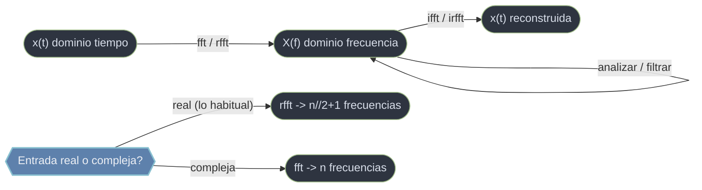

# scipy.fft — transformada rapida de Fourier

`scipy.fft` es el submodulo de **transformadas de Fourier**: el puente entre el **dominio del tiempo** (la señal tal como se muestrea, una secuencia de valores en el tiempo o el espacio) y el **dominio de la frecuencia** (cuanta energia hay en cada frecuencia que compone esa señal). La FFT (Fast Fourier Transform) no es una transformada distinta, sino un **algoritmo rapido** para calcular la Transformada Discreta de Fourier (DFT) en `O(n log n)` en vez del `O(n²)` ingenuo. Con ella se identifican tonos, periodicidades, filtros y espectros que en el dominio del tiempo serian invisibles. Es la **version moderna** que reemplaza al antiguo `scipy.fftpack` y supera a `numpy.fft` (mas rapida, mas tipos de dato, paraleliza con `workers`).

## En accion

```python
import numpy as np
from scipy.fft import fft, ifft, fftfreq

# Señal de 1 s con dos tonos: 50 Hz (fuerte) y 120 Hz (debil)
fs = 500                                  # frecuencia de muestreo (Hz)
t  = np.arange(0, 1, 1/fs)
x  = np.sin(2*np.pi*50*t) + 0.5*np.sin(2*np.pi*120*t)

# 1. Espectro complejo y eje de frecuencias
X     = fft(x)                            # espectro complejo del mismo tamaño
freqs = fftfreq(len(x), d=1/fs)           # frecuencia (Hz) de cada bin
mag   = np.abs(X)                         # modulo = amplitud por frecuencia

# 2. Los dos picos del lado positivo
pos = freqs > 0
picos = freqs[pos][np.argsort(mag[pos])[-2:]]
print(np.sort(picos))                     # → [ 50. 120.]   los dos tonos

# 3. Filtrar e invertir: anular > 80 Hz y volver al tiempo
X[np.abs(freqs) > 80] = 0
x_limpio = ifft(X).real                   # solo queda el tono de 50 Hz
```

## Tiempo, frecuencia y de vuelta



Dos ideas guian el uso. **Real vs complejo**: `fft` devuelve *siempre* un array complejo, pero si la señal es real (el caso fisico habitual) la mitad negativa del espectro es redundante por simetria hermitica y conviene `rfft`, que calcula solo la mitad util (mitad de memoria y de computo). **Los indices no son frecuencias**: la salida de `fft` esta ordenada `[DC, positivas..., negativas...]`, no en Hz; `fftfreq` traduce cada bin a su frecuencia real y da significado fisico al espectro.

## Notas del submodulo

### [[scipy.fft.fft|fft]]
DFT directa 1D de una secuencia (real o compleja); devuelve el **espectro complejo** del mismo tamaño, ordenado segun la convencion fftfreq. Es el punto de entrada al analisis espectral: `np.abs(X)` da la amplitud y `np.angle(X)` la fase de cada frecuencia.

### [[scipy.fft.ifft|ifft]]
DFT **inversa**: reconstruye la señal en el tiempo a partir de su espectro, de modo que `ifft(fft(x)) ≈ x`. Aplica el factor `1/n` (con `norm='backward'`), por lo que junto a `fft` forma la identidad; cuando el espectro venia de una señal real, la salida es real salvo residuo numerico (~1e-16).

### [[scipy.fft.rfft|rfft]]
FFT optimizada para **entrada real**: aprovecha la simetria hermitica y devuelve solo las `n//2 + 1` frecuencias no negativas, de DC a Nyquist. Mitad de memoria y mas velocidad; la opcion correcta para señales fisicas. Su inversa es `irfft` y su eje, `rfftfreq`.

### [[scipy.fft.fftfreq|fftfreq]]
Genera el **array de frecuencias** que corresponde, bin a bin, a la salida de `fft`. Recibe la longitud `n` y el espaciado `d = 1/fs`, y devuelve las frecuencias en el orden `[0, positivas..., negativas...]`. Es el compañero imprescindible de `fft` para dar significado fisico al espectro.

## Tabla de orientacion

| Si tu señal es... | Y quieres... | Usa |
|-------------------|--------------|-----|
| real (lo habitual) | el espectro | [[scipy.fft.rfft\|rfft]] (+ `rfftfreq`) |
| compleja | el espectro | [[scipy.fft.fft\|fft]] (+ `fftfreq`) |
| un espectro ya calculado | reconstruir la señal | [[scipy.fft.ifft\|ifft]] |
| cualquiera | etiquetar el eje de frecuencias | [[scipy.fft.fftfreq\|fftfreq]] |

## Notas relacionadas

- [[SciPy/index\|SciPy]]
- [[concepto_relacion_numpy]]
