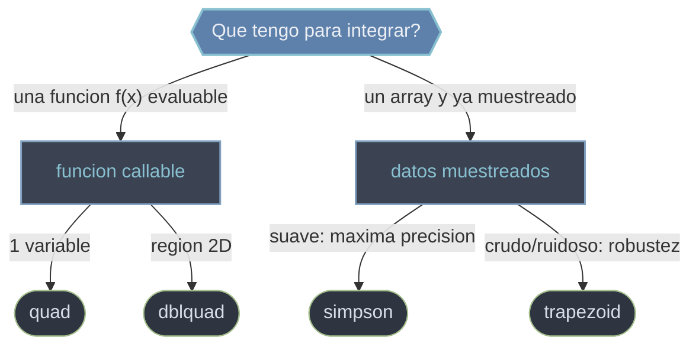

# Cuadratura — integrar funciones y datos muestreados

Esta carpeta agrupa las rutinas de `scipy.integrate` que calculan **integrales definidas**: el area bajo una curva o el volumen bajo una superficie. "Cuadratura" es el termino clasico para la integracion numerica. La eleccion de rutina no depende de la matematica sino de **que tienes en la mano**: una funcion que SciPy puede evaluar donde quiera (familia `quad`, cuadratura adaptativa sobre QUADPACK, con cota de error) o un array de muestras ya tabuladas (`simpson` / `trapezoid`, que solo combinan los numeros dados). Mezclar ambos mundos —pasar una funcion a `simpson` o un array a `quad`— es el error mas comun.

## En accion

```python
from scipy import integrate
import numpy as np

# --- Tengo una FUNCION callable: cuadratura adaptativa con cota de error ---
valor, error = integrate.quad(lambda x: np.exp(-x**2), 0, 1)
print(valor, error)        # 0.7468241328... , error ~8e-15

# Integral impropia: limites infinitos los maneja QUADPACK analiticamente
v, e = integrate.quad(lambda x: np.exp(-x**2), -np.inf, np.inf)
print(v, np.sqrt(np.pi))   # 1.7724538... == sqrt(pi)

# --- Tengo DATOS ya muestreados (no puedo pedir mas puntos) ---
x = np.linspace(0, 1, 101)   # numero impar de puntos -> par de intervalos
y = np.exp(-x**2)
print(integrate.simpson(y, x=x))     # 0.74682... (parabolas por tramos, mas preciso)
print(integrate.trapezoid(y, x=x))   # 0.74678... (rectas por tramos, mas robusto)

# quad devuelve TUPLA: desempaquetar siempre. simpson/trapezoid devuelven un float.
```

## Que rutina uso



## Funciones callable (cuadratura adaptativa, con error)

### [[scipy.integrate.quad|quad]]
Integral definida 1D de una funcion `f(x)` sobre `[a, b]` por cuadratura adaptativa (QUADPACK): el algoritmo elige donde muestrear y refina donde hace falta. Admite limites infinitos (`±np.inf`) para integrales impropias, parametros extra via `args` y aviso de singularidades/quiebres interiores via `points`. Devuelve la tupla `(valor, error)`: el segundo elemento es la cota de incertidumbre, no parte del resultado —desempaquetala siempre.

### [[scipy.integrate.dblquad|dblquad]]
Integral **doble** de `func(y, x)` sobre una region donde `x` va entre constantes `a, b` e `y` va entre dos funciones `gfun(x)` / `hfun(x)` (limites internos que pueden depender de `x`). Aplica `quad` anidado, asi que el coste crece rapido. Trampa critica: el integrando recibe la variable **interna `y` primero** (`func(y, x)`), al reves del orden de lectura matematico. Para mas dimensiones existen `tplquad` y `nquad`.

## Datos muestreados (sin estimacion de error)

### [[scipy.integrate.simpson|simpson]]
Regla de Simpson sobre un array `y` (interpolacion parabolica por tramos). Mas **precisa** que el trapecio en funciones suaves. Abscisas via `x` (admite espaciado no uniforme) o `dx` (paso uniforme). Idealmente requiere un numero impar de muestras (par de intervalos); con numero par aplica una correccion que rompe la simetria del esquema. Antes se llamaba `simps` (deprecado/eliminado).

### [[scipy.integrate.trapezoid|trapezoid]]
Regla del trapecio sobre un array `y` (interpolacion lineal por tramos). Es el metodo mas **simple y robusto**: no asume suavidad, ideal para datos crudos, ruidosos o medidos, aunque menos preciso que Simpson en curvas suaves. Mismo contrato de `x` / `dx` / `axis` que `simpson`. Antes se llamaba `trapz` (deprecado); equivale a `numpy.trapezoid`.

## Tabla de decision

| Tienes... | Quieres... | Usa |
|-----------|-----------|-----|
| Funcion `f(x)`, 1D | Integral + cota de error | `quad` |
| Funcion `f(y, x)`, region 2D | Integral doble | `dblquad` |
| Array `y` muestreado, suave | Maxima precision | `simpson` |
| Array `y` muestreado, ruidoso/crudo | Robustez sin suponer suavidad | `trapezoid` |
| Limites infinitos o singularidades | Manejo analitico del dominio | `quad` (no los muestreados) |

## Notas relacionadas

- [[scipy.integrate/edo/index\|edo]] — el otro pilar del submodulo: resolver ecuaciones diferenciales
- [[concepto_callbacks_vectorizados]] — como escribir integrandos eficientes para la familia `quad`
