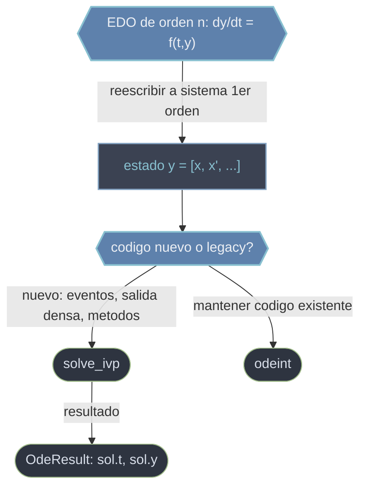

# EDO — resolver ecuaciones diferenciales ordinarias

Esta carpeta agrupa los solucionadores de `scipy.integrate` para **ecuaciones diferenciales ordinarias** (EDO): problemas de la forma `dy/dt = f(t, y)` donde se conoce la derivada y un **estado inicial `y0`**, y se reconstruye la trayectoria `y(t)`. Es lo que en matematicas se llama un **problema de valor inicial** (IVP): integrar la EDO hacia adelante en el tiempo desde la condicion inicial. Ambas rutinas resuelven sistemas de **primer orden**, asi que toda EDO de orden superior se reescribe antes como sistema. La eleccion entre las dos es esencialmente **API moderna (`solve_ivp`) vs legacy (`odeint`)**, no una diferencia de capacidad de calculo.

## En accion

Un oscilador armonico amortiguado es de **2º orden** (`x'' + 2ζω x' + ω² x = 0`). No se integra directo: primero se reescribe como **sistema de primer orden** con estado `y = [x, x']`, de modo que `dy/dt = [x', x''] = [v, -2ζω v - ω² x]`.

```python
import numpy as np
from scipy.integrate import solve_ivp

w, zeta = 2.0, 0.1          # frecuencia natural y amortiguamiento

# Reescritura a 1er orden: el estado es y = [x, v]
def oscilador(t, y):        # firma f(t, y): TIEMPO PRIMERO
    x, v = y
    return [v, -2*zeta*w*v - w**2 * x]

sol = solve_ivp(oscilador, t_span=(0, 30), y0=[1.0, 0.0],
                t_eval=np.linspace(0, 30, 600), method='RK45')

# sol es un OdeResult (acceso por atributo)
print(sol.success)          # True  -> comprobar SIEMPRE antes de usar sol.y
print(sol.t.shape)          # (600,)        instantes de salida
print(sol.y.shape)          # (2, 600)      forma (n_vars, n_puntos): una FILA por variable
x_t = sol.y[0]              # trayectoria de la posicion x(t)
v_t = sol.y[1]              # trayectoria de la velocidad x'(t)
print(x_t[-1])             # posicion final, ya amortiguada hacia ~0
```

## Que rutina uso



## Como elegir

### [[scipy.integrate.solve_ivp|solve_ivp]]
**Interfaz recomendada para codigo nuevo.** Firma del lado derecho `f(t, y)` (**tiempo primero**). Recibe el intervalo como tupla `t_span = (t0, tf)` —no un array de instantes— y devuelve un objeto-resultado `OdeResult` con `.t`, `.y` (forma `(n_vars, n_puntos)`, una fila por variable), `.success`, `.message`, etc. Aporta lo que `odeint` no tiene: eleccion explicita de metodo (`RK45`, `BDF`, `Radau`, `LSODA`...), salida densa interpolable (`dense_output` -> `sol.sol(t)`), puntos de salida elegidos (`t_eval`) y **deteccion de eventos** (`events`). Si la integracion avanza a pasos diminutos o falla, el sistema suele ser rigido: cambia a `BDF` / `Radau` / `LSODA`.

### [[scipy.integrate.odeint|odeint]]
**Interfaz historica** (envuelve LSODA de ODEPACK, que conmuta solo entre rigido y no rigido). Firma `func(y, t)` (**estado primero**, al reves de `solve_ivp`; con `tfirst=True` acepta `func(t, y)`). Recibe `t` como el **array completo de instantes de salida** (no un par `(t0, tf)`) y devuelve un `ndarray` plano de forma `(n_puntos, n_vars)` —transpuesto respecto a `solve_ivp`. Sin eventos ni salida densa ni eleccion de metodo. Se mantiene por compatibilidad; en codigo nuevo se prefiere `solve_ivp`.

## Tabla de decision

| Aspecto | `solve_ivp` (moderna) | `odeint` (legacy) |
|---------|-----------------------|-------------------|
| Firma del RHS | `f(t, y)` (tiempo primero) | `func(y, t)` (estado primero) |
| Tramo de tiempo | `t_span = (t0, tf)` | array completo `t` de instantes |
| Retorno | `OdeResult` (`.t`, `.y`, `.success`) | `ndarray` `(n_puntos, n_vars)` |
| Trayectoria de la variable `i` | `sol.y[i]` (fila) | `out[:, i]` (columna) |
| Eventos / salida densa | si | no |
| Eleccion de metodo | si (`RK45`, `BDF`, `Radau`...) | no (LSODA fijo) |
| Recomendacion | codigo nuevo | mantener codigo existente |

> Las dos confusiones tipicas al portar de `odeint` a `solve_ivp` son cruzar la firma (`f(t, y)` vs `f(y, t)`) e indexar el retorno con la forma equivocada (esta transpuesta entre ambos).

## Notas relacionadas

- [[scipy.integrate/cuadratura/index\|cuadratura]] — el otro pilar del submodulo: integrar funciones y datos
- [[concepto_callbacks_vectorizados]] — como escribir el lado derecho `f` de forma eficiente
- [[concepto_objetos_resultado]] — el objeto-resultado `OdeResult` de `solve_ivp`
