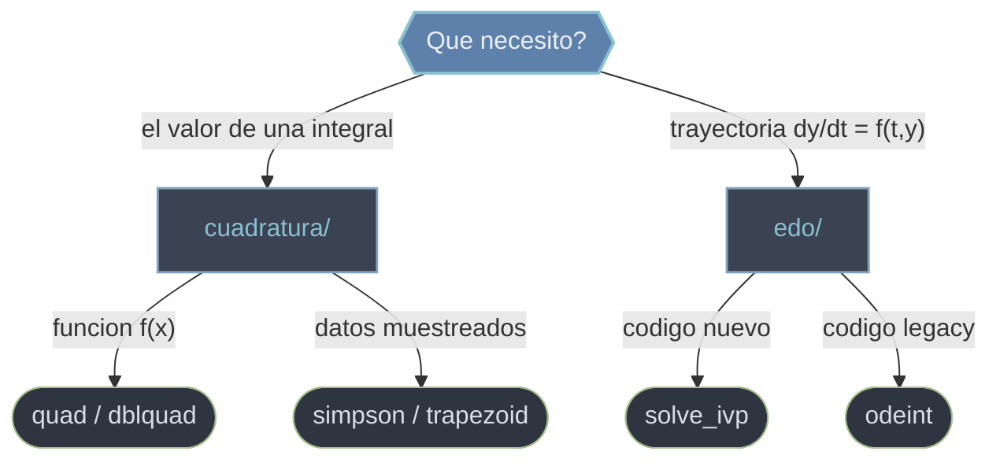

# scipy.integrate — integracion numerica y EDOs

`scipy.integrate` es el submodulo de **integracion numerica**. Cubre dos tareas que comparten la idea de "acumular a partir de una regla local" pero responden preguntas distintas: **calcular integrales definidas** (el area bajo una curva o superficie) y **resolver ecuaciones diferenciales ordinarias** (reconstruir una trayectoria a partir de su derivada y una condicion inicial). Por debajo usa bibliotecas Fortran muy probadas: QUADPACK para cuadratura, LSODA/Runge-Kutta para EDOs.

## En accion

```python
from scipy import integrate
import numpy as np

# 1. Integral definida de una funcion callable: e^(-x^2) entre 0 y 1
valor, error = integrate.quad(lambda x: np.exp(-x**2), 0, 1)
print(valor, error)        # 0.7468241328... , cota de error ~8e-15

# 2. Integral de datos ya muestreados (regla de Simpson)
x = np.linspace(0, 1, 101)
y = np.exp(-x**2)
area = integrate.simpson(y, x=x)   # ~0.74682

# 3. Resolver una EDO: dy/dt = -2y, y(0)=1  (solucion exacta e^(-2t))
sol = integrate.solve_ivp(lambda t, y: -2*y, t_span=[0, 5], y0=[1.0],
                          t_eval=np.linspace(0, 5, 50))
print(sol.y[0, -1])        # ~4.5e-5 en t=5
```

## Que carpeta uso



## Subcarpetas

### [[scipy.integrate/cuadratura/index\|cuadratura]]
Integrales definidas. Reune `quad` y `dblquad` (integran una **funcion callable** por cuadratura adaptativa, devolviendo valor y cota de error) y `simpson` / `trapezoid` (integran un **array de datos ya muestreados**). La pregunta para elegir: ¿tienes una funcion evaluable o solo muestras tabuladas?

### [[scipy.integrate/edo/index\|edo]]
Ecuaciones diferenciales ordinarias (problemas de valor inicial). Reune `solve_ivp` (API moderna: eventos, salida densa, eleccion de metodo) y `odeint` (interfaz historica sobre LSODA). Toda EDO de orden superior se reescribe antes como un **sistema de primer orden**.

## Tabla de orientacion

| Quiero... | Carpeta | Rutina tipica |
|-----------|---------|---------------|
| Integral de una funcion `f(x)` | [[scipy.integrate/cuadratura/index\|cuadratura]] | `quad` |
| Integral doble sobre una region | [[scipy.integrate/cuadratura/index\|cuadratura]] | `dblquad` |
| Integral de datos muestreados | [[scipy.integrate/cuadratura/index\|cuadratura]] | `simpson` / `trapezoid` |
| Resolver una EDO (codigo nuevo) | [[scipy.integrate/edo/index\|edo]] | `solve_ivp` |
| Resolver una EDO (codigo legacy) | [[scipy.integrate/edo/index\|edo]] | `odeint` |

## Notas relacionadas

- [[concepto_callbacks_vectorizados]] — como escribir integrandos y lados derechos eficientes
- [[concepto_objetos_resultado]] — el objeto-resultado de `solve_ivp`
