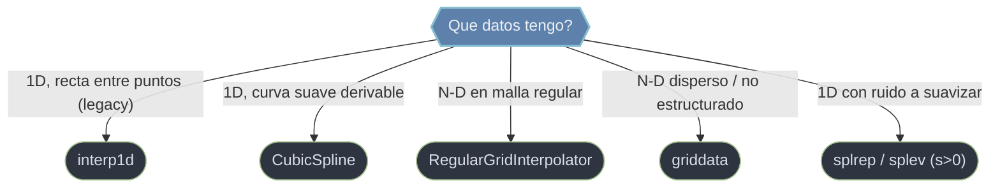

# scipy.interpolate — interpolacion 1D y N-D

`scipy.interpolate` es el submodulo de **interpolacion**: estimar el valor de una funcion en posiciones nuevas a partir de un conjunto de muestras conocidas. La eleccion de herramienta responde a dos preguntas. **¿Cuantas dimensiones?** En 1D estan `interp1d` (interpolador legacy, lineal o por tramos) y `CubicSpline` (spline cubico suave, derivable e integrable). En N dimensiones, lo decisivo es **¿como estan los datos?**: si forman una malla regular, `RegularGridInterpolator`; si son puntos dispersos no estructurados, `griddata`. Casi todas estas herramientas construyen un **objeto/funcion una vez** y se evaluan luego sobre los puntos destino.

## En accion

```python
import numpy as np
from scipy.interpolate import CubicSpline

# Pocos puntos muestreados de una curva suave
x = np.linspace(0, 2*np.pi, 9)
y = np.sin(x)

# 1. Construir el spline cubico C2 (pasa por todos los puntos)
cs = CubicSpline(x, y)

# 2. Evaluar en una malla fina -> curva densa lista para graficar
xn = np.linspace(0, 2*np.pi, 200)
yn = cs(xn)                       # valores interpolados
np.max(np.abs(yn - np.sin(xn)))  # → ~1e-3   muy cercano a sin real

# 3. Como es un spline, ademas deriva e integra analiticamente
cs(xn, 1)                         # 1a derivada -> aproxima cos(x)
cs.integrate(0, np.pi)            # → ~2.0     integral de sin en [0, pi]
cs.roots()                        # abscisas donde el spline cruza 0
```

## Que interpolador uso



La distincion mas importante en N dimensiones es **malla vs disperso**: `griddata` triangula nubes de puntos arbitrarios (lento, re-triangula en cada llamada), mientras que `RegularGridInterpolator` exige una rejilla producto y es mucho mas rapido. Y un matiz transversal: estos interpoladores **pasan exactamente por los puntos** (no suavizan ruido); para ajustar datos ruidosos se usa el suavizado por `s>0` de `splrep`.

## Notas del submodulo

### [[interp1d]]
Interpolador **1D legacy** (callable): construye una funcion `f(xnew)` a partir de `(x, y)`. Soporta varios esquemas via `kind` (`'linear'`, `'nearest'`, `'previous'`, `'cubic'`...) y controla el fuera de rango con `bounds_error` y `fill_value` (incluido `'extrapolate'`). Marcado como **legacy**: abunda en codigo existente, pero para codigo nuevo se prefiere `numpy.interp` o `CubicSpline`.

### [[CubicSpline]]
**Spline cubico C2** interpolante: pasa por todos los puntos con curva, pendiente y curvatura continuas. Ademas de evaluar `cs(xnew)`, permite **derivar, integrar y hallar raices** del propio spline como objetos. `bc_type` fija las condiciones de borde (`'natural'`, `'clamped'`, `'periodic'`). Es la alternativa moderna a `interp1d(kind='cubic')`.

### [[RegularGridInterpolator]]
Interpolacion **N-D en malla regular** (rectilinea): los puntos forman una rejilla producto de ejes 1D (no necesariamente equiespaciados). Se construye con los ejes y el array de valores y se evalua `rgi(puntos)`. La herramienta correcta para **tablas en grilla** (propiedades termodinamicas, campos 2D/3D, lookup multivariable); mucho mas rapida que `griddata` cuando los datos ya estan en malla.

### [[scipy.interpolate.griddata|griddata]]
Interpolacion de **datos dispersos / no estructurados** en N dimensiones: estima un campo sobre una grilla a partir de mediciones esparcidas (sin malla). Recibe `points`, `values` y los destinos `xi` (a menudo de `np.meshgrid`), con `method` `'nearest'`, `'linear'` o `'cubic'`. Los puntos fuera del casco convexo quedan en `NaN` (o `fill_value`). Triangula con Delaunay por dentro.

### [[scipy.interpolate.splrep_splev|splrep / splev]]
Interfaz **procedural FITPACK** de B-splines en dos pasos: `splrep(x, y)` **ajusta** y devuelve la tupla `tck`, `splev(xnew, tck)` **evalua** (o su derivada con `der`). El parametro `s` controla el equilibrio entre interpolar exacto (`s=0`) y **suavizar** datos ruidosos (`s>0`), lo que la distingue del resto: es la via para ajuste suavizado en 1D.

## Tabla de orientacion

| Datos / objetivo | Herramienta | Llamada tipica |
|------------------|-------------|----------------|
| 1D lineal o por tramos (legacy) | [[interp1d]] | `interp1d(x, y, kind='linear')` |
| 1D curva suave, derivar/integrar | [[CubicSpline]] | `CubicSpline(x, y)` |
| N-D en malla regular | [[RegularGridInterpolator]] | `RegularGridInterpolator((x,y), V)` |
| N-D disperso no estructurado | [[scipy.interpolate.griddata\|griddata]] | `griddata(pts, vals, (XX, YY))` |
| 1D con ruido a suavizar | [[scipy.interpolate.splrep_splev\|splrep / splev]] | `splrep(x, y, s>0)` |

## Notas relacionadas

- [[SciPy/index\|SciPy]]
- [[SciPy/scipy.spatial/index\|scipy.spatial]]
- [[concepto_relacion_numpy]]
