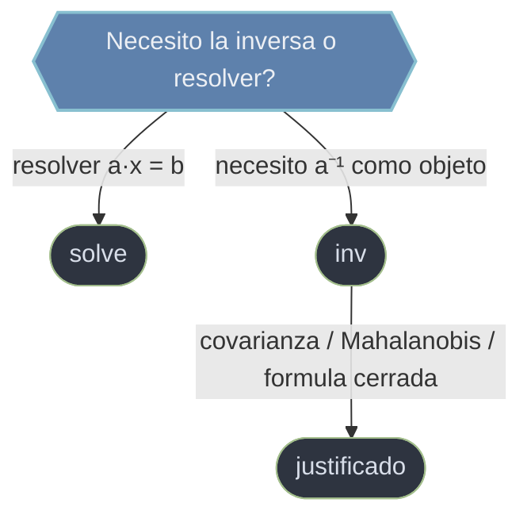

# basicas — operaciones de algebra lineal del dia a dia

Las tres operaciones mas frecuentes sobre matrices cuadradas: **resolver** un sistema lineal (`solve`), **invertir** una matriz (`inv`) y calcular su **determinante** (`det`). Todas se apoyan en una factorizacion LU de LAPACK por debajo, pero las usas como cajas negras. La nota matriz de esta carpeta es entender **cuando NO usar `inv`**: la mayoria de las veces que crees necesitar la inversa, en realidad quieres resolver un sistema, y para eso esta `solve` (mas rapido y mejor condicionado).

## En accion

```python
import numpy as np
from scipy.linalg import solve, inv

A = np.array([[3.0, 2.0], [1.0, 2.0]])
b = np.array([12.0, 8.0])

# CORRECTO: factoriza a una vez y resuelve por sustitucion (nunca forma la inversa)
x_bueno = solve(A, b)
print(x_bueno)               # → [2., 3.]

# ANTIPATRON: invertir para luego multiplicar
x_malo = inv(A) @ b          # mismo resultado, pero mas lento y peor condicionado
print(np.allclose(x_bueno, x_malo))   # → True (... esta vez)

# Por que solve es mejor: invertir cuesta mas operaciones que factorizar + sustituir,
# y acumula mas error de redondeo. En matrices mal condicionadas, inv(A) @ b se degrada
# antes que solve. Reserva inv para cuando necesitas la inversa COMO objeto.
```

## Cuando inv, cuando solve



## Modelo mental: solve es el rey, inv casi nunca

El antipatron mas comun en algebra lineal numerica es escribir `inv(a) @ b` para resolver `a·x = b`. Es a la vez **mas lento** (invertir cuesta mas que factorizar y sustituir) y **numericamente peor condicionado** (acumula mas error). `solve` factoriza `a` una vez y resuelve por sustitucion, sin formar nunca la inversa.

> Regla de oro: para resolver `a·x = b`, usa `solve`. Reserva `inv` para cuando necesitas la inversa **como objeto** (matriz de covarianza/precision, formulas cerradas tipo Mahalanobis, propagacion de incertidumbre).

## Las funciones

### [[scipy.linalg.solve]]

Resuelve el sistema `a·x = b` factorizando `a` (LU por defecto) y sustituyendo; **nunca** invierte. Acepta varios lados derechos a la vez (`b` de forma `(n, m)`) reutilizando una sola factorizacion, y un `assume_a` para declarar estructura (`'pos'` -> Cholesky, `'sym'` -> LDLᵀ) y ganar velocidad y estabilidad. Es la funcion que deberias alcanzar por defecto.

### [[scipy.linalg.inv]]

Calcula la inversa `a⁻¹` tal que `a @ a⁻¹ = I`, factorizando con LU. Justificada solo cuando necesitas la inversa **como objeto** (matriz de precision en gaussianas, distancia de Mahalanobis, formulas cerradas que la contienen); para resolver sistemas es el camino equivocado. Lanza `LinAlgError` si la matriz es singular y no avisa de mal condicionamiento.

### [[scipy.linalg.det]]

Devuelve el determinante (un **escalar**, no un array) como producto de los pivotes de la `U` de la factorizacion LU. Util como factor de escala de volumen (jacobianos), pero **mal indicador de singularidad**: escala como `λⁿ` y desborda facilmente en dimension alta. Para decidir invertibilidad fiate de `np.linalg.cond` o `matrix_rank`, y para determinantes grandes usa `np.linalg.slogdet` (trabaja en escala logaritmica).

## Como elegir

| Objetivo | Funcion | Nota |
|----------|---------|------|
| Resolver `a·x = b` | [[scipy.linalg.solve \| solve]] | siempre; nunca `inv(a) @ b` |
| Necesito la inversa como matriz explicita | [[scipy.linalg.inv \| inv]] | covarianzas, formulas cerradas |
| Factor de escala / jacobiano | [[scipy.linalg.det \| det]] | escalar; cuidado con overflow |
| Saber si `a` es singular/invertible | `cond` o `matrix_rank` | **no** `det ≈ 0` |

## Notas relacionadas

- [[scipy.linalg/index|scipy.linalg]]
- [[descomposiciones/index \| descomposiciones]]
- [[concepto_relacion_numpy]]
