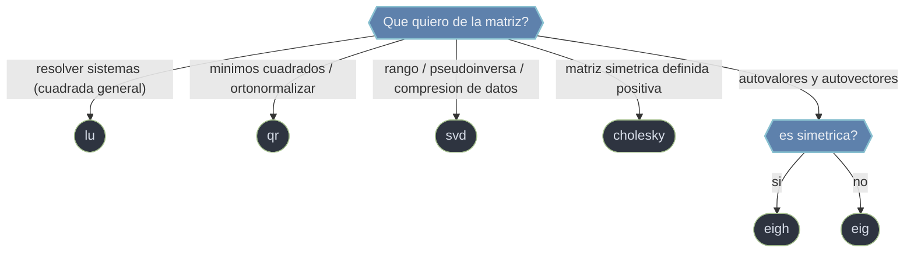

# descomposiciones — factorizaciones de matrices

Una **factorizacion** reescribe una matriz como producto de factores con estructura aprovechable (triangular, ortogonal, diagonal). Es la maquinaria que vive **debajo** de `solve`, `inv` y `det`, pero tambien una caja de herramientas por derecho propio: cada descomposicion revela algo distinto (sistemas, minimos cuadrados, rango, autovalores) y tiene un coste y una estabilidad distintos. La decision central de esta carpeta es **elegir la factorizacion segun la estructura de la matriz y el objetivo**.

## En accion

```python
import numpy as np
from scipy.linalg import qr, solve_triangular

# QR de una matriz rectangular y su reconstruccion: a = Q·R
A = np.array([[1.0, 2.0],
              [3.0, 4.0],
              [5.0, 6.0]])

Q, R = qr(A, mode='economic')      # Q (3,2) ortogonal, R (2,2) triangular superior
print(np.allclose(Q @ R, A))       # → True   (reconstruccion exacta)
print(np.allclose(Q.T @ Q, np.eye(2)))   # → True   (columnas ortonormales)

# Para que sirve: minimos cuadrados min ‖A·x - b‖ se reduce a R·x = Qᵀ·b
b = np.array([1.0, 2.0, 2.0])
x = solve_triangular(R, Q.T @ b)   # solucion estable, sin ecuaciones normales
print(x)
```

## Que descomposicion segun el objetivo



## Modelo mental: la estructura manda

Antes de factorizar, pregunta que sabes de la matriz: ¿es cuadrada o rectangular?, ¿simetrica?, ¿definida positiva? La respuesta selecciona el algoritmo barato y estable. Aplicar LU general a una matriz SPD desperdicia la mitad de las operaciones; usar las ecuaciones normales en vez de QR para minimos cuadrados eleva al cuadrado el numero de condicion.

## Las factorizaciones

### [[scipy.linalg.lu]]

Factoriza `a = P·L·U` por eliminacion gaussiana con pivoteo parcial: `P` permutacion, `L` triangular inferior con diagonal unitaria, `U` triangular superior. Es la base de `solve`/`inv`/`det` para matrices generales. **No existe en `numpy.linalg`**. Para resolver muchos sistemas con la misma `a`, usa la pareja `lu_factor` + `lu_solve`: factorizas una vez (`O(n³)`) y cada resolucion cuesta `O(n²)`.

### [[scipy.linalg.qr]]

Factoriza `a = Q·R` con `Q` **ortogonal** (columnas ortonormales) y `R` triangular superior. Es la via numericamente estable para **minimos cuadrados** (`R·x = Q^H·b`) y para **ortonormalizar** vectores (Gram-Schmidt estable). `mode='economic'` evita la `Q` completa cuando `M >> N`, y `pivoting=True` revela deficiencia de rango. Prefierela a las ecuaciones normales, que duplican el numero de condicion.

### [[scipy.linalg.svd]]

Descompone **cualquier** matriz como `a = U·diag(s)·Vh`, con `U`/`Vh` unitarias y `s` los valores singulares no negativos en orden descendente (un **array 1D**, no una matriz). Es la factorizacion mas robusta: existe siempre y revela rango numerico, numero de condicion (`s[0]/s[-1]`), pseudoinversa y la mejor aproximacion de bajo rango (Eckart-Young, base de PCA y compresion). La mas cara, pero la mas informativa.

### [[scipy.linalg.cholesky]]

Factoriza una matriz **SPD** (simetrica/hermitica definida positiva) como `a = U^H·U` (o `L·L^H` con `lower=True`), devolviendo **un solo** triangulo. Es ~2x mas rapida que LU porque explota la simetria, y **lanza `LinAlgError` si la matriz no es definida positiva**, lo que la convierte en el test barato estandar de definicion positiva. Aparece en sistemas de rigidez, covarianzas y muestreo gaussiano (`x = mu + L·z`).

### [[scipy.linalg.eig]]

Resuelve el problema de autovalores `a·v = w·v` de una matriz general: devuelve `(w, v)` con autovalores **complejos** (aunque `a` sea real) y autovectores en las **columnas** de `v`. Con `b` resuelve el generalizado `a·v = w·b·v` (vibraciones `K·v = w·M·v`). Para matrices **simetricas/hermiticas** usa siempre `eigh`: autovalores reales y ordenados, mas rapido y estable.

## Como elegir

| Matriz / objetivo | Descomposicion | Forma |
|-------------------|----------------|-------|
| Cuadrada general, resolver sistemas | [[scipy.linalg.lu \| lu]] | `a = P·L·U` |
| Rectangular, minimos cuadrados, ortonormalizar | [[scipy.linalg.qr \| qr]] | `a = Q·R` |
| Cualquier matriz: rango, pseudoinversa, compresion | [[scipy.linalg.svd \| svd]] | `a = U·diag(s)·Vh` |
| Simetrica definida positiva (SPD) | [[scipy.linalg.cholesky \| cholesky]] | `a = U^H·U` (~2x mas rapida que LU) |
| Autovalores / autovectores | [[scipy.linalg.eig \| eig]] (general) / `eigh` (simetrica) | `a·v = w·v` |

## Notas relacionadas

- [[scipy.linalg/index|scipy.linalg]]
- [[basicas/index \| basicas]]
- [[matriciales/index \| matriciales]]
- [[concepto_relacion_numpy]]
