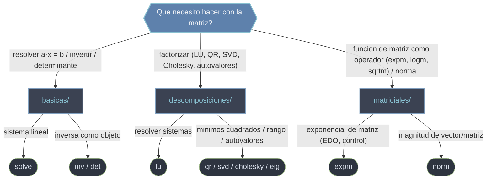

# scipy.linalg — algebra lineal densa

`scipy.linalg` es el submodulo de **algebra lineal densa** de SciPy: resuelve sistemas, factoriza matrices, calcula autovalores, normas y funciones de matriz. Toda rutina corre **siempre** sobre BLAS/LAPACK, las librerias de algebra lineal numerica de referencia, asi que opera sobre el mismo `ndarray` de NumPy pero con algoritmos compilados y estables. Es un **superset de `numpy.linalg`**: hace todo lo de NumPy y ademas trae funciones que alli no existen (`lu`, `cholesky`, `qr` con pivoteo, `expm`/`logm`/`sqrtm`, `solve_triangular`) y mas control (`assume_a`, `overwrite_a`, `lapack_driver`). Importa explicito: `from scipy import linalg` (o `from scipy.linalg import solve, lu, svd`).

## En accion

```python
import numpy as np
from scipy.linalg import solve, lu, svd

# 1. Resolver un sistema a·x = b (factoriza y sustituye; NUNCA inv(a) @ b)
A = np.array([[3.0, 2.0], [1.0, 2.0]])
b = np.array([12.0, 8.0])
x = solve(A, b)
print(x)                 # → [2., 3.]   (3·2 + 2·3 = 12 ; 1·2 + 2·3 = 8)

# 2. Una descomposicion: factorizacion LU a = P·L·U
P, L, U = lu(A)
print(np.allclose(P @ L @ U, A))     # → True

# 3. Otra descomposicion: SVD a = U·diag(s)·Vh (la mas robusta)
M = np.array([[1.0, 2.0], [3.0, 4.0], [5.0, 6.0]])
Us, s, Vh = svd(M, full_matrices=False)
print(s)                 # → valores singulares descendentes
print(np.allclose(Us @ np.diag(s) @ Vh, M))   # → True (hay que expandir s)
```

## Que carpeta uso



## Modelo mental: extiende a numpy.linalg

NumPy ya trae `numpy.linalg` con lo basico (`solve`, `inv`, `det`, `eig`, `svd`, `norm`). `scipy.linalg` lo amplia en tres frentes: **mas funciones** (`lu`, `cholesky`/`cho_factor`, `qr` con pivoteo, `expm`/`logm`/`sqrtm`, `solve_triangular`); **mas control** (`assume_a`, `overwrite_a`, `check_finite`, `lapack_driver` para elegir algoritmo o saltar copias en bucles criticos); y **siempre LAPACK** (NumPy puede usar otros backends; SciPy garantiza LAPACK y suele ser mas rapida). Regla practica: en codigo numerico serio, **prefiere `scipy.linalg`** por consistencia y por las funciones extra. El detalle esta en [[concepto_relacion_numpy]].

## Las tres subcarpetas

### [[basicas/index \| basicas]]
El nucleo del trabajo diario sobre matrices cuadradas: resolver `a·x = b` (`solve`), invertir (`inv`) y el determinante (`det`). La idea que ordena la carpeta es **preferir `solve` sobre `inv`**: invertir para luego multiplicar es mas lento y peor condicionado. Aqui tambien viven las advertencias numericas (el determinante es un mal test de singularidad; usa `cond`/`matrix_rank`).

### [[descomposiciones/index \| descomposiciones]]
Reescriben una matriz como producto de factores con estructura (triangular, ortogonal, diagonal). Son la maquinaria que esta **debajo** de `solve`, `inv` y `det`, pero tambien herramientas en si mismas: `lu` para sistemas generales, `cholesky` para matrices SPD, `qr` para minimos cuadrados y ortonormalizacion, `svd` para rango/pseudoinversa/compresion, `eig`/`eigh` para autovalores. La decision clave es **elegir la factorizacion segun la estructura de la matriz**.

### [[matriciales/index \| matriciales]]
Aplican una funcion escalar a una matriz **como operador algebraico**, no entrada a entrada: `expm` (exponencial, resuelve EDO lineales), `logm` (su inversa), `sqrtm` (raiz matricial). Tambien esta `norm`, que cuantifica la magnitud de un vector o una matriz. El error clasico que esta carpeta combate: `expm(A)` no es `np.exp(A)`.

## Tabla de orientacion

| Quiero... | Carpeta | Rutina tipica |
|-----------|---------|---------------|
| Resolver `a·x = b` | [[basicas/index \| basicas]] | `solve` |
| Invertir o determinante | [[basicas/index \| basicas]] | `inv` / `det` |
| Factorizar LU (sistemas generales) | [[descomposiciones/index \| descomposiciones]] | `lu` |
| Minimos cuadrados / ortonormalizar | [[descomposiciones/index \| descomposiciones]] | `qr` |
| Rango / pseudoinversa / compresion | [[descomposiciones/index \| descomposiciones]] | `svd` |
| Autovalores y autovectores | [[descomposiciones/index \| descomposiciones]] | `eig` / `eigh` |
| Exponencial de matriz (EDO, control, Markov) | [[matriciales/index \| matriciales]] | `expm` |
| Norma de vector o matriz | [[matriciales/index \| matriciales]] | `norm` |

## Notas relacionadas

- [[concepto_relacion_numpy]] — por que y cuando preferir scipy.linalg sobre numpy.linalg
- [[introduccion]]
