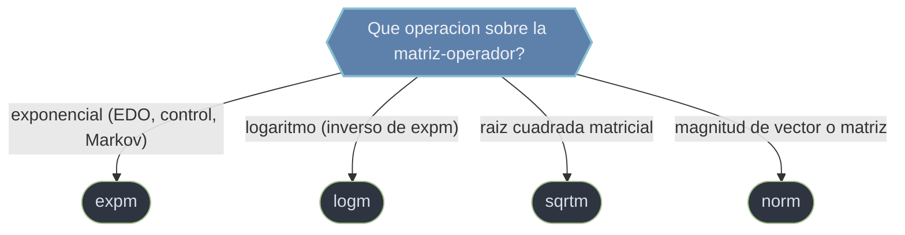

# matriciales — funciones de matriz y normas

Esta carpeta agrupa dos cosas relacionadas con tratar la matriz **como un objeto algebraico entero**: las **funciones de matriz** (aplicar una funcion escalar como `exp`, `log` o `sqrt` a una matriz, vista como operador) y las **normas** (cuantificar la magnitud de un vector o una matriz). El error que ordena toda la carpeta: una funcion de matriz **no** es la funcion aplicada entrada a entrada. `expm(A)` no es `np.exp(A)`.

## En accion

```python
import numpy as np
from scipy.linalg import expm

# Sistema lineal de EDO: dy/dt = A·y, y(0) = y0  ->  solucion cerrada y(t) = expm(A·t)·y0
A  = np.array([[-0.5,  1.0],
               [ 0.0, -0.3]])
y0 = np.array([2.0, 1.0])

t  = 3.0
yt = expm(A * t) @ y0        # el tiempo entra ESCALANDO la matriz, no hay argumento t
print(yt)                    # → estado del sistema en t=3 (decaimiento acoplado)

# CRITICO: expm NO es exp elemento a elemento
D = np.diag([0.0, 1.0])
print(expm(D))               # → [[1., 0.   ], [0., 2.71828]]   exponencial de matriz
print(np.exp(D))             # → [[1., 1.   ], [1., 2.71828]]   ¡distinto! ufunc por entrada
```

## Que funcion de matriz uso



## Modelo mental: funcion de matriz != funcion elemento a elemento

`np.exp(A)` es una ufunc: aplica `exp` a cada entrada por separado. `scipy.linalg.expm(A)` calcula la verdadera exponencial de la matriz, definida por la serie `Σ A^k/k!`, evaluada con algoritmos estables (Pade + scaling-and-squaring). Dan resultados completamente distintos salvo casos triviales. Para EDO lineales, cadenas de Markov y teoria de control, **siempre** es la version de funcion de matriz.

## Las funciones

### [[scipy.linalg.expm]]

Calcula la **exponencial matricial** `exp(A) = Σ A^k/k!` (no entrada a entrada), mediante aproximacion de Pade con scaling-and-squaring. Su uso central es la solucion cerrada de sistemas lineales de EDO `dy/dt = A·y`, que es `y(t) = expm(A·t)·y0`; tambien aparece en cadenas de Markov continuas (`P(t) = expm(Q·t)`) y en la matriz de transicion de estados del control (`Φ(t) = expm(A·t)`). El tiempo se incorpora escalando la matriz (`expm(A * t)`); no hay argumento `t`.

### logm — logaritmo matricial

La operacion **inversa** de `expm`: dada una matriz de transicion, recupera el **generador** `A` tal que `expm(A) = M`. Es una funcion de matriz distinta, con su propio algoritmo (no `np.log` entrada a entrada), util para reconstruir el generador de una cadena de Markov continua o de un sistema dinamico a partir de su matriz en un paso de tiempo.

### sqrtm — raiz cuadrada matricial

Devuelve la matriz `S` tal que `S·S = A` (no `np.sqrt` entrada a entrada). Aparece al "blanquear" datos (raiz de una covarianza), en geometria de matrices SPD y como paso intermedio de otras funciones de matriz. Como `logm`, es una funcion de matriz definida via su descomposicion espectral, no la raiz aplicada a cada elemento.

### [[scipy.linalg.norm]]

Calcula una **norma** de un array tratado como vector (1D) o matriz (2D); el parametro `ord` selecciona el tipo, y su significado **cambia con la dimension** (`ord=2` es la longitud euclidea en un vector pero la norma espectral —un SVD— en una matriz). Sirve para medir residuos `‖A·x − b‖`, numero de condicion, errores relativos y terminos de regularizacion (L1/L2). Con `axis` calcula muchas normas a la vez (por fila/columna) y con `keepdims=True` permite normalizar por broadcasting.

## Como elegir

| Objetivo | Funcion | Notas |
|----------|---------|-------|
| Exponencial de matriz (EDO, Markov, control) | [[scipy.linalg.expm \| expm]] | `y(t) = expm(A·t)·y0`; **nunca** `np.exp(A)` |
| Logaritmo matricial (inverso de expm) | `logm` | recupera el generador `A` de `expm(A)` |
| Raiz cuadrada matricial | `sqrtm` | `S` tal que `S·S = A` |
| Magnitud de vector o matriz | [[scipy.linalg.norm \| norm]] | el significado de `ord` cambia entre vector y matriz |

## Notas relacionadas

- [[scipy.linalg/index|scipy.linalg]]
- [[descomposiciones/index \| descomposiciones]]
- [[scipy.integrate.solve_ivp]] — resolver EDO no lineales (cuando expm no aplica)
- [[concepto_relacion_numpy]]
