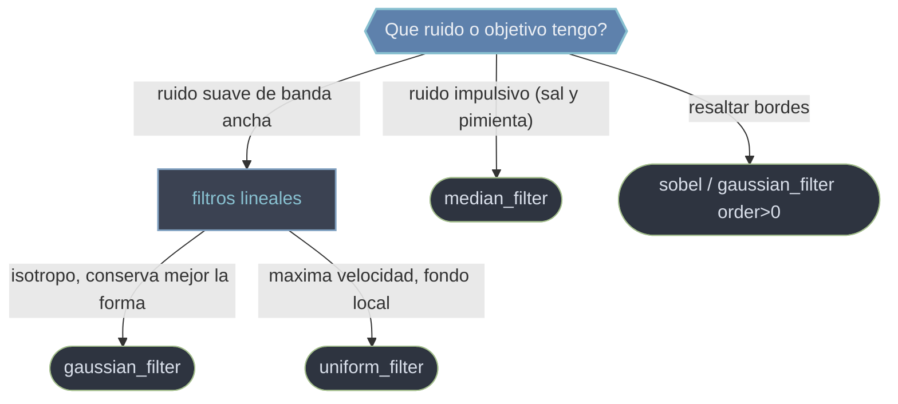

# Filtros de scipy.ndimage

Un **filtro** de `ndimage` recorre el array con una **ventana** centrada en cada pixel y lo reemplaza por una funcion de su vecindario. Es la familia que **limpia y realza** la imagen antes de medirla: atenua ruido, suaviza campos y resalta bordes. Todos comparten la interfaz N-dimensional (sirven en 2-D, 3-D o N-D), respetan el `shape` de la entrada y comparten parametros de borde (`mode`, `cval`) que deciden que vecinos virtuales se usan donde la ventana se sale del array. La distincion clave es **lineal vs no lineal**: un filtro lineal (gaussiano, media) **promedia** el vecindario con pesos —suaviza ruido pero **difumina bordes**—; uno no lineal (mediana) **ordena** el vecindario y elige un valor —**descarta outliers y preserva bordes**—.

## En accion

```python
from scipy import ndimage
import numpy as np

rng = np.random.default_rng(0)
img = np.zeros((80, 80))
img[20:60, 20:60] = 1.0                      # un cuadrado nitido

# ruido gaussiano (banda ancha) + ruido sal y pimienta (impulsivo)
ruidosa = img + 0.3 * rng.standard_normal(img.shape)
sp = ruidosa.copy()
idx = rng.random(img.shape) < 0.05
sp[idx] = rng.choice([0.0, 1.0], size=idx.sum())   # impulsos aislados

# gaussiano: ideal contra el ruido suave, pero redondea el borde
g = ndimage.gaussian_filter(ruidosa, sigma=2)

# mediana: ideal contra sal y pimienta y MANTIENE el borde recto
m = ndimage.median_filter(sp, size=3)

print(g.std(), m.std())   # ambos reducen la dispersion del ruido
```

## Que filtro uso



## Funciones

### [[scipy.ndimage.gaussian_filter|gaussian_filter]]

Suavizado **lineal y separable** con un nucleo gaussiano: cada pixel pasa a ser una media ponderada donde el peso decae con la distancia. Es el suavizado de referencia para **reducir ruido antes de detectar bordes o picos**, porque atenua altas frecuencias de forma isotropa y controlada. Con `order>0` calcula la **derivada gaussiana**, base de muchos detectores de bordes. Difumina los bordes y es flojo contra ruido impulsivo.

### [[scipy.ndimage.median_filter|median_filter]]

Filtro **no lineal** que reemplaza cada pixel por la **mediana** de su vecindario. Descarta valores atipicos aislados en vez de promediarlos, por lo que es la herramienta contra el **ruido impulsivo (sal y pimienta)** y, a diferencia del gaussiano, **preserva los bordes** nitidos. Mas costoso (hay que ordenar) y no es la mejor opcion contra ruido gaussiano de banda ancha.

### [[scipy.ndimage.uniform_filter|uniform_filter]]

Filtro de **caja / media plana**: promedia el vecindario ponderando a todos los vecinos por igual. Es **lineal, separable y muy rapido** (una media movil extendida a N dimensiones), ideal cuando prima la **velocidad** sobre la calidad o para estimar un fondo local. Es menos selectivo que el gaussiano (artefactos de caja en frecuencia) y tambien difumina bordes.

### sobel

Operador **derivativo** que aproxima el gradiente a lo largo de un eje (`axis`): resalta los **bordes** donde la intensidad cambia bruscamente. Se aplica por eje y se combina (p. ej. `hypot(sx, sy)`) para obtener la **magnitud del gradiente**. No suaviza ruido —al contrario, lo amplifica—, asi que suele ir despues de un `gaussian_filter`.

## Tabla de decision

| Tu situacion | Filtro |
|--------------|--------|
| Reducir ruido suave antes de detectar bordes / picos | [[scipy.ndimage.gaussian_filter\|gaussian_filter]] |
| Promediado rapido, calidad no critica, fondo local | [[scipy.ndimage.uniform_filter\|uniform_filter]] |
| Ruido impulsivo (sal y pimienta), conservar bordes | [[scipy.ndimage.median_filter\|median_filter]] |
| Resaltar bordes (gradiente) | `sobel` o [[scipy.ndimage.gaussian_filter\|gaussian_filter]] con `order>0` |

## Notas relacionadas

- [[scipy.ndimage.gaussian_filter|gaussian_filter]]
- [[scipy.ndimage.median_filter|median_filter]]
- [[scipy.ndimage.uniform_filter|uniform_filter]]
- [[Librerias/SciPy/scipy.ndimage/index|scipy.ndimage]]
- [[concepto_relacion_numpy]]
</content>
