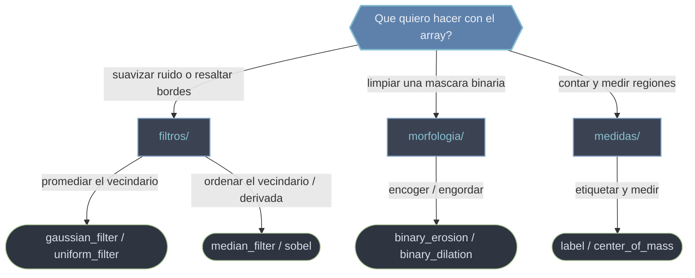

# scipy.ndimage — procesamiento de imagenes N-dimensionales

`scipy.ndimage` es el modulo de SciPy para **procesamiento de imagenes y arrays N-dimensionales**. La idea central es que una imagen no es un objeto especial: es un `ndarray` de NumPy donde cada celda es un pixel (2-D), un voxel (3-D) o un valor de un campo escalar de cualquier dimension. Por eso todo el modulo opera **igual en 2-D, 3-D o N-D**: las mismas funciones suavizan una foto, un volumen de resonancia magnetica o un campo de temperatura sobre una malla. El dato lo aporta NumPy; el algoritmo lo aporta SciPy. El modelo mental es una **ventana o elemento que se desliza sobre el array**: en cada posicion mira un vecindario y produce un valor, y lo que hace con ese vecindario define la familia: **promediarlo/ordenarlo** (filtros), **expandirlo/encogerlo segun su forma** (morfologia) o **agruparlo en regiones y medirlo** (medidas).

## En accion

```python
from scipy import ndimage
import numpy as np

# 1. Un array 2-D con dos cuadrados brillantes sobre fondo cero
img = np.zeros((100, 100))
img[20:40, 20:40] = 1.0
img[60:85, 55:80] = 1.0
img += 0.2 * np.random.default_rng(0).standard_normal(img.shape)  # ruido

# 2. FILTRO: suavizar para reducir ruido antes de umbralizar
suave = ndimage.gaussian_filter(img, sigma=2)

# 3. MEDIDAS: umbralizar -> etiquetar componentes conexas -> contar
mask = suave > 0.5
etiquetas, n = ndimage.label(mask)
print(n)                                   # 2  (dos objetos)
print(ndimage.center_of_mass(mask, etiquetas, index=[1, 2]))
# [(29.5, 29.5), (71.5, 67.0)]  centroides (fila, columna) por etiqueta
```

## Que carpeta uso



El **flujo tipico** encadena las tres familias en este orden: primero se **filtra** para reducir ruido, luego se umbraliza y se **limpia con morfologia** la mascara binaria, y finalmente se **etiqueta y mide** las regiones. Las subcarpetas siguen ese orden.

## Subcarpetas

### [[Librerias/SciPy/scipy.ndimage/filtros/index|filtros]]

Filtros de vecindario que recorren el array y reemplazan cada pixel por una combinacion de sus vecinos: suavizado para reducir ruido (`gaussian_filter`, `uniform_filter`), preservacion de bordes frente a ruido impulsivo (`median_filter`) y operadores derivativos para resaltar bordes (`sobel`). Son el **primer paso** del flujo: limpiar y realzar antes de medir.

### [[Librerias/SciPy/scipy.ndimage/morfologia/index|morfologia]]

Morfologia matematica sobre mascaras binarias: `binary_erosion` y `binary_dilation` como operaciones base, y sus combinaciones (apertura, cierre) para limpiar motas, rellenar huecos y conectar o separar regiones. Es el paso de **acondicionar la mascara** entre el filtrado y el etiquetado.

### [[Librerias/SciPy/scipy.ndimage/medidas/index|medidas]]

Etiquetado de regiones y extraccion de magnitudes. El flujo es **etiquetar luego medir**: `label` separa la imagen en componentes conexas y funciones como `center_of_mass` calculan centroide, area o intensidad de cada region por su etiqueta. Aqui el array se **reduce a numeros** que describen objetos.

## Tabla de decision

| Tu objetivo | Familia |
|-------------|---------|
| Reducir ruido o resaltar bordes | [[Librerias/SciPy/scipy.ndimage/filtros/index\|filtros]] |
| Limpiar, engordar, adelgazar o cerrar una mascara binaria | [[Librerias/SciPy/scipy.ndimage/morfologia/index\|morfologia]] |
| Contar objetos y medir centroide / area / intensidad | [[Librerias/SciPy/scipy.ndimage/medidas/index\|medidas]] |

## Notas relacionadas

- [[Librerias/SciPy/scipy.ndimage/filtros/index|filtros]]
- [[Librerias/SciPy/scipy.ndimage/morfologia/index|morfologia]]
- [[Librerias/SciPy/scipy.ndimage/medidas/index|medidas]]
- [[concepto_relacion_numpy]]
</content>
</invoke>
