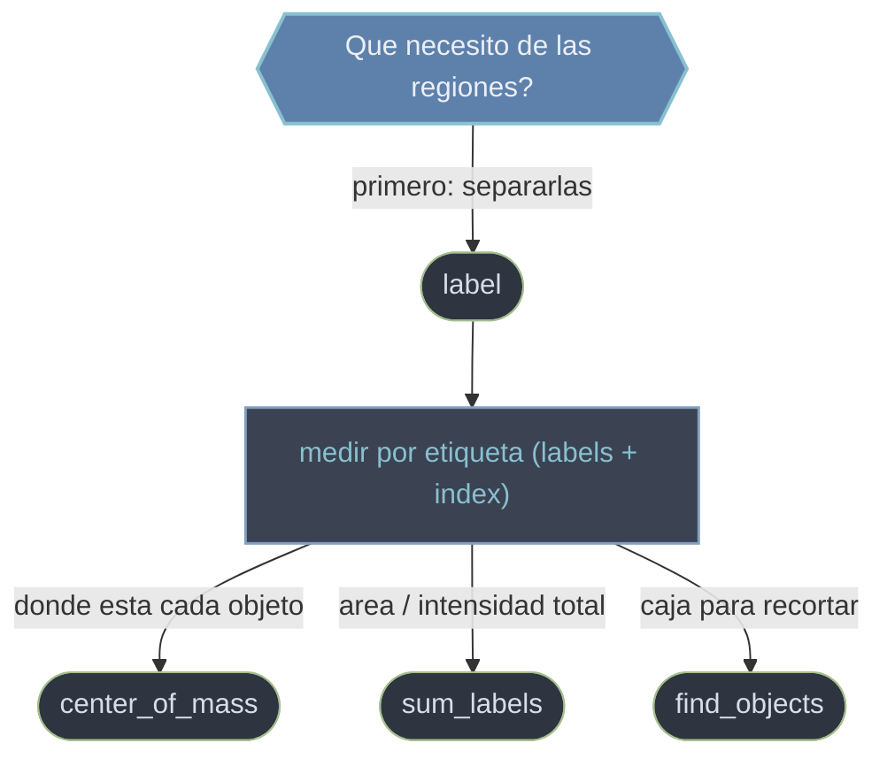

# Medidas sobre regiones de scipy.ndimage

Las **medidas** de `ndimage` extraen **numeros que describen objetos** dentro de una imagen: cuantos hay, donde estan, que tamaño o que intensidad tienen. A diferencia de los filtros, no devuelven un array transformado sino **magnitudes por region**. Su modelo de trabajo es un flujo en dos pasos: primero **etiquetar** (separar la imagen en regiones, cada una con un entero unico) y luego **medir** cada region por su etiqueta. Todas las funciones de medida aceptan un array `labels` y un `index`, asi que la misma mascara etiquetada sirve para calcular varias magnitudes a la vez. Las etiquetas empiezan en 1 porque el **0 es el fondo**.

## En accion

```python
from scipy import ndimage
import numpy as np

# Mascara binaria con tres objetos separados
mask = np.zeros((100, 100), dtype=bool)
mask[10:30, 10:30] = True      # objeto A
mask[40:60, 50:70] = True      # objeto B
mask[75:90, 20:35] = True      # objeto C

# 1. ETIQUETAR: separar en componentes conexas
etiquetas, n = ndimage.label(mask)
print(n)                       # 3  -> tres objetos contados

# 2. MEDIR por etiqueta: un centroide por region, todos alineados
indices = range(1, n + 1)
centros = ndimage.center_of_mass(mask, etiquetas, index=indices)
for i, c in zip(indices, centros):
    print(i, c)
# 1 (19.5, 19.5)   2 (49.5, 59.5)   3 (82.0, 27.0)   en (fila, columna)

# misma mascara etiquetada -> otra magnitud (area por region)
areas = ndimage.sum_labels(mask, etiquetas, index=indices)  # pixeles por objeto
```

## Flujo etiquetar -> medir



## Funciones

### [[scipy.ndimage.label|label]]

**Punto de partida del flujo**: etiqueta las **componentes conexas** de una mascara, asignando un entero unico a cada region de pixeles no nulos conectados y dejando el fondo en 0. Devuelve la **tupla** `(labeled_array, num_features)` —el mapa de etiquetas y el numero de regiones— que se desempaqueta con `labeled, n = label(mask)`. La conectividad (`structure`) decide si las diagonales unen regiones y por tanto cambia el conteo.

### [[scipy.ndimage.center_of_mass|center_of_mass]]

Calcula el **centroide ponderado por intensidad** de cada region: las zonas mas brillantes pesan mas en la posicion resultante. Con una mascara binaria da el **centro geometrico**; con la imagen de intensidades da el centro de "masa" luminosa. Devuelve coordenadas en **orden de ejes** `(fila, columna)` = `(y, x)`, no `(x, y)`: el desajuste al dibujarlas es el error mas comun.

> Otras medidas habituales siguen el mismo patron `labels` + `index`: `sum_labels` (area o intensidad total por region), `mean` / `maximum` / `minimum`, y `find_objects` (devuelve, por etiqueta, las **rebanadas** que enmarcan cada objeto, util para recortar cada region).

## Flujo de referencia

| Paso | Funcion | Resultado |
|------|---------|-----------|
| 1. Separar regiones | [[scipy.ndimage.label\|label]] | mapa de etiquetas + numero de objetos |
| 2a. Localizar cada objeto | [[scipy.ndimage.center_of_mass\|center_of_mass]] | centroide `(y, x)` por region |
| 2b. Medir tamaño / intensidad | `sum_labels`, `mean`, `maximum` | una magnitud por region |
| 2c. Enmarcar / recortar | `find_objects` | bounding box (slices) por region |

## Notas relacionadas

- [[scipy.ndimage.label|label]]
- [[scipy.ndimage.center_of_mass|center_of_mass]]
- [[Librerias/SciPy/scipy.ndimage/morfologia/index|morfologia]]
- [[Librerias/SciPy/scipy.ndimage/index|scipy.ndimage]]
</content>
