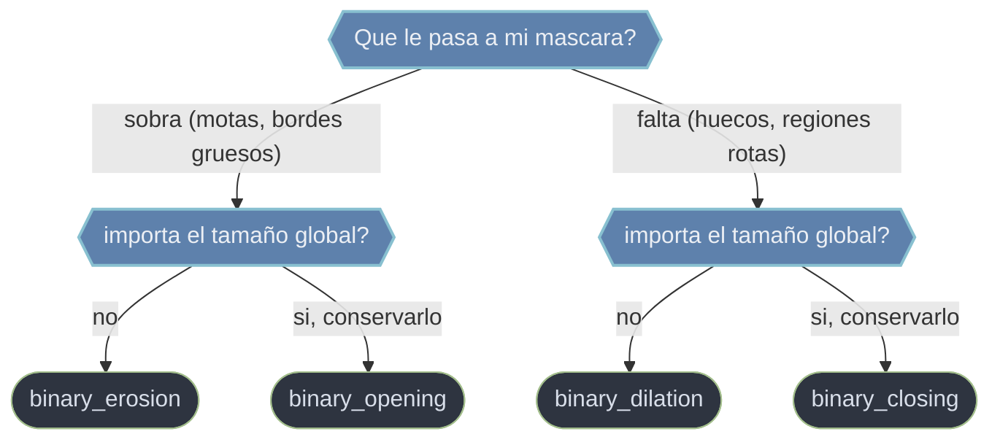

# Morfologia matematica de scipy.ndimage

La **morfologia matematica** transforma **mascaras binarias** segun la **forma** de sus regiones, no segun la intensidad. Desliza un **elemento estructurante** (una vecindad: cruz, cuadrado, disco) sobre la mascara y, en cada posicion, decide si el pixel central se enciende o apaga comparando esa forma con el objeto. Es el paso de **acondicionar la mascara** entre el filtrado y el etiquetado: limpia motas de ruido, rellena huecos, separa o conecta regiones, antes de contar y medir objetos. Las funciones binarias devuelven un `ndarray` **booleano** del mismo `shape`. Las dos operaciones base son duales: la **erosion** apaga un pixel salvo que TODO el elemento quepa dentro del objeto (**encoge**), y la **dilatacion** lo enciende si el elemento TOCA el objeto (**engorda**).

## En accion

```python
from scipy import ndimage
import numpy as np

# Mascara binaria: un cuadrado con una mota de ruido aislada
mask = np.zeros((20, 20), dtype=bool)
mask[5:15, 5:15] = True
mask[2, 2] = True               # mota de 1 pixel (ruido)

# EROSION: encoge -> adelgaza el cuadrado y BORRA la mota
ero = ndimage.binary_erosion(mask)
print(ero.sum())                # < mask.sum(); la mota de 1px desaparece

# DILATACION: engorda -> expande bordes y rellena huecos finos
dil = ndimage.binary_dilation(mask)
print(dil.sum())                # > mask.sum()

# APERTURA = erosion -> dilatacion: quita la mota SIN encoger el cuadrado
limpia = ndimage.binary_opening(mask)
print(limpia[2, 2], limpia[5:15, 5:15].all())   # False True
```

## Que operacion uso



La **apertura** (erosion -> dilatacion) limpia ruido conservando el tamaño de lo grande; el **cierre** (dilatacion -> erosion) rellena huecos sin engordar lo grande.

## Funciones

### [[scipy.ndimage.binary_erosion|binary_erosion]]

**Encoge** el primer plano: un pixel sobrevive solo si el elemento estructurante cabe **entero** dentro del objeto. Adelgaza bordes, **elimina motas** mas pequeñas que el elemento y desconecta puentes finos. Por si sola tambien encoge lo valido; por eso se compone con una dilatacion (apertura) para limpiar ruido sin perder tamaño. `border_value=1` evita recortar objetos que tocan el borde.

### [[scipy.ndimage.binary_dilation|binary_dilation]]

**Engorda** el primer plano: un pixel se activa si el elemento estructurante **toca** el objeto. Expande bordes, **rellena huecos pequeños** y **conecta regiones** separadas por una brecha estrecha. Operacion dual de la erosion; sola engorda tambien lo valido, asi que se compone con una erosion (cierre) para rellenar sin alterar el tamaño global.

> Las combinaciones tienen funciones propias: `binary_opening` (= erosion -> dilatacion) quita ruido conservando el tamaño de los objetos grandes; `binary_closing` (= dilatacion -> erosion) cierra huecos y grietas sin engordar. El parametro `structure` (generado con `generate_binary_structure`) define la conectividad y, con ella, que se rompe o se une.

## Tabla de decision

| Tu objetivo | Operacion |
|-------------|-----------|
| Adelgazar bordes / borrar motas / romper puentes | [[scipy.ndimage.binary_erosion\|binary_erosion]] |
| Expandir bordes / rellenar huecos / conectar regiones | [[scipy.ndimage.binary_dilation\|binary_dilation]] |
| Quitar ruido sin encoger lo grande | apertura: `binary_opening` (erosion -> dilatacion) |
| Cerrar huecos sin engordar lo grande | cierre: `binary_closing` (dilatacion -> erosion) |

## Notas relacionadas

- [[scipy.ndimage.binary_erosion|binary_erosion]]
- [[scipy.ndimage.binary_dilation|binary_dilation]]
- [[scipy.ndimage.label|label]]
- [[Librerias/SciPy/scipy.ndimage/index|scipy.ndimage]]
</content>
