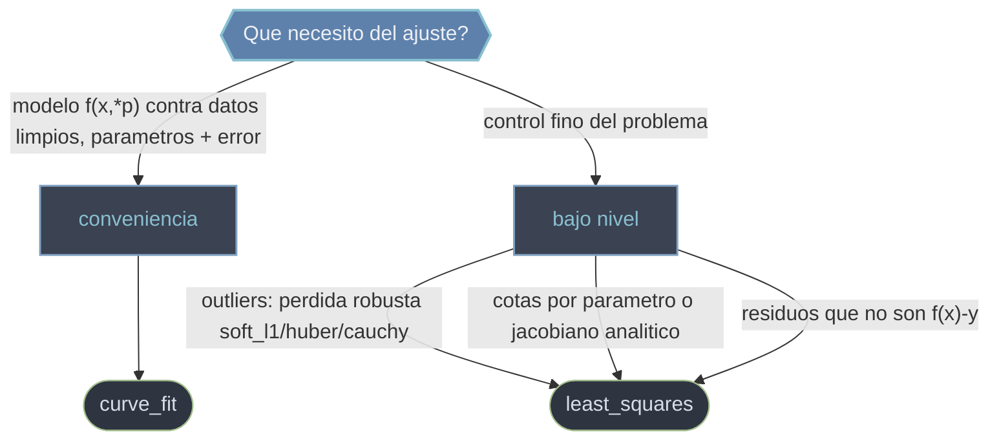

# Ajuste — encontrar los parametros de un modelo que mejor explican los datos

Esta carpeta agrupa las rutinas de `scipy.optimize` que **ajustan un modelo parametrico a datos experimentales** por minimos cuadrados: dado un conjunto de mediciones `(xdata, ydata)` y un modelo con parametros libres, buscan los valores de esos parametros que hacen que el modelo pase lo mas cerca posible de los puntos. La meta no es un minimo abstracto ni una raiz, sino **la curva que mejor describe tus datos**, con su incertidumbre. Por debajo todo se reduce a minimizar la suma de cuadrados de los residuos `r = modelo - datos`.

## En accion

```python
import numpy as np
from scipy.optimize import curve_fit

# Modelo a ajustar: y = a * exp(-b * x) + c
def modelo(x, a, b, c):
    return a * np.exp(-b * x) + c

# Datos sinteticos con ruido (en la practica vendrian de una medicion)
rng = np.random.default_rng(0)
xdata = np.linspace(0, 4, 50)
ydata = modelo(xdata, 2.5, 1.3, 0.5) + 0.2 * rng.normal(size=xdata.size)

# Ajuste: devuelve una TUPLA (popt, pcov), no un OptimizeResult
popt, pcov = curve_fit(modelo, xdata, ydata, p0=[1.0, 1.0, 0.0])
popt                       # → ~[2.5, 1.3, 0.5]  parametros optimos
errores = np.sqrt(np.diag(pcov))   # desviacion estandar (1 sigma) de cada parametro
print(popt, errores)
```

## Comodidad o control: que funcion uso



Ambas resuelven el mismo tipo de problema, pero a distinto nivel: `curve_fit` calcula los residuos por dentro y te da los parametros; `least_squares` te pide el vector de residuos a cambio de control fino. De hecho `curve_fit` delega internamente en `least_squares` (o en MINPACK con `method='lm'`): es la capa de conveniencia sobre el motor general.

## Funciones

### [[scipy.optimize.curve_fit|curve_fit]]

La via directa para "encontrar los parametros de mi ecuacion que mejor explican mis mediciones". Le pasas el modelo `f(x, a, b, ...)` (la variable independiente va primero) y los datos `(xdata, ydata)`, y devuelve una **tupla** `(popt, pcov)`: los parametros optimos y su matriz de covarianza, de donde salen los errores estandar con `np.sqrt(np.diag(pcov))`. Acepta semilla `p0` (determinante para converger), cotas `bounds` y pesos `sigma`. Ojo: no devuelve un OptimizeResult, no tiene `.x` ni `.success`. Minimiza suma de cuadrados clasica, asi que no es robusta a outliers.

### [[scipy.optimize.least_squares|least_squares]]

El motor de bajo nivel de minimos cuadrados no lineales. Aqui **tu funcion devuelve el vector de residuos** `r = modelo - datos` (no la suma de cuadrados), y el resultado **es un OptimizeResult** (`.x`, `.cost`, `.fun`, `.jac`, `.success`). Su gran ventaja es el control: funcion de perdida `loss` robusta a outliers (`soft_l1`, `huber`, `cauchy`) calibrada con `f_scale`, cotas por parametro, jacobiano analitico y eleccion de metodo (`trf`, `dogbox`, `lm`). Usalo cuando `curve_fit` se queda corto.

## Tabla de decision

| Tu situacion | Usa |
|--------------|-----|
| Modelo `f(x, *p)` contra datos limpios, quiero parametros + error | `curve_fit` |
| Datos con outliers, necesito perdida robusta (`soft_l1`/`huber`/`cauchy`) | `least_squares` |
| Quiero cotas por parametro y jacobiano analitico | `least_squares` |
| Residuos que no son un simple `f(x) - y` (sistema sobredeterminado) | `least_squares` |
| Comodidad y resultado rapido sin tocar residuos | `curve_fit` |
| Necesito `cost`, residuos o `jac` como diagnostico | `least_squares` |

> Regla practica: empieza con `curve_fit`; si aparecen outliers, necesitas acotar parametros o quieres diagnosticos finos, reescribe el problema en terminos de residuos y pasa a `least_squares`.

## Notas relacionadas

- [[scipy.optimize.curve_fit|curve_fit]]
- [[scipy.optimize.least_squares|least_squares]]
- [[OptimizeResult|OptimizeResult]]
- [[Librerias/SciPy/scipy.optimize/minimizacion/index|minimizacion]]
- [[concepto_callbacks_vectorizados]]
- [[concepto_relacion_numpy]]
