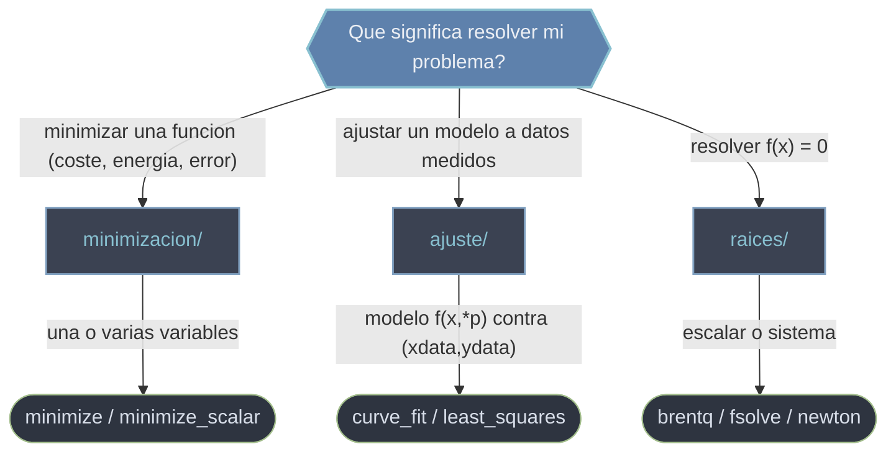

# scipy.optimize — optimizacion, raices y ajuste

`scipy.optimize` es el submodulo para tres problemas numericos emparentados que comparten un mismo nucleo iterativo: **minimizar** una funcion (hallar el punto donde vale lo menos posible), encontrar las **raices** de una ecuacion o sistema (los puntos donde vale cero) y **ajustar** un modelo parametrico a datos experimentales. Los tres parten de una semilla inicial, evaluan la funcion muchas veces y avanzan hasta cumplir una tolerancia. Casi todas las rutinas devuelven un objeto-resultado comun ([[OptimizeResult|OptimizeResult]]) que agrupa la solucion con el diagnostico de convergencia; la excepcion notable es `curve_fit`, que devuelve una tupla `(popt, pcov)`.

## En accion

```python
import numpy as np
from scipy.optimize import minimize, curve_fit, brentq

# 1. Minimizar una funcion: minimo de (x-3)^2 + (y+1)^2, esperado (3, -1)
res = minimize(lambda v: (v[0] - 3)**2 + (v[1] + 1)**2, x0=[0.0, 0.0])
res.x            # → array([ 3., -1.])
res.success      # → True (comprobar SIEMPRE antes de usar res.x)

# 2. Ajustar un modelo a datos ruidosos: y = a*exp(-b*x)
def modelo(x, a, b):
    return a * np.exp(-b * x)

x = np.linspace(0, 4, 50)
y = modelo(x, 2.5, 1.3) + 0.05 * np.random.default_rng(0).normal(size=x.size)
popt, pcov = curve_fit(modelo, x, y, p0=[1.0, 1.0])
popt             # → ~[2.50, 1.30]  (tupla, NO un OptimizeResult)

# 3. Resolver f(x)=0: raiz de x^2 - 2 en [0, 2] (hay cambio de signo)
r = brentq(lambda x: x**2 - 2, 0, 2)
r                # → 1.4142135623730951
```

## Que subcarpeta uso



Las tres familias estan ligadas por debajo: ajustar es minimizar la suma de cuadrados de los residuos, y muchas raices se plantean como minimizar `||f(x)||`. Aun asi conviene usar la herramienta especifica de cada caso porque expone la interfaz y los diagnosticos adecuados.

## Subcarpetas

### [[Librerias/SciPy/scipy.optimize/minimizacion/index|minimizacion]]

Minimizar funciones escalares de una o varias variables. Reune `minimize` (multivariable, con cotas y restricciones, varios algoritmos como Nelder-Mead o BFGS), `minimize_scalar` (una sola variable, por intervalo o bracket) y `linprog` (programacion lineal pura, unico caso con optimo global garantizado). Es el punto de partida cuando tu objetivo es "encontrar el valor que hace minimo este coste".

### [[Librerias/SciPy/scipy.optimize/ajuste/index|ajuste]]

Ajustar modelos no lineales a datos por minimos cuadrados. Tiene `curve_fit` (la via directa `modelo(x, *params)` contra `(xdata, ydata)`, devuelve `popt` y la matriz de covarianza `pcov`) y `least_squares` (el motor de bajo nivel, con control fino de residuos, perdidas robustas a outliers, cotas y jacobiano). La meta no es un minimo abstracto sino la curva que mejor describe tus datos, con su incertidumbre.

### [[Librerias/SciPy/scipy.optimize/raices/index|raices]]

Resolver `f(x) = 0`. Cubre el caso **escalar** con cambio de signo garantizado (`brentq`, `bisect`), el escalar rapido desde una semilla con derivada (`newton`) y los **sistemas** multivariable con la interfaz moderna `root` y la antigua `fsolve`. La eleccion depende de si tienes un intervalo que encierra la raiz o solo una estimacion inicial.

## Nota suelta del modulo

### [[OptimizeResult|OptimizeResult]]

El objeto-resultado comun que devuelven la mayoria de rutinas (`minimize`, `minimize_scalar`, `root`, `least_squares`, `linprog`). Es un Bunch: se accede por atributo (`res.x`) o por clave (`res["x"]`) y agrupa la solucion con los metadatos de convergencia (`success`, `status`, `message`, `nit`, `nfev`). Regla de oro: comprueba `res.success` antes de leer `res.x`. Ojo: `curve_fit` es la excepcion, devuelve una tupla `(popt, pcov)`, no un OptimizeResult.

## Tabla de orientacion

| Tu problema | Subcarpeta | Rutina tipica |
|-------------|------------|---------------|
| Minimizar un coste / energia de varias variables | [[Librerias/SciPy/scipy.optimize/minimizacion/index\|minimizacion]] | `minimize` |
| Minimizar funcion de una sola variable | [[Librerias/SciPy/scipy.optimize/minimizacion/index\|minimizacion]] | `minimize_scalar` |
| Objetivo y restricciones todos lineales (LP) | [[Librerias/SciPy/scipy.optimize/minimizacion/index\|minimizacion]] | `linprog` |
| Parametros de un modelo que ajusta a datos medidos | [[Librerias/SciPy/scipy.optimize/ajuste/index\|ajuste]] | `curve_fit` |
| Ajuste robusto a outliers o con control de residuos | [[Librerias/SciPy/scipy.optimize/ajuste/index\|ajuste]] | `least_squares` |
| Raiz escalar con intervalo de cambio de signo | [[Librerias/SciPy/scipy.optimize/raices/index\|raices]] | `brentq` |
| Raiz de un sistema desde una semilla | [[Librerias/SciPy/scipy.optimize/raices/index\|raices]] | `fsolve` / `root` |
| Interpretar el objeto que devuelve cualquier rutina | [[OptimizeResult\|OptimizeResult]] | — |

## Notas relacionadas

- [[Librerias/SciPy/scipy.optimize/minimizacion/index|minimizacion]]
- [[Librerias/SciPy/scipy.optimize/ajuste/index|ajuste]]
- [[Librerias/SciPy/scipy.optimize/raices/index|raices]]
- [[OptimizeResult|OptimizeResult]]
- [[concepto_objetos_resultado]] — el patron general de objetos-resultado de SciPy
- [[concepto_callbacks_vectorizados]] — como escribir funciones objetivo eficientes
- [[concepto_relacion_numpy]]
