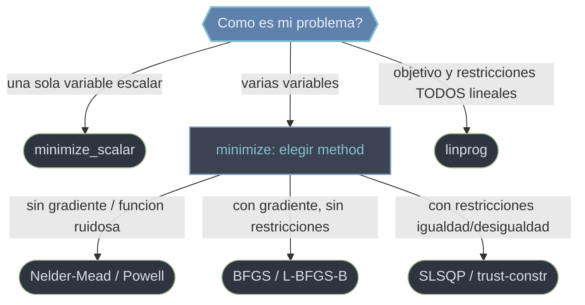

# Minimizacion — encontrar el punto donde una funcion vale lo menos posible

Esta carpeta agrupa las rutinas de `scipy.optimize` que **minimizan una funcion objetivo**: dado un coste, una energia o un error, buscan el punto que lo hace lo mas pequeño posible. Todas parten de una semilla inicial, evaluan la funcion muchas veces y descienden hacia un minimo. Salvo la programacion lineal, son optimizadores **locales**: encuentran el valle mas cercano a donde arrancan, no garantizan el optimo global. Para maximizar, se minimiza el negativo de la funcion.

## En accion

```python
import numpy as np
from scipy.optimize import minimize

# Funcion de Rosenbrock: minimo global en (1, 1) con valor 0
def rosenbrock(v):
    x, y = v
    return (1 - x)**2 + 100 * (y - x**2)**2

# BFGS (cuasi-Newton): usa el gradiente, ideal sin restricciones y diferenciable
res = minimize(rosenbrock, x0=[0.0, 0.0], method='BFGS')
res.x            # → ~array([1., 1.])
res.fun          # → ~0.0  valor de la funcion en el minimo
res.success      # → True (comprobar antes de usar res.x)

# Nelder-Mead (sin gradiente): util para funciones ruidosas o no diferenciables
res2 = minimize(rosenbrock, x0=[0.0, 0.0], method='Nelder-Mead')
res2.x           # → ~array([1., 1.])
```

## Interfaz unificada: que metodo elijo



`minimize` es el punto de entrada por defecto: una sola firma `minimize(fun, x0, ...)` da acceso a muchos algoritmos via `method`, y SciPy autoselecciona uno razonable segun lo que pases (BFGS sin restricciones, L-BFGS-B si solo hay cotas, SLSQP si hay restricciones). `minimize_scalar` es su contraparte univariable y `linprog` el caso especial lineal.

## Funciones

### [[scipy.optimize.minimize|minimize]]

La **interfaz unificada** para minimizar funciones de una o varias variables. Una sola firma da acceso a muchos algoritmos via `method`, soporta cotas por variable (`bounds`) y restricciones de igualdad/desigualdad (`constraints`), y acepta gradiente (`jac`) y hessiano (`hess`). Devuelve un OptimizeResult cuyo `.x` es el vector solucion. La gracia es que SciPy **autoselecciona el metodo** segun lo que pases.

### [[scipy.optimize.minimize_scalar|minimize_scalar]]

La contraparte de `minimize` para **una sola variable**. No usa `x0`, sino un `bracket` (triplete que encierra el minimo) o `bounds=(a, b)` para acotar la busqueda. Su `.x` es un **escalar**, no un array. Tres metodos: `brent` (default, rapido para funciones unimodales), `golden` (seccion aurea, robusto y lento) y `bounded` (el unico que respeta un intervalo cerrado `[a, b]`). Regla: si la incognita es un solo numero, esta es la herramienta.

### [[scipy.optimize.linprog|linprog]]

**Programacion lineal**: minimiza `c·x` cuando objetivo y restricciones son todos lineales (`A_ub·x <= b_ub`, `A_eq·x = b_eq`, cotas por variable). Es un caso especial pero muy comun (asignacion de recursos, mezclas, dietas, planificacion) y encuentra el optimo **global** del LP. Convenciones clave: siempre minimiza (para maximizar, niega `c` y `res.fun`), toda desigualdad debe ser `<=`, y el default `bounds=(0, None)` fuerza `x >= 0`. Usa el solver `'highs'`. Soporta variables enteras (MILP) via `integrality`.

## Metodos de minimize: cuando usar cada uno

| Metodo | Gradiente | bounds | constraints | Cuando |
|--------|-----------|--------|-------------|--------|
| `Nelder-Mead` | no | si | no | Funciones ruidosas o no diferenciables, pocas variables |
| `Powell` | no | si | no | Sin gradiente, alternativa a Nelder-Mead |
| `BFGS` | si | no | no | Default sin restricciones; cuasi-Newton denso |
| `L-BFGS-B` | si | si | no | Muchas variables + cotas; poca memoria |
| `TNC` | si | si | no | Newton truncado con cotas |
| `SLSQP` | si | si | igualdad y desigualdad | Restricciones generales, pocas-medianas variables |
| `trust-constr` | si | si | igualdad y desigualdad | Restricciones a gran escala; admite hessiano |

## Tabla de decision

| Tu problema | Usa |
|-------------|-----|
| Una sola variable, con o sin cota `[a, b]` | `minimize_scalar` |
| Varias variables, sin restricciones | `minimize` (BFGS) |
| Muchas variables + cotas por variable | `minimize` (L-BFGS-B) |
| Restricciones de igualdad/desigualdad | `minimize` (SLSQP o trust-constr) |
| Objetivo y restricciones todos lineales | `linprog` |
| Necesito el optimo global (no local) | `linprog` (si es LP); si no, `differential_evolution` / `basinhopping` |

> Recuerda: `minimize` y `minimize_scalar` son **locales** salvo lo indicado. Comprueba siempre `res.success` antes de usar `res.x`.

## Notas relacionadas

- [[scipy.optimize.minimize|minimize]]
- [[scipy.optimize.minimize_scalar|minimize_scalar]]
- [[scipy.optimize.linprog|linprog]]
- [[OptimizeResult|OptimizeResult]]
- [[Librerias/SciPy/scipy.optimize/ajuste/index|ajuste]]
- [[concepto_objetos_resultado]]
- [[concepto_callbacks_vectorizados]]
