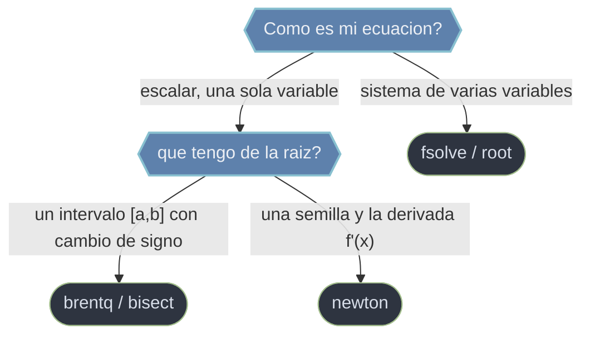

# Raices — resolver f(x) = 0

Esta carpeta agrupa las rutinas de `scipy.optimize` que **hallan las raices** de una ecuacion o sistema: los puntos donde la funcion se anula (`f(x) = 0`). La meta no es un minimo ni el ajuste de un modelo, sino el **cruce por cero**. La eleccion de herramienta depende de dos preguntas: si tu incognita es un **escalar** o un **sistema** de varias variables, y si dispones de un **intervalo que encierra la raiz** (con cambio de signo) o solo de una **semilla inicial**. Con bracket se gana robustez (convergencia garantizada); con semilla se gana velocidad a riesgo de divergir.

## En accion

```python
import numpy as np
from scipy.optimize import brentq, fsolve

# 1. RAIZ ESCALAR con bracket: f(x) = x^2 - 2 en [0, 2]
#    f(0) = -2 < 0 y f(2) = 2 > 0  -> hay cambio de signo (Bolzano)
r = brentq(lambda x: x**2 - 2, 0, 2)
r                # → 1.4142135623730951  (convergencia garantizada)

# 2. SISTEMA no lineal: x0*cos(x1) = 4 ; x0*x1 - x1 = 5
def sistema(v):
    x0, x1 = v
    return [x0 * np.cos(x1) - 4,
            x0 * x1 - x1 - 5]

x = fsolve(sistema, x0=[1.0, 1.0])   # parte de una semilla
x                # → array([6.50409711, 0.90841421])  (array directo, NO OptimizeResult)
```

## Que rutina elijo



La regla: si tienes un intervalo con cambio de signo, `brentq` (o `bisect`) **converge siempre**; si solo tienes una estimacion inicial y la derivada, `newton` es mas rapido pero puede diverger; para sistemas multivariable, usa `root` (moderno) o `fsolve` (legacy).

## Funciones

### [[scipy.optimize.brentq|brentq]]

Raiz de una funcion **escalar** dentro de un intervalo `[a, b]`. **Requiere** que `f(a)` y `f(b)` tengan signo opuesto (cambio de signo), garantizando por Bolzano que existe una raiz. Usa el metodo de Brent (biseccion + secante + interpolacion cuadratica inversa): robusto y de **convergencia garantizada**. Es la opcion mas recomendada para una raiz escalar acotada. Su primo `bisect` es la biseccion pura (mas lenta, igual de robusta).

### [[scipy.optimize.newton|newton]]

Raiz de una funcion **escalar** partiendo de una semilla `x0`. Con derivada `fprime` usa Newton-Raphson (convergencia cuadratica); sin ella, cae a la secante; con `fprime2` usa Halley. Es **rapido** pero **no garantiza convergencia** (puede diverger con mala semilla). Admite `x0` como array para resolver muchas raices a la vez (modo vectorizado). Cuando tengas un bracket y necesites robustez, prefiere `brentq`.

### [[scipy.optimize.fsolve|fsolve]]

Resuelve `func(x) = 0` para un **sistema** de ecuaciones no lineales. Es el wrapper **legacy** sobre el metodo `'hybr'` de MINPACK: por defecto devuelve directamente el array solucion, no un OptimizeResult. Abunda en codigo viejo, pero para codigo nuevo conviene migrar a `root`. Parte de una semilla `x0` y encuentra una sola raiz cercana; activa `full_output=1` para recuperar el diagnostico de convergencia (`ier == 1`).

### [[scipy.optimize.root|root]]

La interfaz **moderna y unificada** para raices de **sistemas** no lineales. Reemplaza a `fsolve` exponiendo varios metodos bajo una sola firma (`'hybr'`, `'lm'`, `'broyden1/2'`, `'krylov'` para sistemas grandes y dispersos, `'df-sane'`) y devolviendo siempre un OptimizeResult (`.x`, `.success`, `.fun`). Comprueba `sol.success` antes de usar `sol.x`. Es la opcion por defecto para sistemas en codigo nuevo.

## Tabla de decision

| Tu situacion | Usa |
|--------------|-----|
| Raiz escalar con intervalo `[a, b]` de cambio de signo | `brentq` (o `bisect`) |
| Raiz escalar desde una semilla, con derivada | `newton` |
| Muchas raices escalares de golpe (vectorizado) | `newton` con `x0` array |
| Sistema no lineal, codigo nuevo | `root` |
| Sistema no lineal, codigo legacy | `fsolve` |
| Sistema grande y disperso | `root` (`method='krylov'`) |

> `newton`, `fsolve` y `root` encuentran **una** raiz cercana a la semilla; no son globales ni enumeran todas las raices. Solo `brentq`/`bisect` garantizan converger dentro del bracket.

## Notas relacionadas

- [[scipy.optimize.brentq|brentq]]
- [[scipy.optimize.newton|newton]]
- [[scipy.optimize.fsolve|fsolve]]
- [[scipy.optimize.root|root]]
- [[OptimizeResult|OptimizeResult]]
- [[Librerias/SciPy/scipy.optimize/minimizacion/index|minimizacion]]
- [[concepto_callbacks_vectorizados]]
