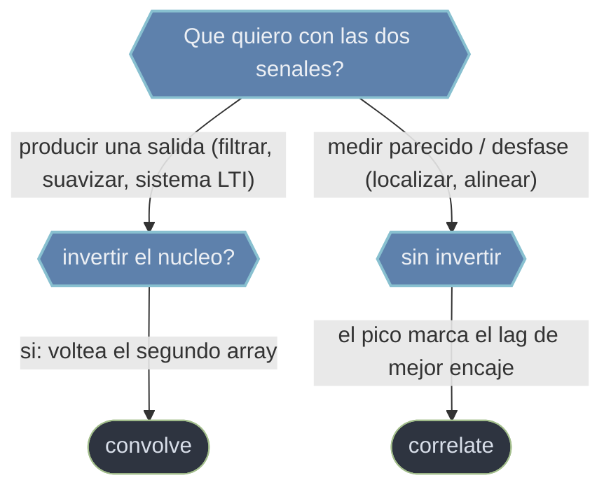

# scipy.signal convolucion — deslizar y sumar

Esta carpeta reune las dos operaciones base que **deslizan** un array sobre otro y, para cada desplazamiento, suman los productos de las muestras solapadas. Comparten casi toda la maquinaria —el mismo `mode` para el tamano de salida (`'full'`, `'same'`, `'valid'`) y el mismo `method` para elegir algoritmo directo o por FFT— y se diferencian en un solo detalle decisivo: la **convolucion invierte** el segundo array antes de deslizarlo y la **correlacion no**. De esa diferencia nacen dos usos distintos: la convolucion **transforma** una senal (filtrar, suavizar, modelar un sistema LTI) y la correlacion la **compara** con otra (buscar un patron, medir un desfase). La regla practica: convolucion para producir una salida, correlacion para localizar o alinear.

## En accion

```python
import numpy as np
from scipy.signal import convolve

# Convolucionar una senal con un kernel (media movil de 5 muestras)
senal = np.array([1, 5, 2, 8, 3, 9, 4, 7, 2], dtype=float)
kernel = np.ones(5) / 5                    # nucleo normalizado -> no escala la amplitud

# 'same' alinea la salida con la entrada (misma longitud)
suave = convolve(senal, kernel, mode='same')
suave    # → senal suavizada, atenua los saltos rapidos

# Si el kernel fuese la respuesta al impulso h de un sistema LTI,
# convolve(x, h) seria directamente la salida del sistema.
```

## convolve o correlate



## Contenido

### [[scipy.signal.convolve\|convolve]]
Calcula la **convolucion** de dos arrays N-dimensionales: desliza el nucleo, lo **invierte** y suma los productos solapados. Es la operacion base de los sistemas LTI (si el nucleo es la respuesta al impulso, el resultado es la salida del sistema) y de los suavizados por media movil. Es **conmutativa**; para senales grandes conviene `method='fft'` o las funciones dedicadas `fftconvolve` / `oaconvolve`.

### [[scipy.signal.correlate\|correlate]]
Calcula la **correlacion cruzada**: igual que la convolucion pero **sin invertir** el segundo array. Mide la **similitud** entre dos senales en funcion del desfase, de modo que el indice del maximo indica el desplazamiento de mayor coincidencia. Sirve para detectar un patron dentro de una senal o estimar el retardo entre dos sensores; usa `correlation_lags` para traducir indices a lags reales.

## Tabla de decision

| Si necesitas... | Usa | Por que |
|-----------------|-----|---------|
| Modelar la salida de un sistema LTI | [[scipy.signal.convolve\|convolve]] | Invierte el nucleo: es la convolucion del sistema |
| Suavizar con un nucleo (media movil) | [[scipy.signal.convolve\|convolve]] | Filtrado directo con `mode='same'` |
| Localizar un patron dentro de una senal | [[scipy.signal.correlate\|correlate]] | El pico marca la posicion de mejor encaje |
| Estimar el retardo entre dos senales | [[scipy.signal.correlate\|correlate]] | El lag del maximo es el desfase en muestras |
| Acelerar con senales muy largas | ambas con `method='fft'` | Coste mucho menor que la via directa |

## Notas relacionadas

- [[scipy.signal.convolve]]
- [[scipy.signal.correlate]]
- [[Librerias/SciPy/scipy.signal/filtros/index\|filtros]]
- [[Librerias/SciPy/scipy.signal/picos/index\|picos]]
- [[Librerias/SciPy/scipy.signal/index\|scipy.signal]]
