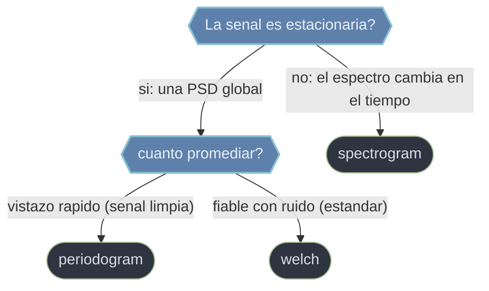

# scipy.signal espectral — del tiempo a la frecuencia

El **analisis espectral** responde a la pregunta "que frecuencias componen esta senal y con cuanta potencia". En lugar de mirar como varia la amplitud en el tiempo, se mira que tonos u oscilaciones estan presentes: el paso del dominio del tiempo al de la **frecuencia** via la transformada de Fourier. Todos estos estimadores parten del mismo ladrillo —ventanear un tramo, hacerle la FFT y elevar al cuadrado la magnitud para obtener potencia por frecuencia— y lo que cambia es **cuanto se promedia**. Un solo tramo da el periodograma (rapido pero ruidoso); partir la senal en segmentos y promediar sus periodogramas da Welch (suave, el estandar practico); no promediar sino conservar cada segmento como una franja temporal da el espectrograma (frecuencia frente a tiempo). Es el mismo calculo con tres grados distintos de promediado.

## En accion

```python
import numpy as np
from scipy.signal import welch

# Densidad espectral de potencia (PSD) de una senal con dos tonos + ruido
fs = 2000.0                                   # Hz
t = np.arange(0, 10, 1/fs)
x = (np.sin(2*np.pi*120*t)                    # tono 1
     + 0.5*np.sin(2*np.pi*375*t)              # tono 2
     + 2.0*np.random.randn(t.size))           # ruido fuerte

# welch parte la senal en segmentos, promedia sus periodogramas -> baja varianza
f, Pxx = welch(x, fs, nperseg=2048)           # devuelve (frecuencias, PSD)

# Los dos picos de la PSD recuperan los tonos pese al ruido
dos_tonos = np.sort(f[np.argsort(Pxx)[-2:]])
dos_tonos    # → ~[120., 375.]
```

## PSD global o evolucion temporal



## Contenido

### [[scipy.signal.periodogram\|periodogram]]
La estimacion **mas directa y rapida** de la PSD: un **unico** periodograma sobre toda la senal, sin promediar nada. Maxima resolucion en frecuencia pero **alta varianza** (muy ruidoso), y esa varianza no baja aunque alargues la senal. Util como primer vistazo o con senales limpias.

### [[scipy.signal.welch\|welch]]
La PSD por el **metodo de Welch**: parte la senal en segmentos solapados, calcula el periodograma de cada uno y los **promedia**. Ese promediado reduce drasticamente la varianza a costa de algo de resolucion en frecuencia (`nperseg` arbitra el compromiso), lo que lo convierte en el estimador **estandar en la practica** para senales ruidosas. Devuelve la tupla `(f, Pxx)`.

### [[scipy.signal.spectrogram\|spectrogram]]
El **espectrograma** (STFT): divide la senal en segmentos solapados y calcula el espectro de cada uno, de modo que cada columna es el espectro en un instante. Devuelve una matriz tiempo-frecuencia `(f, t, Sxx)` que se grafica como mapa de calor. Es la herramienta para senales **no estacionarias** (chirps, voz, transitorios) donde el contenido frecuencial cambia con el tiempo. La API moderna equivalente es `ShortTimeFFT`.

## Tabla de decision

| Si necesitas... | Usa | Por que |
|-----------------|-----|---------|
| Un vistazo rapido del espectro (senal limpia) | [[scipy.signal.periodogram\|periodogram]] | Directo, sin promediar; maxima resolucion |
| La PSD fiable de una senal ruidosa | [[scipy.signal.welch\|welch]] | Promedia segmentos: baja varianza, estandar practico |
| Saber como cambia el espectro en el tiempo | [[scipy.signal.spectrogram\|spectrogram]] | Da una matriz tiempo-frecuencia (no estacionaria) |
| Separar tonos muy cercanos | [[scipy.signal.welch\|welch]] con `nperseg` alto | Mas resolucion en frecuencia |
| Localizar un transitorio en el tiempo | [[scipy.signal.spectrogram\|spectrogram]] con `nperseg` bajo | Mejor resolucion temporal |

## Notas relacionadas

- [[scipy.signal.periodogram]]
- [[scipy.signal.welch]]
- [[scipy.signal.spectrogram]]
- [[Librerias/SciPy/scipy.signal/filtros/index\|filtros]]
- [[Librerias/SciPy/scipy.signal/index\|scipy.signal]]
