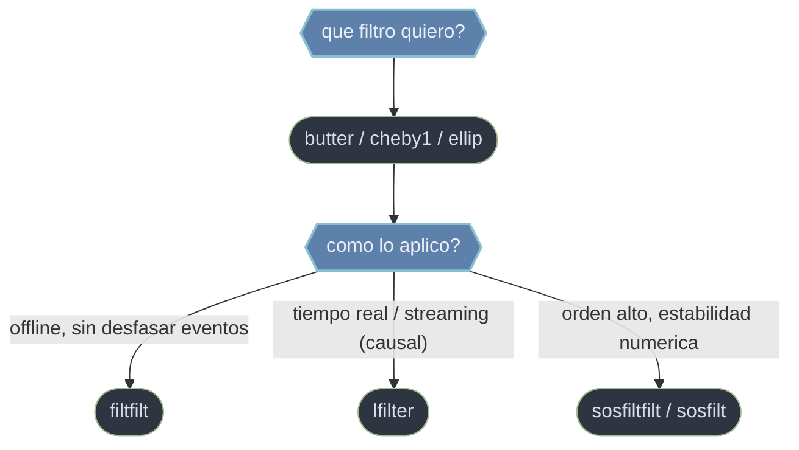

# scipy.signal filtros — disenar y aplicar

Filtrar una senal es **dejar pasar unas frecuencias y atenuar otras**: quitar ruido de alta frecuencia, eliminar una deriva lenta, aislar una banda de interes. En `scipy.signal` esto se hace en **dos pasos deliberadamente separados**: primero se **disena** el filtro (se calculan sus coeficientes a partir del tipo, el orden y la frecuencia de corte) y despues se **aplica** a la senal. `butter` (y la familia `cheby1`, `cheby2`, `ellip`) no toca la senal: solo entrega coeficientes. Quien filtra de verdad los recibe y recorre la senal, y ahi aparece la gran decision: **fase cero** (`filtfilt`, ida y vuelta, sin desfase, pero offline) frente a **causal** (`lfilter`, una sola pasada, con retardo, pero valido en tiempo real). La variante numericamente estable usa el formato `sos` (`sosfiltfilt`, `sosfilt`). Esa separacion permite reutilizar el mismo filtro sobre muchas senales y elegir como aplicarlo segun el contexto.

## En accion

```python
import numpy as np
from scipy.signal import butter, filtfilt

# Senal: tono util a 5 Hz contaminado por una interferencia a 150 Hz
fs = 1000.0                                   # Hz
t = np.arange(0, 1.0, 1/fs)
x = np.sin(2*np.pi*5*t) + 0.5*np.sin(2*np.pi*150*t)

# 1. DISENAR un pasa-bajos Butterworth de orden 4, corte a 30 Hz
b, a = butter(4, 30, btype='low', fs=fs)      # solo coeficientes; no filtra

# 2. APLICAR sin desfase (ida y vuelta) -> fase cero
y = filtfilt(b, a, x)                          # y.shape == x.shape

# y conserva los 5 Hz ALINEADOS en el tiempo y atenua los 150 Hz.
# Con lfilter(b, a, x) el resultado saldria DESPLAZADO (retardo de fase).
```

## Disenar y aplicar



## Contenido

### [[scipy.signal.butter\|butter]] — disena
**Disena** un filtro Butterworth y devuelve sus coeficientes; no aplica nada. El Butterworth se caracteriza por una respuesta **maximamente plana en la banda de paso** (sin rizado), a cambio de una transicion mas suave hacia la banda de rechazo. Se parametriza con el orden `N`, la frecuencia de corte `Wn` y el tipo (`low`, `high`, `band`, `bandstop`). Conviene `output='sos'` para estabilidad en orden alto. Para transiciones mas abruptas, la familia `cheby1` / `cheby2` / `ellip` disena igual a cambio de rizado.

### [[scipy.signal.filtfilt\|filtfilt]] — aplica sin desfase
**Aplica** el filtro pasandolo hacia adelante y hacia atras, logrando **fase cero**: no desplaza la senal en el tiempo, los picos y flancos quedan alineados con la original. Como filtra dos veces, el orden efectivo se duplica. Necesita conocer toda la senal, por lo que es la herramienta de **procesamiento offline**. Su variante para `sos` es `sosfiltfilt`.

### [[scipy.signal.lfilter\|lfilter]] — aplica causal
**Aplica** el filtro recorriendo la senal una sola vez de principio a fin. Por ser **causal** (cada salida depende solo del presente y el pasado) introduce **retardo y distorsion de fase**, pero esa misma causalidad lo hace apto para **tiempo real y filtrado por bloques** (streaming), manteniendo continuidad con el estado `zi`. Su variante para `sos` es `sosfilt`.

## Tabla de decision

| Si necesitas... | Usa | Por que |
|-----------------|-----|---------|
| Calcular los coeficientes de un filtro | [[scipy.signal.butter\|butter]] | Disena; no toca la senal |
| Filtrar offline sin desfasar los eventos | [[scipy.signal.filtfilt\|filtfilt]] | Fase cero (ida y vuelta); requiere la senal completa |
| Filtrar en tiempo real o por bloques | [[scipy.signal.lfilter\|lfilter]] | Causal; admite streaming con estado `zi` |
| Estabilidad numerica en orden alto | `butter(..., output='sos')` + `sosfiltfilt` / `sosfilt` | El formato `sos` evita la fragilidad de `ba` |
| Transicion mas abrupta que Butterworth | `cheby1` / `cheby2` / `ellip` (disenan) | Mas selectividad a costa de rizado |

## Notas relacionadas

- [[scipy.signal.butter]]
- [[scipy.signal.filtfilt]]
- [[scipy.signal.lfilter]]
- [[Librerias/SciPy/scipy.signal/espectral/index\|espectral]]
- [[Librerias/SciPy/scipy.signal/index\|scipy.signal]]
